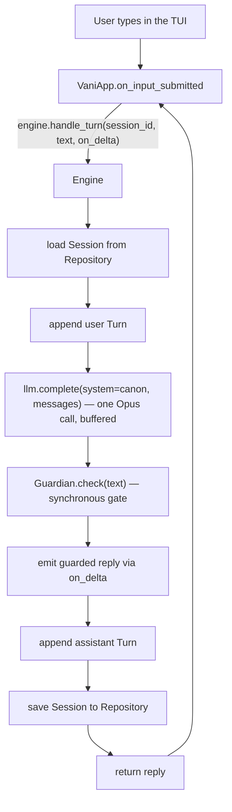

# Vani — v0 Phase 0 Implementation Guide

**Version:** 0.0.1 (tag `v0.0.1`) · **Scope:** roadmap `v0 P0` — the Chat Skeleton (TUI).

This document explains *what* exists in the codebase today and *how* it works. It complements the design specs (the "what/how/when" triad under `specification/`); here we describe the actual implementation under `src/`. Issues VANI-001…010 produced it.

> **In one line:** a local, streaming **text chat** with a clean, layered foundation — a transport-agnostic brain behind typed contracts, a repository for state, a synchronous safety gate, and a test/replay harness — built so the later phases (planner, personality layers, voice, server, device) and the v2 API slot in without rework.

---

## 1. What you can do today

Run `vani` and hold a streaming text conversation with the assistant. Each turn:

1. your message is added to the session,
2. the model is called (one Opus call) under a canon-derived system prompt,
3. the reply passes a synchronous guardrail **before** you see it,
4. the turn is persisted, so history survives a restart.

What is **not** here yet (it arrives in later phases): the deterministic planner with Haiku perception and simple/deep routing (v0 P1), the conversation line, the portrait, the background pass, the personality layers (canon bible, astro temperament, facets, delivery), voice, the server, and the device. P0 deliberately uses a single Opus call and a placeholder identity.

---

## 2. Package layout

Everything lives under the `src/` package (architecture §2). Phase 0 fills in a subset; the other directories are placeholders for later phases.

```
src/
  app/tui_main.py     # composition root: wires config + repo + llm + canon -> Engine -> TUI
  engine.py           # the brain entry point: Engine.handle_turn (transport-agnostic)
  config/config.py    # Config.load(): env + .env, no os.environ mutation
  contracts/
    documents.py      # Session/Turn models, SCHEMA_VERSION, migrate()
    confidence.py     # Confident[T] + clamp (cross-cutting confidence scaffolding)
  state/
    repository.py     # Repository ABC (save/load/list_ids/delete)
    json_store.py     # JsonStore: atomic JSON files, migrate-on-read, cipher hook
  llm/client.py       # LLMClient protocol + AnthropicClient (streaming, token usage)
  guardian/guardrail.py  # MinimalGuardian: synchronous pass/redirect gate
  core/canon.py       # placeholder canon -> compiled identity system prompt
  telemetry/logging.py   # structured logger + redacting TelemetrySink
  tui/app.py          # Textual VaniApp: chat UI, adapter over the engine
tests/
  unit/               # per-module tests
  replay/             # headless, network-free full-conversation replay
  conftest.py         # shared fixtures + scripted StubLLM
```

---

## 3. How a turn flows



The key sequencing rule (architecture §12/§13): the model output is **buffered, then gated, then emitted** — nothing reaches the UI or storage before the Guardian approves it. Safety is never checked after the fact.

---

## 4. The pieces, and how they fit

### Engine (`src/engine.py`) — the brain
`Engine.handle_turn(session_id, user_input, on_delta=None)` is the single, transport-agnostic entry point. It:
- loads the `Session` from the injected `Repository` (keyed by `session_id`),
- appends the user turn, builds the message list, and calls the injected `LLMClient` (one Opus call),
- passes the candidate through the injected `Guardian`, then emits the *guarded* text via `on_delta`,
- appends the assistant turn and saves the session.

The engine holds **only its injected dependencies** (repository, llm, guardian, system prompt) — never session state and never transport code. That is what makes it reusable behind the TUI now and the v2 WebSocket server later (architecture §10). `Engine.transcript(session_id)` is a read accessor the TUI uses to render history without touching state itself.

### Repository + JSON store (`src/state/`)
`Repository` is an ABC with `save/load/list_ids/delete` keyed by `(doc_type, doc_id)` — the single access point to state. `JsonStore` implements it over local JSON files at `{state_dir}/{doc_type}/{doc_id}.json`:
- **atomic writes** (write to `.tmp`, then rename) so a crash never leaves a half-written document,
- **migrate-on-read** via an optional `migrator` callable,
- a **`cipher` hook** for at-rest encryption of sensitive documents (wired up in a later phase; refinement #1).

No other module knows JSON sits underneath — swapping in `mongo_store` at v2 P2 changes only this directory.

### Contracts (`src/contracts/`)
`documents.py` defines the serializable shapes that flow through the system and persist. Phase 0 realizes `Session` and `Turn` (the `sessions` document). Each document carries a `schema_version`; `migrate(doc_type, raw)` is the seam that upgrades older documents on read (v1 has no upgrades yet — it just stamps the current version). The models mirror the JSON Schemas under `specification/architecture/schemas/`, and a test validates `Session` against `sessions.schema.json`.

`confidence.py` scaffolds the cross-cutting **confidence** attribute (spec §9.7): `Confident[T]` pairs a value with a confidence clamped to `[0, 1]`. The canon and hard invariants carry no confidence. Rise/decay equations come at v0 P3.

### LLM client (`src/llm/client.py`)
`LLMClient` is a `@runtime_checkable` protocol with one method, `complete(system, messages, tier, on_delta)`. `AnthropicClient` implements it over the Anthropic SDK:
- it **streams** internally (`messages.stream`) and returns a `Completion(text, tier, usage)`,
- `Usage` captures input/output and cache-read tokens (the basis for the P1 token meter),
- the SDK is **imported lazily** and the API key comes from `Config`; calling with no key raises a clear error.

Being a small protocol, the client is trivially **mockable** — tests inject a `StubLLM`, so nothing hits the network.

### Guardian (`src/guardian/guardrail.py`)
`MinimalGuardian` is the placeholder synchronous gate. `check(text)` returns a `GuardResult` — `pass` (text unchanged) or `redirect` (safe replacement) when a denylisted term appears. The denylist is the extension point; it defaults to empty in V1, and the full rubric (wellbeing, child safety, no-manipulation) replaces it at v1 P4. The engine routes **every** reply through it synchronously before emitting.

### Canon (`src/core/canon.py`)
A minimal placeholder identity so the assistant is *someone*. `load_canon(repository)` seeds and persists it on first run; `compile_identity_prompt(canon)` turns it into the system-prompt block (name, voice, hard invariants). The full hand-authored character bible arrives at v1 P1. The canon carries no confidence.

### Telemetry (`src/telemetry/logging.py`)
`get_logger()` returns a configured structured logger. `TelemetrySink` is a repository-backed, append-only store of per-turn events conforming to `telemetry.schema.json`; `redact()` masks sensitive keys (message text, birth data, secrets) before anything is written. Phase 0 provides the sink only — the engine starts writing per-turn metrics at v0 P1.

### Config (`src/config/config.py`)
`Config.load()` builds an immutable config with precedence **explicit overrides > environment variable > `.env` file > default**. It reads `.env` with `dotenv_values` (which does **not** mutate `os.environ`), so a real environment variable always wins and tests don't leak state. `ANTHROPIC_API_KEY`, `VANI_LOG_LEVEL`, and `VANI_STATE_DIR` are recognized.

### TUI (`src/tui/app.py`) and composition root (`src/app/tui_main.py`)
`VaniApp` is a Textual app — scrollable transcript, input field, status line — and a **thin adapter**: it renders `engine.transcript(...)` on mount and sends input through `engine.handle_turn(...)`; it imports neither the llm nor the repository. `tui_main.main()` is the composition root: it constructs `Config`, `JsonStore` (with the `migrate` migrator), `AnthropicClient`, and the compiled canon, assembles the `Engine`, and launches the TUI. This is the only place concrete dependencies are wired.

---

## 5. State on disk

Conversation state lives under `VANI_STATE_DIR` (default `.vani_state/`, gitignored):

```
.vani_state/
  canon/default.json      # the placeholder canon (seeded on first run)
  sessions/<id>.json      # per-session turn history (the `sessions` document)
  telemetry/events.json   # appended per-turn events (from v0 P1)
```

Each file carries a `schema_version` and is upgraded on read.

---

## 6. Running and testing

```bash
python -m venv .venv && source .venv/bin/activate
pip install -e ".[dev]"
cp .env.example .env          # add ANTHROPIC_API_KEY=sk-ant-...
vani                          # launch the TUI

pytest                        # 44+ tests, including a network-free replay
ruff check . && ruff format . # lint + format
```

The **headless replay** (`tests/replay/`) drives full conversations through the engine with a scripted `StubLLM` and a temp repository — no API calls. This is the foundation for the per-phase tests and the ablation/eval harness in later phases.

---

## 7. Design decisions worth knowing

- **Transport-agnostic brain.** The engine is reached only through `handle_turn`; surfaces are adapters. The v2 API is therefore a wrapper, not a rewrite (architecture §10).
- **State behind a repository.** One interface, swappable implementation (JSON → Mongo at v2 P2) with no changes elsewhere.
- **Buffer-then-gate.** Replies are gated before they reach the UI or storage — the synchronous safety invariant, even with streaming.
- **One source of truth for data shapes.** Typed contracts ⇄ JSON Schema, versioned with migrate-on-read.
- **Everything LLM goes through one mockable interface** — fast, deterministic, network-free tests.
- **Dependency injection at the composition root** — the engine, TUI, and tests all assemble the same parts differently.

---

## 8. Where this maps

| Concern | Code | Spec / Architecture |
|---|---|---|
| Brain entry point / API-readiness | `engine.py`, `app/tui_main.py` | architecture §10 |
| State repository | `state/` | architecture §4 |
| Data contracts + schemas | `contracts/`, `architecture/schemas/` | architecture §9; spec §13 |
| LLM + (later) caching | `llm/client.py` | architecture §11; spec §11 |
| Guardian | `guardian/guardrail.py` | architecture §13; spec §9.6, §19 |
| Confidence | `contracts/confidence.py` | spec §9.7 |
| Telemetry | `telemetry/logging.py` | spec §20 |
| Delivery (TUI) | `tui/app.py` | architecture §10 |

**Next:** v0 P1 (Planner Skeleton and Tiers) — perception on Haiku, deterministic routing, dispatch, per-turn telemetry, and the TUI token meter. See `specification/roadmap/implementation-v0/phase-1-issues.md`.
