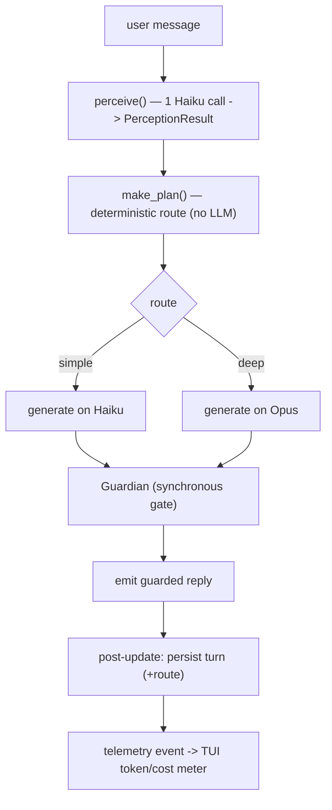

# Vani — v0 Phase 1 Implementation Guide

**Version:** 0.2.0 (tag `v0.2.0`) · **Scope:** roadmap `v0 P1` — Planner Skeleton and Tiers. Issues VANI-011…018.

Phase 1 turns the Phase 0 skeleton into a **structured, deterministic turn pipeline**. Instead of one unconditional Opus call, each turn now: classifies the message with one Haiku call, decides a route in plain code, generates on the route's tier (Haiku for simple, Opus for deep), degrades gracefully on LLM failure, and records per-turn telemetry that drives a live token/cost meter in the TUI. The LLM still touches only two points per turn (perception in, generation out) — everything between is scored code.

> Builds directly on [v0 Phase 0](v0-phase-0.md): the engine, repository, contracts, guardrail, canon, and telemetry sink were already in place; P1 fills the planner.

## What changed in this phase

- `src/contracts/pipeline.py` — `PerceptionResult` and `TurnPlan` (serializable, schema-validated) (VANI-011)
- `src/planner/perception.py` — `perceive()` / `parse_perception()`: one Haiku classification call (VANI-012, VANI-017)
- `src/planner/router.py` — `decide_route()` / `make_plan()`: deterministic simple/deep routing (VANI-013)
- `src/engine.py` — `handle_turn` rewritten into the full pipeline; `_generate` retry/fallback; `usage_summary` (VANI-014/015/017/018)
- `src/llm/prompt.py` — `build_system()`: cached prefix + fresh suffix (VANI-016)
- `src/telemetry/cost.py` — `estimate_cost()` from config-driven prices (VANI-018)
- `src/tui/app.py` — status-line token/cost meter (VANI-018)
- `src/config/config.py` — routing, retry, and price knobs

## How it works

A deep turn is **one Haiku (perception) + one Opus (generation)**; a simple turn keeps both calls on Haiku. Generation is wrapped in retry/backoff and the synchronous Guardian still gates the buffered output before anything is shown (unchanged from P0).

## The pieces

### Contracts (`src/contracts/pipeline.py`)
`PerceptionResult` (topic, intent, emotion, modality — each with confidence) and `TurnPlan` (route, strategy, facet_weights, …). Both serialize and validate against `architecture/schemas/{perception_result,turn_plan}.schema.json`. For P1 only topic+intent (perception) and route (plan) are populated; the rest are present placeholders for later phases.

### Perception (`src/planner/perception.py`)
`perceive(llm, messages)` makes one `tier="haiku"` call and `parse_perception(text)` turns the JSON into a `PerceptionResult` — tolerant of code fences/prose, with a low-confidence fallback on malformed output (so a bad classification never crashes the turn). It does not reply to the user.

### Router (`src/planner/router.py`)
`decide_route(perception, config)` is scored code, no LLM: low-confidence (ambiguity) or high arousal escalate to deep; configured `simple_intents` stay on Haiku. Thresholds are `Config` knobs, so routing is tunable without code changes.

### Engine (`src/engine.py`)
`handle_turn` is the pipeline: perceive → `make_plan` → dispatch on `_TIER_FOR_ROUTE[plan.route]` → Guardian → persist (recording `Turn.route`) → telemetry. `_generate` retries transient LLM failures with exponential backoff (emitting `RETRY_FILLER`) and returns an honest `GENERATION_FALLBACK` after exhaustion, keeping state a complete user+assistant pair. `usage_summary()` reads the telemetry sink for the token/cost meter.

### Prompt assembly (`src/llm/prompt.py`)
`build_system(identity, temperament=None)` returns the system as Anthropic text blocks with `cache_control` — the stable cached prefix; the message list is the fresh suffix. `AnthropicClient` sends `system=build_system(...)`, so the prefix is served from the prompt cache and cache reads surface in `Usage`.

### Telemetry + cost (`src/telemetry/`)
The engine records a per-turn event (route, perception/generation latencies, per-tier token usage incl. cache reads, guardian outcome) via the `TelemetrySink`, redacted and schema-conformant. `cost.py:estimate_cost` prices a token-usage dict from config per-million-token rates; `Engine.usage_summary()` aggregates per-turn + cumulative.

### TUI meter (`src/tui/app.py`)
After each turn the status line shows `turn … tok $… · session … tok $… · H/O/cache`, formatted by `format_meter` from `engine.usage_summary()` — sourced from telemetry, never a direct llm call.

## Design decisions
- **Perception always runs (Haiku), routing decides only the generation tier** — per spec §9.2/§9.5. So a simple turn is two Haiku calls, a deep turn is Haiku + Opus.
- **Fail soft, never crash** — transient errors retry then fall back to an honest message; a failed perception degrades to the deep route.
- **Config-driven knobs** — routing thresholds, retry policy, and token prices all live in `Config`.
- **Telemetry is the single source for the meter** — the TUI reads usage through the engine, preserving the adapter boundary (no direct llm/state access).

## Where this maps

| Concern | Code | Spec / Architecture |
|---|---|---|
| Perception | `planner/perception.py` | spec §9.2 step 1 |
| Routing | `planner/router.py` | spec §9.5 |
| Pipeline contracts | `contracts/pipeline.py` | architecture §9 |
| Dispatch + post-update | `engine.py` | spec §9.2 steps 4–5 |
| Degradation | `engine._generate` | spec §15; architecture §12 |
| Prompt caching | `llm/prompt.py` | architecture §11; spec §11 |
| Telemetry / cost | `telemetry/` | spec §17, §20 |

**Next:** v0 P2 (Conversation Line) — open loops, arc goals/phase, follow-ups, initiative budget. See `specification/roadmap/implementation-v0/` (issue file to be authored from the roadmap).
