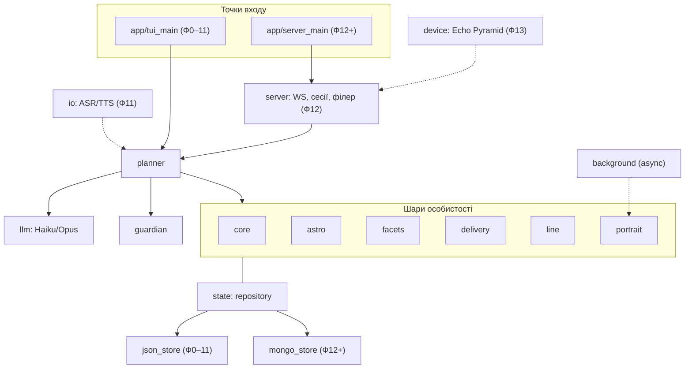
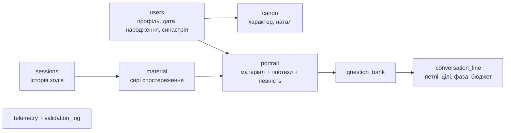
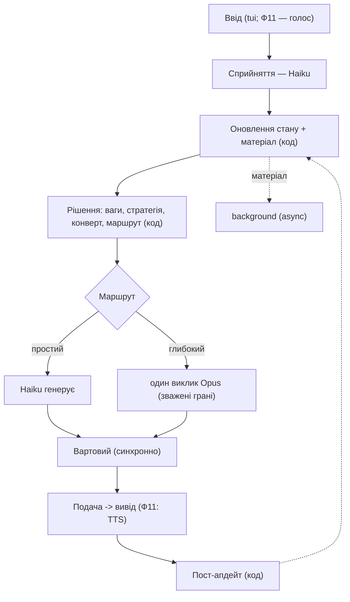
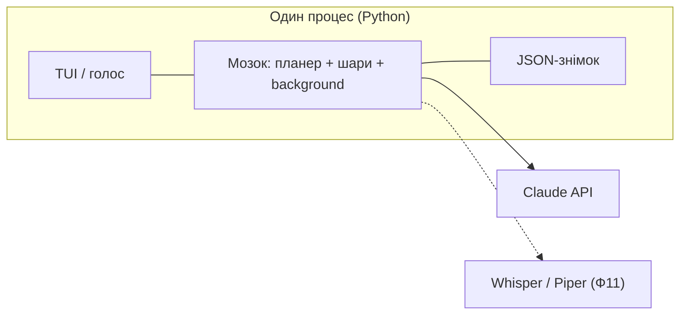
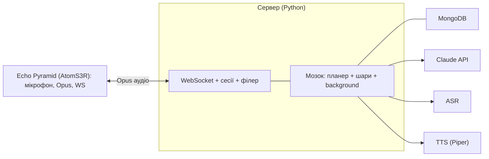

# Vani — архітектура рішення

Vani — жива особистість, що народжується під тебе. Бекенд — Python. Версія 0.1.
Це документ «як побудовано». «Що» — у майстер-специфікації (v1.8). «Коли» — у роудмапі.

---

## 1. Огляд

Рішення росте від монолітного локального застосунку до клієнт-серверної системи з пристроєм:

- **Ф0–11:** один процес на Python — текстовий TUI, потім голос на машині розробника. Стан — локальний JSON.
- **Ф12:** серверний бекенд (WebSocket) і MongoDB.
- **Ф13:** пристрій Echo Pyramid як термінал.

Мозок (шари особистості, планер, фоновий прохід, Вартовий) той самий на всіх етапах; змінюється лише транспорт і сховище. Усе сховище за тонким репозиторієм, тож JSON міняється на Mongo без впливу на шари.

---

## 2. Структура рішення

```
voice_companion/
  app/
    tui_main.py        # точка входу Ф0–11 (локальний TUI)
    server_main.py     # точка входу Ф12+ (сервер)
  core/                # канон, тверді інваріанти
  astro/               # натал, транзити, синастрія, ручки, онбординг-скоринг
  planner/             # сприйняття, політика, маршрут, диспетч, пост-апдейт
  facets/              # визначення граней, формула ваг
  delivery/            # профіль стилю, конверт, флуктуація
  line/                # петлі, цілі, фаза, follow-up, цікавість, банк питань
  portrait/            # спостережний + інтерпретаційний шари, певність
  background/          # async-прохід: валідація, портрет, генерація питань
  guardian/            # синхронний гейт безпеки
  llm/                 # клієнти Haiku/Opus, складання промпта, кеш
  state/
    repository.py      # інтерфейс доступу до стану
    json_store.py      # реалізація Ф0–11
    mongo_store.py     # реалізація Ф12+
  io/                  # Ф11: asr (Whisper), tts (Piper), barge-in
  server/              # Ф12: FastAPI + WebSocket, сесії, протокол, філер
  device/              # Ф13: інтеграція Echo Pyramid (прошивка xiaozhi, конфіг)
  telemetry/           # метрики, журнал валідації
  config/              # ручки налаштування
  tui/                 # компоненти інтерфейсу
```

---

## 3. Карта модулів



Відповідальність модулів:

- **core** — канон у кешований блок ідентичності; інваріанти.
- **astro** — карти, ручки темпераменту, скоринг кандидатів на онбордингу.
- **planner** — виконавча функція (сприйняття Haiku, детермінована політика, маршрут, диспетч, пост-апдейт). Деталі — специфікація, розділ 9.
- **facets** — грані й ваги (тема × темперамент × канон).
- **delivery** — профіль стилю, конверт, флуктуація (текстова до Ф11, просодійна з Ф11).
- **line** — лінія розмови й цікавість.
- **portrait** — два шари й певність; банк питань.
- **background** — async-прохід (валідація + портрет + питання).
- **guardian** — синхронний гейт безпеки до озвучення.
- **llm** — клієнти, складання промпта, кеш префікса.
- **state** — репозиторій з реалізаціями json (Ф0–11) і mongo (Ф12+).
- **io** — ASR/TTS (Ф11).
- **server** — WebSocket, сесії, протокол пристрою, філер (Ф12).
- **device** — Echo Pyramid: прошивка й конфіг (Ф13).
- **telemetry, config, tui** — наскрізні.

---

## 4. Модель стану

Однакові логічні документи на всіх етапах; змінюється лише реалізація за репозиторієм: JSON-файли (Ф0–11) → колекції MongoDB (Ф12+).



Документи: `canon` (сталий характер, без певності), `users` (профіль і дата народження для синастрії), `portrait` (два шари з певністю), `conversation_line`, `question_bank`, `material`, `sessions`, `telemetry`, `validation_log`. Поля — у специфікації, розділ 13. Кожен елемент (крім канону й інваріантів) несе певність. Репозиторій надає єдиний доступ (зберегти/прочитати документи); жоден шар не знає, JSON під ним чи Mongo.

---

## 5. Потоки виконання

### 5.1 Хід у локальній версії (Ф0–11)



Два звернення до LLM на хід (Haiku на вході, Opus на виході); решта — код; фон не блокує.

### 5.2 Хід через сервер і пристрій (Ф12–13)

Той самий мозок, інший транспорт: Atom ловить wake-word, кодує звук в Opus, стрімить по WebSocket на сервер; сервер проганяє той самий конвеєр; на глибокому ході пускає філер, поки Opus готує відповідь; результат через TTS у Opus і назад на Atom. Стан — у Mongo.

---

## 6. Розгортання

### 6.1 Локально (Ф0–11)



### 6.2 Клієнт-сервер із пристроєм (Ф12–13)



---

## 7. Конкурентність

asyncio в одному процесі: головний цикл ходу (швидкий шлях) і фонова задача (`background`) через чергу матеріалу; фон не блокує відповідь, запускається селективно. Вартовий — синхронний у головному циклі. На сервері (Ф12) — обслуговування багатьох сесій тим самим мозком.

---

## 8. Технологічний стек за етапами

- **Ф0–11:** Python; Textual (TUI); Anthropic SDK (Haiku/Opus); skyfield (астро); asyncio; локальний JSON; Whisper (ASR) і Piper-українська (TTS) з Ф11.
- **Ф12:** FastAPI + WebSocket; MongoDB.
- **Ф13:** AtomS3R із прошивкою xiaozhi; кодек Opus; стрімінг аудіо.

---

## 9. Наскрізні елементи

Репозиторій стану (єдина точка доступу); певність (атрибут більшості стану); Вартовий (синхронний гейт); телеметрія (з ранніх фаз); конфігурація (ручки налаштування). Канон та інваріанти — поза певністю.
