# Vani — роудмап імплементації

Vani — жива особистість, що народжується під тебе. Бекенд — Python. Версія 0.2 (перевпорядкування за скором рецензій).
Документ «коли». «Що» — у специфікації (v1.8). «Як» — в архітектурі (v0.1).

---

## 1. Принцип

Порядок фаз перевпорядковано за зведеною оцінкою рецензій: **спершу реалізуються концепції зі скором ≥ 8** — планер (8), лінія розмови (10), портрет із наскрізною певністю (13 і 8) та фоновий прохід (9), — щоб найцінніша когнітивна машинерія працювала й перевірялася найраніше. **Потім — решта в порядку наявного плану:** канон, астро й темперамент, онбординг, грані з Вартовим, подача, пам'ять. Як і раніше, увесь мозок спершу в текстовому TUI, далі голос (Ф11), сервер і MongoDB (Ф12), пристрій (Ф13); стан — JSON до Ф11, Mongo з Ф12 за тим самим репозиторієм.

```mermaid
flowchart LR
  P0["Ф0 каркас"] --> P1["Ф1 планер (8)"] --> P2["Ф2 лінія (10)"] --> P3["Ф3 портрет (13) + певність (8)"] --> P4["Ф4 фоновий (9)"] --> M{{"Високоскорові концепції в тексті"}}
  M --> P5["Ф5 канон"] --> P6["Ф6 астро + темперамент"] --> P7["Ф7 онбординг"] --> P8["Ф8 грані + Вартовий"] --> P9["Ф9 подача"] --> P10["Ф10 памʼять"] --> M2{{"Усі шари в тексті"}}
  M2 --> P11["Ф11 голос"] --> P12["Ф12 сервер + Mongo"] --> P13["Ф13 пристрій"]
```

**Компроміс перевпорядкування:** рання особистість «худа» за характером і пласка за подачею (мінімальний канон-заглушка й текстова подача), бо канон, грані, онбординг і дзеркалення наповнюються в другій хвилі; безпеку до повного Вартового (Ф8) тримає мінімальний гейт із Ф0.

Формат опису фази: мета; що додається; модулі; стан; залежності; результат (готовність).

---

## 2. Фази

## Перша черга — концепції зі скором ≥ 8

### Фаза 0 — Каркас чату (TUI)
- **Мета:** працюючий текстовий чат із моделлю.
- **Додається:** цикл TUI, виклик Opus, відповідь; мінімальна перевірка безпеки; репозиторій стану з першого дня; мінімальний рукописний канон-заглушка (ідентичність) і каркас наскрізної певності у стані.
- **Модулі:** tui, llm, state.
- **Стан:** JSON-знімок історії; каркас певності.
- **Залежності:** —
- **Задачі:**
  - Створити каркас Python-проєкту: пакетування, керування залежностями, лінтинг.
  - Визначити інтерфейс `Repository` і першу реалізацію `json_store` (завантаження/збереження за типом документа).
  - Реалізувати клієнт `llm` поверх Anthropic SDK (Opus) зі стрімінгом.
  - Побудувати цикл TUI (поле вводу, прокручуваний транскрипт, рядок стану).
  - Зберігати й перезавантажувати історію транскрипту через репозиторій.
  - Додати мінімальну перевірку безпеки на виході (заглушка Вартового).
  - Написати мінімальний канон-заглушку, щоб асистент мав ідентичність.
  - Закласти поля певності на елементах стану.
  - Налаштувати каркас логування/телеметрії (поки без метрик).
- **Результат:** можна вести текстовий діалог; є каркас для шарів.

### Фаза 1 — Планер-скелет і яруси (скор 8)
- **Мета:** структурований конвеєр ходу.
- **Додається:** сприйняття (Haiku-класифікація), детермінований маршрут (простий — Haiku, складний — Opus), диспетч, мінімальний план ходу.
- **Модулі:** planner; telemetry (старт).
- **Стан:** план ходу, телеметрія.
- **Залежності:** Ф0.
- **Задачі:**
  - Визначити структуру даних `TurnPlan`.
  - Реалізувати виклик сприйняття на Haiku, що повертає структурований JSON (тема, намір; емоція й модальність — пізніше).
  - Реалізувати детермінований маршрутизатор (простий проти глибокого) з порогами.
  - Реалізувати диспетч для обох маршрутів і хук пост-оновлення.
  - Видавати потурову телеметрію (обраний маршрут, латентності, витрата токенів).
  - Додати збирання префікса промпта в `llm` (заглушка системного блоку).
- **Результат:** видно класифікацію й маршрутизацію; два звернення до LLM на хід.

### Фаза 2 — Лінія розмови (скор 10)
- **Мета:** ведена бесіда, а не реакція.
- **Додається:** відкриті петлі, цілі арки, фази, follow-up (зокрема міжсесійні), бюджет ініціативи.
- **Модулі:** line, state (персист).
- **Стан:** conversation_line.
- **Залежності:** Ф1. Подача поки текстова заглушка; повне дзеркалення — у Ф9.
- **Задачі:**
  - Визначити запис відкритої петлі та її життєвий цикл (відкрита/відкладена/закрита) з вагою значущості й власником наміру.
  - Реалізувати стек цілей арки й відстеження фази арки (відкриття → … → згортання).
  - Реалізувати чергу follow-up, зокрема міжсесійне винесення.
  - Реалізувати бюджет ініціативи (зменшення на веденні, поповнення на ходах користувача).
  - Підключити дії лінії розмови до кроку рішення (підхопити петлю, follow-up, звести).
  - Додати запобіжник точності зворотних посилань.
- **Результат:** асистент повертається до відкладеного, ставить follow-up, зводить на фазі сходження.

### Фаза 3 — Портрет, певність, модальність (скори 13 і 8)
- **Мета:** модель користувача; рішення зважають на певність; читання жартів.
- **Додається:** двошаровий портрет і скринька матеріалу; певність як наскрізний атрибут; фільтр модальності в сприйнятті.
- **Модулі:** portrait, розширення planner.
- **Стан:** portrait, material; певність на елементах стану.
- **Залежності:** Ф1, Ф2 і мінімальний канон (Ф0). Лінзи граней тимчасово реалізуються в промпті осмислення; рантаймові зважені грані замінять їх у Ф8.
- **Задачі:**
  - Реалізувати спостережний шар (скринька матеріалу, що дописується щоходу).
  - Визначити інтерпретаційний шар (гіпотези про грані користувача з певністю).
  - Додати певність до кожного релевантного елемента стану; реалізувати зростання й згасання з часом.
  - Підключити певність до рішень планера (перепитати / обережна стратегія / менше дзеркалити).
  - Розширити сприйняття полем модальності висловлювання (жарт/серйозне/гіпотетичне/сарказм/цитата, з певністю).
  - Застосувати ефекти модальності до тону й до того, що заноситься в портрет; зберегти запобіжник безпеки.
- **Результат:** будується портрет; невпевненість змінює поведінку; сарказм і жарт не сприймаються буквально.

### Фаза 4 — Фоновий прохід (async) (скор 9)
- **Мета:** самокорекція й цікавість.
- **Додається:** асинхронний прохід — валідація політики + вирощування портрета + генерація питань у банк; цикл цікавості.
- **Модулі:** background.
- **Стан:** question_bank, validation_log, оновлення portrait і line.
- **Залежності:** Ф3.
- **Задачі:**
  - Реалізувати фонову asyncio-задачу й чергу матеріалу.
  - Реалізувати валідацію політики (грані/стратегія/класифікація/пропущені петлі) з тіньовим і активним режимами.
  - Реалізувати вирощування портрета з накопиченого матеріалу.
  - Реалізувати генерацію питань у банк (звʼязок із гіпотезою, делікатність, умова доречності, старіння).
  - Реалізувати цікавість як клас петель; додати відбір питань у моменти цікавості (релевантність + делікатність + бюджет).
  - Застосовувати висновки фонового проходу до стану мʼяко, з інерцією; тримати Вартового синхронним і поза проходом.
  - Додати вибіркове спрацювання (поріг невпевненості, вибірка, паузи).
- **Результат:** система самокоригується й ставить питання з цікавості, не блокуючи відповідь.

**Рубіж: високоскорові концепції (скор ≥ 8) працюють у тексті.**

## Друга черга — решта за наявним планом

### Фаза 5 — Шар 1: Ядро характеру (канон)
- **Мета:** сталий характер.
- **Додається:** character bible у кешований блок ідентичності; інваріанти (розгортає канон-заглушку з Ф0 у повну біографію).
- **Модулі:** core.
- **Стан:** canon.
- **Залежності:** Ф1.
- **Задачі:**
  - Визначити схему канону (усі виміри Шару 1).
  - Написати повну біографію характеру (замість заглушки з Ф0).
  - Скомпілювати канон у кешований префікс системного промпта; підключити кешування промпта в `llm`.
  - Закодувати тверді інваріанти як незмінний розділ промпта.
  - Додати шлях завантаження канону через репозиторій.
- **Результат:** асистент має впізнавану особистість у тексті.

### Фаза 6 — Астро-двигун і Шар 2 (темперамент)
- **Мета:** добовий настрій.
- **Додається:** натал (поки задана дата) і транзити через skyfield; ручки темпераменту в промпт.
- **Модулі:** astro.
- **Стан:** астро-стан (натал, транзити дня).
- **Залежності:** Ф5.
- **Задачі:**
  - Інтегрувати skyfield; кешувати ефемериди локально.
  - Обчислити натальну карту із заданої дати.
  - Обчислити добові транзити до натальної карти.
  - Відобразити астро-стан на п'ять регуляторів (енергія, теплота, багатослівність, уява, обережність).
  - Рендерити кешований добовий блок темпераменту в промпт; оновлювати раз на добу.
  - Перевірити, що регулятори змінюють тон і багатослівність у тексті.
- **Результат:** тон і багатослівність змінюються щодоби. Просодійна флуктуація відкладена до Ф11.

### Фаза 7 — Онбординг (народження)
- **Мета:** характер народжується під користувача.
- **Додається:** підбір кандидатних дат за синастрією (дата народження користувача) і призначенням; прев'ю; вибір; насіння канону.
- **Модулі:** astro (скоринг), онбординг у tui.
- **Стан:** users (дата народження, синастрія), оновлений canon.
- **Залежності:** Ф6.
- **Задачі:**
  - Додати онбординг-флоу в TUI зі збором даних народження користувача, призначення й статі/імені/віку асистента.
  - Відобразити призначення на цільовий архетип і бажану сигнатуру карти.
  - Реалізувати обчислення синастрії (карта асистента × карта користувача).
  - Реалізувати функцію оцінки (синастрія-до-користувача + відповідність архетипу), формовану призначенням.
  - Перебрати кандидатні дати в межах року народження; ранжувати й обрати 3–4 різні кандидати.
  - Згенерувати короткий прев'ю характеру для кожного кандидата.
  - На вибір — зафіксувати натальну карту й засіяти канон (архетип, базовий темперамент, теми ран-дарів).
- **Результат:** замість заданої дати — обрана на онбордингу натальна карта.

### Фаза 8 — Шар 3: Грані з вагами та Вартовий
- **Мета:** відповідь відображає зважені грані; активний гейт безпеки.
- **Додається:** визначення граней, формула ваг, один зважений виклик Opus; Вартовий як окрема синхронна перевірка. Замінює тимчасові лінзи-в-промпті з Ф3 рантаймовими зваженими гранями; вмикає повний Вартовий (мінімальний гейт тримався з Ф0).
- **Модулі:** facets, guardian.
- **Стан:** ваги граней у плані ходу.
- **Залежності:** Ф5, Ф6.
- **Задачі:**
  - Визначити набір граней і метадані кожної (компетенція, ціль, режим, спорідненість з архетипом).
  - Реалізувати формулу ваг (базова спорідненість + релевантність теми + зсув темпераменту), обмежену, з порогом і регулятором максимуму активних.
  - Зібрати акцент зважених граней у промпті Opus (один виклик).
  - Позначити внутрішні грані як модифікатори змісту, ніколи не голос.
  - Реалізувати Вартового як окремий синхронний гейт (блок/перенаправлення за безпекою/добробутом).
  - Додати ваги граней і вердикти Вартового в телеметрію.
- **Результат:** різні грані виходять наперед за темою й настроєм; усе озвучене проходить Вартового.

### Фаза 9 — Шар 4: Подача
- **Мета:** дзеркалення стилю й добовий текстовий дрейф.
- **Додається:** профіль стилю (ковзне середнє), конверт, флуктуація позиції в конверті й лексичної барви. Замінює текстову заглушку подачі з Ф2.
- **Модулі:** delivery.
- **Стан:** профіль стилю.
- **Залежності:** Ф1, Ф6.
- **Задачі:**
  - Реалізувати профіль стилю (EMA довжини, регістру, складності, щільності питань, мовного міксу, нетерплячості).
  - Вивести конверт подачі (цільова довжина, регістр) з частковим зближенням і підлогою зрозумілості.
  - Реалізувати текстову флуктуацію: позиція в конверті й лексична барва від регуляторів.
  - Додати правила «ніколи не дзеркалити шкідливе» і «звертання на ти лише після користувача».
  - Забезпечити пріоритет (конверт користувача > флуктуація) при збиранні плану.
- **Результат:** коротко користувачу — коротко у відповідь; манера дрейфує за днем.

### Фаза 10 — Пам'ять і персистентність
- **Мета:** безперервність між сесіями.
- **Додається:** розділення сесійного й довготривалого; усталення локального JSON-сховища за репозиторієм.
- **Модулі:** state.
- **Стан:** усі документи з політикою життя.
- **Залежності:** Ф2, Ф3, Ф4.
- **Задачі:**
  - Визначити політику життя/утримання для кожного документа (сесійне проти довготривалого).
  - Усталити JSON-сховище; забезпечити атомарні записи знімків.
  - Реалізувати злиття довготривалої бази із сесійним станом на старті.
  - Подбати про приватність даних народження користувача (локально, без експорту).
  - Додати перевірки готовності до майбутньої міграції на Mongo.
- **Результат:** характер і портрет переживають перезапуски. **Рубіж: усі шари в тексті.**

### Фаза 11 — Голос: ASR + TTS
- **Мета:** голосовий діалог на машині розробника.
- **Додається:** Whisper (ASR) на вхід, Piper-українська (TTS) на вихід; просодійна флуктуація тепер активна; barge-in.
- **Модулі:** io (asr, tts), розширення delivery.
- **Стан:** без змін.
- **Залежності:** усі шари (Ф10).
- **Задачі:**
  - Інтегрувати локальний Whisper (faster-whisper); видати транскрипт і опційні просодійні сигнали.
  - Інтегрувати Piper-українську; видати параметри синтезу (темп, варіація).
  - Відобразити флуктуацію подачі на просодійні параметри від регуляторів.
  - Реалізувати захоплення мікрофона, VAD і відтворення на динамік.
  - Реалізувати barge-in (переривання TTS, скасування Opus у польоті).
  - Перевірити українську якість на слух (особливо наголоси); налаштувати.
- **Результат:** з асистентом можна говорити голосом; без сервера й пристрою.

### Фаза 12 — Сервер і MongoDB
- **Мета:** бекенд для сесій і ґрунт для пристрою.
- **Додається:** FastAPI + WebSocket-сервер навколо мозку; протокол; філер для приховування латентності; MongoDB як реалізація репозиторію замість JSON.
- **Модулі:** server, state (mongo_store).
- **Стан:** міграція JSON → Mongo за тим самим інтерфейсом.
- **Залежності:** Ф11.
- **Задачі:**
  - Реалізувати `mongo_store` за наявним інтерфейсом `Repository`.
  - Мігрувати наявний JSON-стан у колекції Mongo.
  - Побудувати FastAPI + WebSocket-сервер; обгорнути мозок; керувати сесіями.
  - Визначити протокол до пристрою (рукостискання, кадри Opus-аудіо).
  - Реалізувати шлях філера для приховування TTFT Opus на глибоких ходах.
  - Підтримати кілька одночасних сесій над одним мозком.
  - Додати автентифікацію/безпеку сесій і обробку життєвого циклу зʼєднання.
- **Результат:** мозок доступний по WebSocket; стан у Mongo; філер прикриває TTFT Opus.

### Фаза 13 — Залізо: Echo Pyramid
- **Мета:** фізичний голосовий термінал.
- **Додається:** AtomS3R із прошивкою xiaozhi, наведеною на наш сервер; стрімінг Opus-аудіо в обидва боки.
- **Модулі:** device.
- **Стан:** без змін.
- **Залежності:** Ф12.
- **Задачі:**
  - Прошити xiaozhi на AtomS3R + Echo Pyramid через M5Burner.
  - Навести пристрій на WebSocket/OTA-ендпойнт нашого сервера.
  - Перевірити стрімінг Opus в обидва боки й роботу слова-активатора.
  - Налаштувати наскрізну латентність (тайминг філера, буферизація аудіо).
  - Перевірити повний цикл розмови на залізі.
- **Результат:** розмова через Echo Pyramid; повна цільова система.

---

## 3. Доопрацювання за рецензіями (високий пріоритет)

Шість високопріоритетних покращень із рецензій, прив'язані до фаз. Повний опис реалізації — у файлі `vani_high_priority_improvements_uk.md`.

| # | Покращення | Цільові фази | Як (коротко) |
|---|---|:--:|---|
| 1 | Захист надчутливих даних | Ф0, Ф10 | Шифрування чутливих документів у `json_store` за інтерфейсом `Repository`; редакція в телеметрії; видалення на вимогу |
| 2 | Маршрут фактів на самоперевірку | Ф1 | Ознака `self_check` у сприйнятті; умовний дешевий перевірочний виклик у диспетчі |
| 3 | Абляції та метрики | після Ф4 | Прапорці `config.ablation`; headless-прогон через `repository`; метрики узгодженості, петель і суперечностей у телеметрію (суддя на Haiku) |
| 4 | Червоне тестування Стратега впливу | Ф8 | Правило «немає маніпуляції на виході» в рубриці Вартового; змагальні діалоги в eval-оснащенні (з п.3) |
| 5 | Формалізувати ваги й певність | Ф3, Ф4, Ф8 | Рівняння згасання/підтвердження певності (`state/confidence.py`); явна формула ваг із tie-break; научіння корисності стратегій |
| 6 | Операціоналізувати анти-залежність | після Ф4, фінал Ф8 | Індикатор ризику з телеметрії; зниження бюджету ініціативи й частоти питань; офлайн-чек-іни |

Рекомендований порядок: спершу швидкі перемоги (1 захист даних, 2 маршрут фактів), далі 3 абляції як основа для 4 червоного тестування, потім 5 формалізація й 6 анти-залежність (краще після Ф4, фінал із повним Вартовим у Ф8).

---

## 4. Наскрізні елементи

Не окремі фази, супроводжують усі: певність і Вартовий закладаються в каркас стану з ранніх фаз (мінімальна перевірка безпеки з Ф0, повний Вартовий з Ф8); телеметрія з Ф1; репозиторій стану з Ф0 (щоб Ф12 змінила лише реалізацію).

---

## 5. Відкриті рішення

- TUI-бібліотека: Textual чи простіший старт.
- Чи піднімати мінімальний канон (Ф0) і базову подачу раніше, якщо рання «худість» характеру заважатиме тестуванню.
- Онбординг (Ф7) рано чи тимчасово жити із заданою датою.
- Локальний ASR/TTS на машині проти хмарних на Ф11.
- Ритм фонового проходу: спільний для валідації й портрета чи рознесений.
