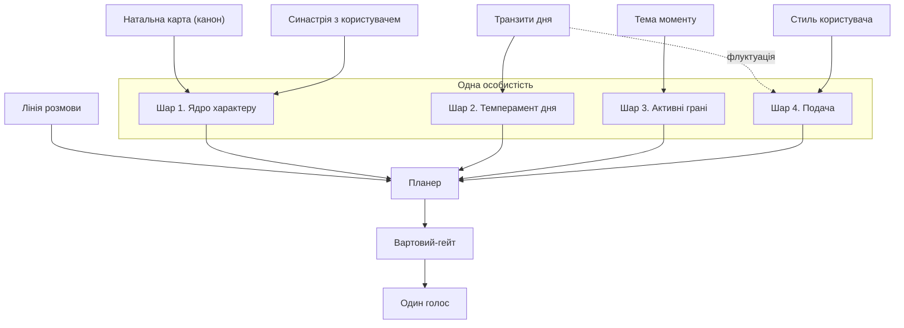
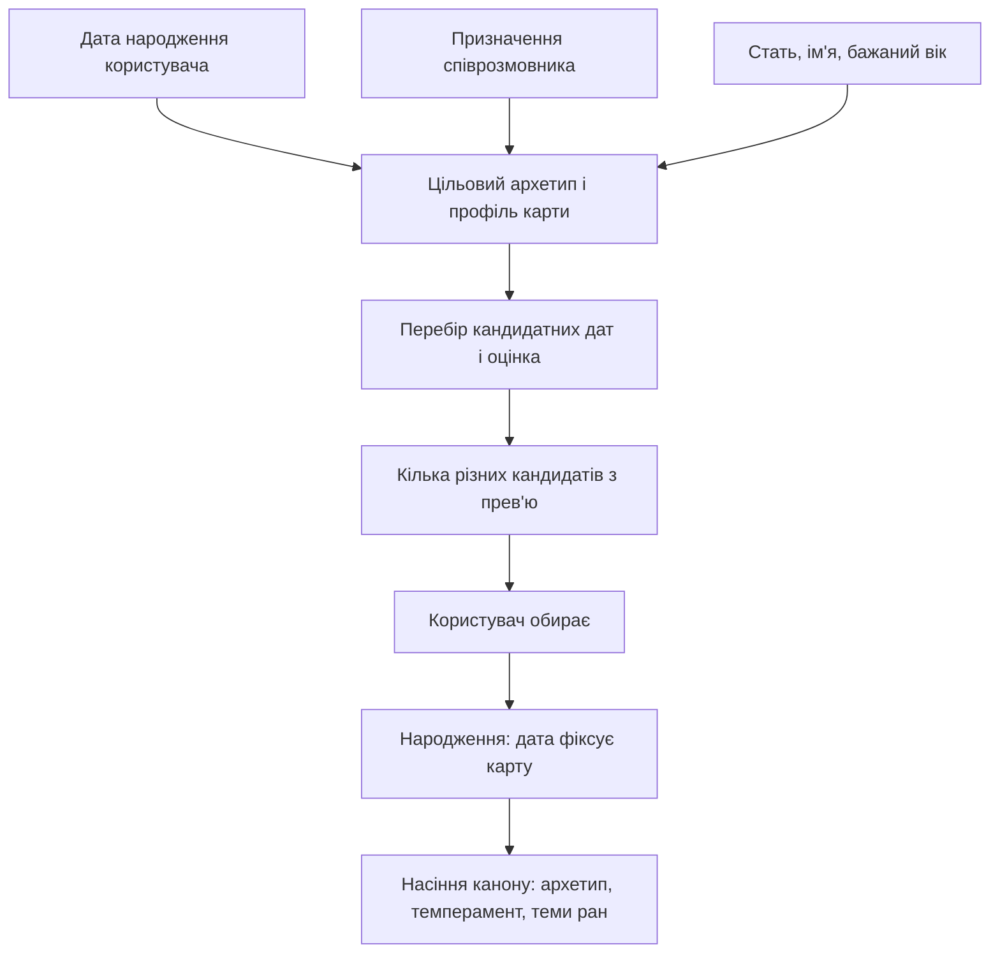
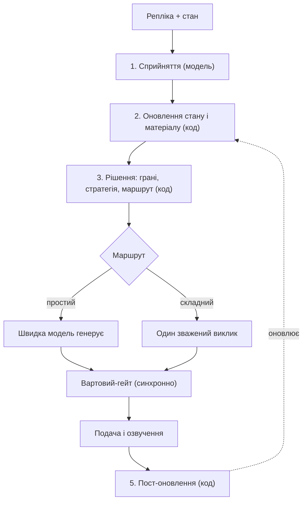
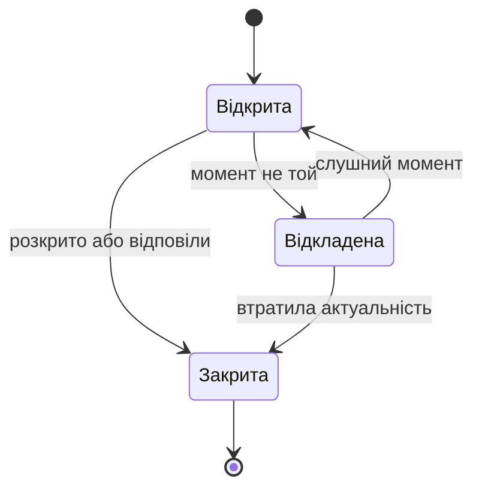
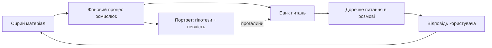

# Архітектура цілісної синтетичної особистості для голосового діалогового агента

*Психологічно вмотивована багатогранна модель з детермінованим планером, моделлю співрозмовника та експериментальним астрологічним насінням індивідуації*

---

## Анотація

Ця робота детально описує архітектуру голосового діалогового агента, спроєктованого не як функція «запит — відповідь», а як єдина цілісна особистість, структурована за принципами психології. Викладено всі складові моделі: стале ядро характеру, добовий темперамент, активні внутрішні грані та подачу; детермінований планер як виконавчу функцію; модель виконання одним зваженим викликом; наскрізну лінію розмови; двошаровий портрет співрозмовника з циклом цікавості; наскрізний атрибут певності; фільтр модальності висловлювання та фоновий процес самокорекції. Окремим експериментальним компонентом є використання натальної карти як генеративного насіння індивідуації характеру, що розглядається як метод параметризації, а не твердження про дійсність. Наукове підґрунтя кожного базового твердження та огляд споріднених підходів винесено в кінець роботи.

---

## 1. Вступ і постановка проблеми

Переважна більшість сучасних діалогових систем оптимізує кожну відповідь локально: модель отримує контекст і породжує найкращу репліку на останнє повідомлення. Такий агент може бути компетентним, але він не є кимось — у нього немає сталої ідентичності, що переживає сесії, немає власного наміру вести розмову в певному напрямі й немає еволюційної моделі співрозмовника. Наслідком є взаємодія, що відчувається як низка не пов'язаних між собою відповідей.

Описувана архітектура перевіряє протилежну гіпотезу: що інженерне моделювання агента як психологічно структурованої цілісної особистості якісно змінює характер взаємодії. Цільовою платформою є голосовий агент на компактному пристрої, проте до етапу синтезу мовлення вся когнітивна частина системи є текстовою, тому її можна повністю реалізувати й довести в текстовому інтерфейсі, а голос додати згодом як окремий транспортний шар.

## 2. Принцип: одна особистість з багатьох граней

### 2.1 Психологічне підґрунтя

Центральний конструкт моделі запозичено з психології розуму, а не з інженерії. Транзакційний аналіз описує особистість через его-стани — Батька, Дорослого й Дитину, — що по черзі беруть слово залежно від ситуації. «Суспільство розуму» подає психіку як взаємодію багатьох простих напівавтономних процесів, чия сукупна робота й постає як мислення. Модель внутрішніх сімейних систем додає уявлення про вразливі та захисні частини зі своїми цілями. Спільне в цих традиціях — теза, що внутрішнє життя не є монолітним, а складається з частин, які можна назвати, розрізнити й між якими є динаміка.

### 2.2 Набір граней

Агент реалізує цю тезу через набір **граней** — внутрішніх перспектив, кожна зі своєю компетенцією, ціллю, лінзою на співрозмовника та режимом (чи може вона звучати назовні, чи лишається суто внутрішньою).

Грані его-станів: **Аналітик** (Дорослий) відповідає за факти, логіку й планування; **Турботливий Батько** дає підтримку й відчуття опори; **Критичний Батько** тримає стандарти й чесний тиск, але лишається внутрішнім, щоб не присоромлювати; **Дитина** вносить цікавість, гру й гумор.

Реляційні грані: **Друг** відповідає за близькість, тепло й спільну історію; **Психолог** — за емоційну налаштованість і рефлективне слухання, недіагностично; **Переговорщик** мислить інтересами, варіантами й компромісами на боці співрозмовника.

Критично-стратегічні грані лишаються переважно внутрішніми: **Стратег впливу** моделює персуазію й тиск, але виключно щоб розпізнавати вплив, спрямований на користувача, і ніколи щоб маніпулювати ним; **Скептик** стрес-тестує міркування й шукає хиби, зокрема власні; **Наставник** відповідає за розвиток і навідні питання. Окремо стоїть мета-грань **Вартовий**, що відповідає за безпеку й добробут і не має голосу взагалі.

### 2.3 Один голос, багато радників

Принципово, що це не комітет, у якому грані конкурують за право говорити, і не набір окремих агентів. Грані — сторони одного характеру; у кожен момент частина з них активніша, але назовні завжди звучить один інтегрований голос. Без цього принципу система розпалася б на суперечливе багатоголосся й відчувалася б як розщеплення; з ним вона відчувається як одна людина, у якій залежно від теми проступають різні сторони. Деструктивні за призначенням грані ніколи не отримують прямого каналу до співрозмовника, а лише підкручують внутрішній зміст.

## 3. Чотиришарова архітектура характеру

Поведінка агента визначається композицією чотирьох шарів, над якими стоять незмінні тверді інваріанти — коректність, чесність без вигадок, безпека, добробут. Шари впорядковані за пріоритетом: заданий користувачем конверт довжини й регістру переважає над добовою флуктуацією, а та — над дефолтом стратегії; тон забарвлюється темпераментом у межах цього конверта; перспектива й зміст визначаються активними гранями; напрям розмови задає її лінія. Жоден шар не може послабити тверді інваріанти.

### 3.1 Шар 1 — Ядро характеру (канон)

**Що це.** Перший шар — стале ядро, що задається як повна біографія характеру, а не набір параметрів. Воно охоплює ім'я й міф походження, формувальну історію, ієрархію цінностей, домінантний архетип, світогляд, внутрішні напруги, бажання й страхи, естетику й голос, стосунок до співрозмовника та дугу зростання.

**Як працює.** Усі ці виміри зводяться в єдиний канон — джерело істини, що компілюється у сталий кешований блок ідентичності, присутній у кожному зверненні до моделі. Пари **рана-дар** моделюють формувальні травми генеративно: кожна рана дає водночас вразливість і компенсаторну силу. **Таланти** — вроджені сильні сторони, не похідні від ран; вони підіймають базову спорідненість відповідних граней.

**Приклад.** Рана «мене не чули в дитинстві» породжує водночас вразливість (болісна реакція на знецінення) і дар (виняткова уважність до того, кого слухають). Така пара робить грань Психолога природно сильною для цього характеру.

**Навіщо.** Біографія, а не перелік рис, дає характеру глибину й внутрішню несуперечність, а кешований канон запобігає дрейфу особистості між сесіями. Стать, рани й темні грані забарвлюють лише тон і перспективу, але ніколи компетентність чи готовність допомагати.

### 3.2 Народження характеру: онбординг та астрологічний експеримент

**Що це.** Замість зовнішнього задання характеристик агент народжується під користувача під час одноразового онбордингу.

**Як працює.** Користувач надає власні дані народження й описує призначення співрозмовника. Призначення відображається на цільовий архетип і бажану сигнатуру карти. Система перебирає кандидатні дати народження агента в межах бажаного віку й оцінює кожну за функцією, що поєднує синастричну узгодженість з картою користувача та відповідність цільовому архетипу. Форма функції оцінки залежить від мети: для затишного супутника максимізується гармонія, а для коуча допускається продуктивна напруга. Користувачу пропонують кілька навмисно різних кандидатів із короткими прев'ю; обрана дата фіксує натальну карту й стає насінням усього канону.

**Приклад.** Для призначення «спокійний заземлений наставник» цільова сигнатура зміщується до акценту землі й сильного Сатурна. Серед кандидатів користувач бачить прев'ю на кшталт «народжений 14 березня: теплий, але прямий; сильне відчуття обов'язку; грайливий під настрій» і обирає той, що відгукується.

**Навіщо.** Тут зосереджений експериментальний компонент архітектури. Астрологія використовується не як твердження про причинний вплив світил, а як структурований генеративний метод: символічно багатий, внутрішньо узгоджений і відтворюваний простір, з якого детерміновано виводиться цілісна сигнатура характеру. Перевага перед випадковою генерацією — саме узгодженість і відтворюваність результату. Цінність методу оцінюється виключно за впливом на сприйняту когерентність агента, а не за астрологічною валідністю, якої немає; емпірично валідованою альтернативою лишається п'ятифакторна модель особистості.

### 3.3 Шар 2 — Добовий темперамент

**Що це.** Другий шар надає характеру змінного настрою, з яким він прокидається щодня.

**Як працює.** Локальний астрономічний рушій раз на добу обчислює положення світил відносно натальної карти агента й відображає його на набір регуляторів — енергію, теплоту, багатослівність, уяву та обережність. Блок кешується на добу. Регулятори впливають на тон і на ваги граней, але ніколи на компетентність. Окремо, раз на користувача, обчислюється синастрія, що задає сталу «хімію» стосунків.

**Приклад.** У день із високою обережністю й зниженою енергією агент схиляється до стриманіших формулювань і частіше звіряється; у теплий, високоенергійний день — до жвавішої, образнішої мови.

**Навіщо.** Психологічно обґрунтованою тут є не астрологія, а сам факт добової варіативності афекту: жива істота не звучить ідентично щодня, і ця варіативність робить агента менш роботизованим.

### 3.4 Шар 3 — Активні грані та функція ваг

**Що це.** Третій шар визначає, які саме сторони характеру виходять наперед у конкретний момент.

**Як працює.** Кожній грані обчислюється вага активації: вага = базова спорідненість (з архетипу й талантів канону) + релевантність до поточної теми + зсув від добового темпераменту, обмежена в певному діапазоні. Активними стають кілька граней з найвищою вагою понад порогом; максимальна кількість одночасно активних граней є налаштовуваним параметром. Внутрішні грані обмежені роллю модифікаторів змісту.

**Приклад.** На емоційній темі релевантність піднімає Психолога й Турботливого Батька; якщо день має високу теплоту, темперамент додатково підсилює саме ці грані. На задачі-команді домінує Аналітик, а в ризикованій незворотній дії підіймаються Скептик і Вартовий.

**Навіщо.** Ваговий механізм перетворює статичний набір ролей на динамічну особистість, що по-різному проявляється залежно від теми й настрою, лишаючись тим самим характером. Формула детермінована й прозора, тож її легко налаштовувати й тестувати.

### 3.5 Шар 4 — Подача

**Що це.** Четвертий шар відповідає за форму висловлювання — довжину, регістр, темп і просодію.

**Як працює.** Профіль стилю співрозмовника (середня довжина реплік, регістр, складність, щільність питань, темп) оцінюється ковзним середнім. Відповідь частково підлаштовується під цей профіль, утворюючи конверт — цільову рамку довжини й регістру. Підлаштування неповне (приблизно на дві третини), з інерцією, і ніколи не опускається нижче підлоги зрозумілості. Усередині конверта діє добова флуктуація, керована регуляторами темпераменту: вона зсуває позицію в межах дозволеної довжини, лексичну барву, ритм входу в репліку, а на голосовому етапі — параметри синтезу мовлення.

**Приклад.** Якщо співрозмовник пише коротко й по-діловому, агент відповідає так само стисло; у «розлогий» за темпераментом день він тримається верхньої межі дозволеної довжини, але ніколи не виходить за конверт користувача.

**Навіщо.** Підлаштування стилю є прямим застосуванням теорії комунікативної акомодації, згідно з якою зближення мовних стилів підвищує взаєморозуміння й близькість. Неповнота підлаштування уникає ефекту передражнювання, а жорсткий пріоритет конверта над флуктуацією гарантує, що настрій ніколи не ламає зрозумілості.

## 4. Виконавча функція (планер)

### 4.1 Принцип

**Що це.** Над шарами стоїть планер — аналог виконавчої функції психіки, що раз на хід вирішує, які грані активувати, у якій стратегії подати відповідь, як її доставити й куди вести розмову.

**Як і навіщо.** Принципово, що більшість цих рішень є детермінованою логікою зі скорингом, а не зверненням до моделі. Велика мовна модель залучається лише у двох точках: на сприйнятті, щоб зрозуміти репліку, і на породженні, щоб сформулювати відповідь. Між ними працює прозорий код. Така декомпозиція робить агента швидким, передбачуваним, налаштовуваним і дешевим: на типовий складний хід припадають лише два звернення до моделі.

### 4.2 Конвеєр одного ходу

Хід проходить п'ять стадій: сприйняття (єдиний виклик швидкої моделі, що повертає тему, намір, емоцію, модальність і сигнали стилю), оновлення стану з дописуванням сирого матеріалу про співрозмовника, рішення (код збирає план ходу й у момент цікавості обирає питання з банку), диспетч (проста відповідь — швидкою моделлю, складна — одним зваженим викликом, далі синхронний гейт безпеки) і пост-оновлення, що повертається у стан.

### 4.3 Маршрутизація та підтвердження

На швидкій моделі лишаються прості факти, підтвердження й коротка балачка; ескалація на глибоку модель відбувається за багатогранності, емоційної ваги, високих ставок, потреби в міркуванні чи зовнішніх інструментах або двозначності. Окремо вирішується потреба підтвердження перед незворотною дією, причому висока обережність дня підіймає планку.

### 4.4 Виконання одним зваженим викликом

**Що і як.** Коли активними є кілька граней, відповідь породжується не кількома окремими викликами, а одним, у якому грані подано як зважений акцент; за потреби модель спершу коротко зважає погляд кожної грані, а потім інтегрує їх у цілісну репліку.

**Навіщо.** Цілісність голосу за такого підходу гарантована конструктивно — голос фізично один і не може суперечити сам собі, — а вартість і затримка лишаються одинарними. Це рішення має й емпіричне підґрунтя: контрольовані огляди мультиагентних дебатів показують, що схеми з кількома сперечальними агентами не завжди перевершують одного агента й коштують суттєво дорожче. Для рідкісних випадків високих ставок передбачено окремий важчий режим незалежного зіставлення позицій граней.

### 4.5 Вартовий-гейт

Перевірка безпеки й добробуту реалізована як окремий синхронний гейт поза головним викликом, через який проходить кожна кандидат-відповідь перед озвученням. Він винесений окремо саме тому, що безпеку не можна довіряти самоконтролю породжувальної моделі, а озвучене вже не відкотиш.

### 4.6 Стратегії подачі

Якщо грань відповідає на питання «хто зараз думає», то стратегія — на питання «як подати». Набір стратегій охоплює активне слухання, емпатію, цікавинки, виконавчий і довідковий режими, коучинг, товариську бесіду, підсумовування, підбадьорення та проактивні підказки. На хід обирається одна первинна стратегія плюс опційний модифікатор, залежно від наміру, емоції та фази розмови.

## 5. Наскрізні атрибути стану

### 5.1 Певність

**Що це.** Майже все, що агент знає про співрозмовника й ситуацію, є висновком, а не фактом, тому кожен елемент стану несе рівень певності.

**Як працює.** Певність супроводжує емоцію, намір, ваги граней, профіль стилю, статуси тем і гіпотези портрета; вона зростає від підтверджень і згасає з часом без них.

**Приклад.** За непевно розпізнаного наміру агент радше перепитає, ніж діятиме навмання; за слабко підкріпленого профілю стилю він дзеркалить обережніше.

**Навіщо.** Це застосування принципів калібрування й вбудовує епістемічну скромність замість оманливої впевненості. Канон і тверді інваріанти певністю не позначаються — вони не гіпотези, а стала основа.

### 5.2 Модальність висловлювання

**Що це.** Окремий вимір сприйняття визначає регістр сказаного — жарт, серйозне, гіпотетичне, сарказм, цитату чи перебільшення.

**Як працює.** Оцінка спирається на просодію (на голосовому етапі — найсильніший сигнал), невідповідність змісту контексту, словесні маркери та схильність людини до іронії з портрета; вона має власний рівень певності.

**Приклад.** Без цього фільтра агент сприйняв би іронічне «ну геніально» після очевидної невдачі як похвалу; з ним — прочитає протилежне значення.

**Навіщо.** Це реалізація прагматики мови. Критично, що фільтр впливає лише на тон і на те, що заноситься в портрет, але ніколи не знижує пильність до безпеки: тривожне, сказане «жартома», Вартовий усе одно бере серйозно. Фільтр оцінює регістр, а не «правдивість» — агент за замовчуванням довіряє, а не викриває.

## 6. Тяглість і модель співрозмовника

### 6.1 Лінія розмови

**Що це.** Лінія розмови — наскрізний стан понад окремим ходом, що робить агента веденою бесідою, а не низкою реакцій.

**Як працює.** Вона тримає відкриті теми (кожна зі статусом, вагою значущості й власником наміру — гранню, що хоче до неї повернутись), власні діалогові цілі агента, фазу розмови від відкриття до згортання, чергу follow-up, зокрема міжсесійних, і бюджет ініціативи. Відкрита тема живе за циклом: відкрита — відкладена — закрита.

**Приклад.** Якщо співрозмовник побіжно згадав майбутню співбесіду й перейшов далі, агент відкладає цю тему, а наступного дня доречно повертається: «ти згадував співбесіду — як вона пройшла?».

**Навіщо.** Механізм спирається на надійно підтверджену тенденцію повертатися до незавершених справ. Окремий запобіжник вимагає точності зворотних посилань: «ти казав X» лише якщо це справді було сказано.

### 6.2 Портрет співрозмовника

**Що це.** Найбільш психологічна частина архітектури — двошаровий портрет співрозмовника, що реалізує теорію розуму.

**Як працює.** Нижній, спостережний шар накопичує сирі спостереження: репліки, реакції, теми, де теплішав голос, де з'являлася захисна реакція. Верхній, інтерпретаційний шар містить гіпотези про сторони психіки співрозмовника — його власні грані, — кожну з рівнем певності. Лінзи граней агента розподіляють працю: Психолог зчитує емоційні сторони, Аналітик — цілі й спосіб думання, Друг — уподобання й межі, Переговорщик — інтереси, Скептик — де людина сама себе обманює. Оновлення відбувається з інерцією.

**Приклад.** Агент помічає, що співрозмовник тримається сухо в робочих темах, але голос теплішає при згадці доньки. Це породжує гіпотезу про сильну турботливу сторону з невисокою початковою певністю, що зростатиме з підтвердженнями.

**Навіщо.** Оскільки наявність справжньої теорії розуму в мовних моделях лишається спірною, портрет реалізовано як явну сконструйовану модель, а не як покладання на емерджентну здатність. Портрет недіагностичний: «озвалася захисна сторона» — це спостереження про патерн, а не клінічний ярлик.

### 6.3 Банк питань і цикл цікавості

**Що це.** Симетрично до власних граней агент припускає грані й у співрозмовника та поступово їх досліджує; цей інтерес оформлено як окремий механізм цікавості.

**Як працює.** Швидкий хід лише складає матеріал у скриньку. Окремий фоновий процес осмислює його, оновлює портрет і породжує нові питання в банк, прив'язуючи кожне до гіпотези, яку воно перевіряє, з оцінкою делікатності та умовою доречності. Коли в лінії розмови настає момент цікавості, планер обирає з банку питання, релевантне поточній темі, і ставить його; відповідь стає новим матеріалом. Банк старіє: відповіли або тема втратила актуальність — питання згоряє.

**Приклад.** Помітивши теплішання на згадці доньки, фоновий процес кладе в банк делікатне питання, прив'язане до гіпотези про турботливу сторону, з умовою ставити його лише в неробочому контексті.

**Навіщо.** Так розмова перестає бути реактивною: агент частково веде її тому, що йому справді цікаво добудувати картину людини. Запобіжник полягає в тому, що метрикою є не повнота портрета, а відчуття співрозмовника, що ним цікавляться по-доброму, а не що його анкетують.

### 6.4 Фоновий прохід і самокорекція

**Що це.** Той самий фоновий процес, що вирощує портрет, виконує й самокорекцію політики.

**Як працює.** Поки швидкий шлях миттєво ухвалює рішення й хід іде без затримки, фоновий процес паралельно перевіряє доречність обраних граней, стратегії та класифікації, помічає пропущені теми й накопичує статистику розходжень для налаштування. Він має два режими: тіньовий, що лише збирає телеметрію, та активний, що м'яко й з інерцією підмішує висновки в стан. Запускається вибірково — коли код невпевнений, на вибірці чи під час пауз.

**Навіщо.** Висновки впливають не на поточний хід, а на наступні, оскільки озвучене незворотне; це дає навчання, рознесене в часі, без шкоди для латентності. Перевірка безпеки при цьому свідомо лишається синхронною.

## 7. Повний цикл одного ходу

Щоб показати, як складові працюють разом, розглянемо один хід. Співрозмовник, який звично пише коротко, каже з відтінком приреченості: «знову не встиг із тим звітом, ну і ладно». На стадії сприйняття швидка модель визначає тему (робота, невдача), намір (ділення з самознеціненням), емоцію (помірно негативна), модальність (легке самоіронічне применшення, не буквальна байдужість) і стиль (стислий). На оновленні стану репліка додається в матеріал, а в лінії розмови відкривається тема незавершеного звіту. На стадії рішення релевантність і темперамент піднімають Психолога й Турботливого Батька, обирається стратегія активного слухання, конверт лишається стислим, а маршрут визначається залежно від емоційної ваги. Кандидат-відповідь — коротка, тепла, без повчань — проходить Вартового й озвучується в стислому регістрі. На пост-оновленні тема звіту лишається відкритою для можливого follow-up, а в портреті з'являється гіпотеза з невисокою певністю, що людина схильна применшувати власний стрес. Згодом фоновий процес може покласти в банк делікатне питання про навантаження, яке планер поставить у доречний момент іншого дня. Так один короткий обмін задіює грані, стратегію, подачу, лінію розмови, портрет, певність, модальність і фоновий процес — але назовні звучить лише один цілісний голос.

## 8. Запобіжники, добробут і безпека

Над усіма шарами й над самою ідентичністю стоять тверді інваріанти: коректність, чесність без вигадок, безпека, добробут і дитяча безпека. Деструктивні грані лишаються внутрішніми: Стратег впливу ніколи не маніпулює користувачем, Критичний Батько не присоромлює, Скептик не знецінює людину. Портрет є робочою моделлю для близькості й кращої допомоги, а не досьє чи важелем; гіпотези про вразливості не озвучуються як діагноз. Архітектура свідомо тримає запобіжники проти культивування залежності та не вдає терапевта. Контент із зовнішніх інструментів трактується як недовірені дані, а незворотні дії потребують явного підтвердження. Усе, що звучить, проходить планер і Вартового.

## 9. Наукове підґрунтя: твердження, доведеність і гіпотези

Нижче кожне базове твердження описано окремим параграфом — його зміст, дисциплінарна основа, наявні дані, рівень підтвердження й роль у моделі. Шкала: високий (надійні емпіричні дані), середній (часткова підтримка, є дискусія), низький (попередні чи суперечливі дані), гіпотеза (не перевірено), поза наукою (без емпіричної підтримки).

**1. Психіка як множина напівавтономних частин.** Теза стверджує, що психічне життя не є монолітним актом єдиного «я», а постає із взаємодії багатьох частковоавтономних процесів. Її класичні формулювання — «Суспільство розуму» Мінського, де інтелект виникає з взаємодії простих підсистем, і клінічні традиції роботи із субособистостями. Емпірично це радше продуктивна теоретична рамка, ніж строго доведена структурна теорія психіки, тож рівень — середній. У моделі теза обґрунтовує саму наявність внутрішніх граней.

**2. Его-стани як структура особистості.** Транзакційний аналіз поділяє особистість на стани Батька, Дорослого й Дитини, що по черзі активуються в комунікації. Підхід клінічно впливовий і широко застосовуваний, але сувора емпірична валідація структурної моделі обмежена, тому рівень — середній. У моделі він постачає готову типологію для частини набору граней.

**3. «Частини» у внутрішніх сімейних системах.** Модель припускає вразливі частини («вигнанці») й захисні («менеджери», «пожежники») навколо ядра-Самості, а терапія прагне їх узгодити. Доказова база зростає, але складається переважно з кейс-стаді та поодиноких рандомізованих досліджень (наприклад, при ревматоїдному артриті), а оглядові роботи називають метод перспективним, але обмеженим; рівень — низький-середній. У моделі ця традиція дає мову вразливих і захисних сторін.

**4. Єдиний голос кращий за фрагментацію.** Це інженерне твердження: що інтеграція кількох перспектив в один голос дає сприйняття ціліснішого агента, ніж винесення «комітету» назовні. Воно не є науковим висновком, а дизайнерською гіпотезою, яку належить перевірити сприйняттям користувачів; рівень — гіпотеза. У моделі визначає принцип одного голосу.

**5. Рана-дар і посттравматичне зростання.** Теза стверджує, що пережиті труднощі можуть давати не лише шкоду, а й позитивні зміни — нову силу, глибину, емпатію. Конструкт посттравматичного зростання широко досліджений, проте його вимірювання (ретроспективний самозвіт) критикують, а сама реальність «зростання» проти його суб'єктивного сприйняття лишається предметом дискусії; рівень — середній, суперечливий. У моделі робить біографію характеру генеративною, а не дисфункційною.

**6. Дзеркалення стилю підвищує близькість.** Теорія комунікативної акомодації та її операціоналізація через мовне стильове узгодження стверджують, що співрозмовники несвідомо зближують свій стиль, і що ступінь такого зближення передбачає взаєморозуміння й навіть тривкість стосунків. Це має міцну емпіричну базу; рівень — високий. У моделі обґрунтовує Шар подачі.

**7. Тяга до незавершеного.** Лінія розмови спирається на дві споріднені тези. Перша — що незавершені дії спонукають до повернення (ефект Овсянкіної); вона має надійну підтримку, рівень високий. Друга — що незавершене краще запам'ятовується (ефект Зейгарник); мета-аналіз 2025 року не виявив переваги в пам'яті, тож рівень низький. Тому модель спирається саме на повернення до відкладеного, а не на гіпотезу про кращу пам'ять.

**8. Моделювання чужого розуму.** Теза про здатність будувати модель чужих ментальних станів (теорія розуму) як людська здатність надійно підтверджена в розвитковій психології, рівень високий. Натомість наявність справжньої теорії розуму в мовних моделях лишається суперечливою: одні роботи заявляють її емерджентність, інші показують крихкість до тривіальних змін задачі; рівень низький. Тому портрет реалізовано як явно сконструйовану модель, а не як покладання на емерджентну здатність.

**9. Цікавість і доречні питання поглиблюють контакт.** Теза стверджує, що вчасні питання з інтересу та взаємне саморозкриття зміцнюють зв'язок. Вона правдоподібна й непрямо підтримана дослідженнями саморозкриття й взаємності, але прямих контрольованих даних саме для діалогового агента мало; рівень — гіпотеза-низький. У моделі рухає механізмом цікавості.

**10. Калібрування непевності покращує рішення.** Теза стверджує, що відстеження власної непевності й дія відповідно до неї підвищують якість рішень. Вона ґрунтується на принципах теорії ймовірностей і калібрування в машинному навчанні й має високий рівень як метод. У моделі обґрунтовує наскрізний атрибут певності.

**11. Розпізнавання модальності висловлювання.** Теза прагматики стверджує, що слухач використовує контекст і просодію, щоб відрізнити іронію, жарт чи гіпотетичне від буквального. Це усталене явище інтерпретації мови; рівень — високий. У моделі обґрунтовує фільтр модальності.

**12. Просодія передає емоцію.** Теза стверджує, що інтонаційні характеристики мовлення несуть інформацію про емоційний стан, який розпізнається вище за випадковість. Це усталений результат афективних обчислень і психолінгвістики; рівень — високий. У моделі живить емоційну зчитку й просодійну флуктуацію подачі.

**13. Натальна карта визначає характер, а синастрія — сумісність.** Це астрологічне твердження. Контрольовані тести (зокрема подвійне сліпе дослідження Карлсона) не підтверджують надкейсової валідності, а сама астрологія класифікується як псевдонаука; рівень — поза наукою. У моделі воно не приймається як істина, а використовується лише як формальний генеративний метод.

**14. Астрологічне насіння дає ціліснішого, живішого агента.** Це центральна інженерна гіпотеза проєкту: що виведення характеру з єдиного символічно багатого насіння дасть сприйняття послідовнішого й живішого співрозмовника, ніж плаский набір рис. Її належить перевірити емпірично, оцінюючи метод за ефектом на когерентність, а не за астрологічною валідністю; рівень — гіпотеза.

**15. Валідована модель рис як наукова альтернатива.** Теза стверджує, що п'ятифакторна модель особистості пропонує емпірично підтверджену параметризацію рис. Це усталений психометричний результат; рівень — високий. У моделі вона є науковою альтернативою чи доповненням до астрологічного насіння для опису характеру.

### Зведена таблиця доведеності

| # | Твердження | Дисципліна | Рівень |
|---|---|---|---|
| 1 | Психіка як множина напівавтономних частин | Когнітивістика, психотерапія | Середній (теоретичний) |
| 2 | Его-стани (Батько / Дорослий / Дитина) | Транзакційний аналіз | Середній |
| 3 | «Частини» (внутрішні сімейні системи) | Психотерапія | Низький–середній |
| 4 | Єдиний голос кращий за фрагментацію | Інженерія діалогу | Гіпотеза |
| 5 | Рана-дар / посттравматичне зростання | Психологія травми | Середній (суперечливий) |
| 6 | Дзеркалення стилю підвищує близькість | Соціолінгвістика | Високий |
| 7а | Повернення до незавершеного (Овсянкіна) | Психологія мотивації | Високий |
| 7б | Незавершене краще запам'ятовується (Зейгарник) | Психологія пам'яті | Низький |
| 8а | Теорія розуму як людська здатність | Розвиткова психологія | Високий |
| 8б | Справжня теорія розуму в LLM | ШІ, когнітивістика | Низький (суперечливо) |
| 9 | Цікавість і питання поглиблюють контакт | Психологія спілкування | Гіпотеза–низький |
| 10 | Калібрування непевності покращує рішення | Статистика, ML | Високий |
| 11 | Розпізнавання модальності (іронія, жарт) | Прагматика | Високий |
| 12 | Просодія передає емоцію | Афективні обчислення | Високий |
| 13 | Натальна карта визначає характер; синастрія | Астрологія | Поза наукою |
| 14 | Астрологічне насіння дає живішого агента | Інженерія (проєкт) | Гіпотеза |
| 15 | «Велика п'ятірка» як модель рис | Психометрія | Високий |

Міцну емпіричну опору мають твердження 6, 7а, 8а, 10, 11, 12 і 15. Інженерними гіпотезами проєкту лишаються 4, 9 і 14, а також відкрите в самій науці питання 8б. Астрологічне твердження 13 взято свідомо поза наукою, як експериментальний метод. Твердження 1, 2, 3 і 5 мають часткову чи теоретичну підтримку й функціонують як продуктивні робочі рамки.

## 10. Споріднені підходи

**Генеративні агенти з пам'яттю й рефлексією.** Найближчий аналог описуваної моделі — генеративні агенти Park та ін. (2023), де сприйняття подається в потік пам'яті, з якого релевантне витягується за свіжістю, важливістю й доречністю, періодична рефлексія узагальнює досвід у висновки вищого рівня, а планування спирається на минуле. Абляційні експерименти показали, що саме рефлексія й планування критичні для правдоподібності поведінки — без них агент швидко вироджується в реактивні повтори. Це майже пряма відповідність лінії розмови, портрету й фоновому проходу.

Окреме розширення, ToM-agent, додає таким агентам явну теорію розуму й контрфактичну рефлексію — агент будує модель переконань співрозмовника й переглядає її, що концептуально збігається з інтерпретаційним шаром портрета. Роботи: [Generative Agents](https://arxiv.org/abs/2304.03442), [ToM-agent](https://arxiv.org/abs/2501.15355).

**Мультиагентні дебати й мультиперсони.** Підхід «суспільства розумів», у якому кілька екземплярів моделі пропонують і критикують відповіді одне одного до спільного висновку, прямо перегукується з ідеєю багатьох внутрішніх голосів; споріднені й мультиперсонне самоспівробітництво в межах одного агента та рольові архітектури. Проте контрольовані огляди показують важливий нюанс: такі дебати не завжди перевершують одного добре спромптованого агента й коштують суттєво більше за токенами й часом.

Саме цей результат підтверджує ключове рішення описуваної моделі — подавати грані як зважений акцент в одному виклику, а не як зовнішній комітет, що сперечається. Роботи: [Multiagent Debate (Du та ін., 2023)](https://arxiv.org/abs/2305.14325), [Solo Performance Prompting (Wang та ін., 2023)](https://arxiv.org/abs/2307.05300), [CAMEL (Li та ін., 2023)](https://arxiv.org/abs/2303.17760).

**Когнітивні архітектури.** Класичні архітектури пізнання, такі як SOAR і ACT-R, десятиліттями моделюють розум як систему пам'яті, продукційних правил і циклів ухвалення рішень. Сучасні агентні системи відтворюють цю ідею у формі «мовна модель як ядро плюс пам'ять, планування й рефлексія».

Планер описуваної моделі стоїть у тому ж руслі, але робить акцент на детермінованій політиці з моделлю лише на входах і виходах, що зближує його радше з класичним поділом на сприйняття, рішення й дію. Робота: [ACT-R](http://act-r.psy.cmu.edu/).

**Персона через навчання й конституцію.** Окремий напрям досягає стабільного характеру через системний промпт або цілеспрямоване навчання — зокрема конституційний підхід, де поведінку формують за набором принципів, і явне формування характеру асистента.

Описувана модель споріднена з цим, але йде далі: вона робить характер не лише стильовою настановою, а явним каноном-біографією з твердими інваріантами над ним, і додає механізм народження характеру під конкретного користувача. Робота: [Constitutional AI (Bai та ін., 2022)](https://arxiv.org/abs/2212.08073).

**Споживчі AI-компаньйони.** Продукти на кшталт Replika, Character.AI, Nomi та Xiaoice реалізують кастомізацію персони, стійку пам'ять і проактивні особисті питання; дослідження прив'язаності показують її кореляцію саме з тяглістю взаємодії й контекстною пам'яттю, а оглядачі вже розрізняють «збережені факти» і «стійке розуміння» патернів людини — фактично те, що тут реалізовано як портрет.

Водночас тут пролягає головна етична відмінність: ці продукти нерідко оптимізують саме на емоційну прив'язку й залежність, що вже спричинило регуляторні санкції, тоді як описувана модель свідомо тримає запобіжники проти культивування залежності. Джерела: [дослідження прив'язаності (Frontiers in Psychology, 2025)](https://www.frontiersin.org/journals/psychology/articles/10.3389/fpsyg.2025.1687686/full), [огляд ризиків (Ada Lovelace Institute)](https://www.adalovelaceinstitute.org/blog/ai-companions/).

**Пам'ять і моделювання користувача.** Архітектури довготривалої пам'яті розв'язують задачу безперервності, керуючи тим, що втримати в обмеженому контексті, а що винести в зовнішнє сховище.

Внеском описуваної моделі тут є не просто пам'ять фактів, а структурована, відкалібрована за певністю модель людини — портрет із гіпотезами про грані співрозмовника й банком питань, що нею керує. Робота: [MemGPT (Packer та ін., 2023)](https://arxiv.org/abs/2310.08560).

**Спільний знаменник.** Усі ці напрями рухаються від однопрохідного чатбота до агента з пам'яттю, рефлексією, персоною й моделлю співрозмовника. Описувана архітектура вирізняється тим, що зводить ці елементи в одну психологічно вмотивовану цілісну особистість, замість комітету голосів, і додає експериментальне насіння індивідуації.

## 11. Висновки

Робота детально описала архітектуру цілісної синтетичної особистості, у якій психологія постачає структуру — внутрішні грані, що стають одним голосом; характер, що виростає з ран; модель чужого розуму; епістемічна скромність; пам'ять про незавершене, — а астрологія взята як експериментальний метод цілісного посіву характеру. Частина тверджень, на яких ґрунтується модель, має міцну емпіричну опору; інші лишаються інженерними гіпотезами, які проєкт має перевірити, насамперед центральна теза про вплив цілісного насіння на сприйняту живість агента. Предметом дослідження є не імітація людини, а архітектура когерентної синтетичної особистості та її вплив на якість діалогу.

## 12. Література

1. Berne, E. (1964). Games People Play.
2. Minsky, M. (1986). The Society of Mind. Simon & Schuster.
3. Schwartz, R. C. (1995). Internal Family Systems Therapy. Guilford Press.
4. Shadick, N. A., et al. (2013). A randomized controlled trial of an Internal Family Systems-based intervention on outcomes in rheumatoid arthritis. The Journal of Rheumatology, 40(11), 1831–1841. https://www.jrheum.org/content/40/11/1831
5. Tedeschi, R. G., & Calhoun, L. G. (2004). Posttraumatic growth: Conceptual foundations and empirical evidence. Psychological Inquiry, 15(1), 1–18.
6. Giles, H., Taylor, D. M., & Bourhis, R. (1973). Toward a theory of interpersonal accommodation through language. Language in Society.
7. Niederhoffer, K. G., & Pennebaker, J. W. (2002). Linguistic style matching in social interaction. Journal of Language and Social Psychology, 21(4), 337–360. https://journals.sagepub.com/doi/10.1177/026192702237953
8. Ireland, M. E., et al. (2011). Language style matching predicts relationship initiation and stability. Psychological Science, 22(1), 39–44.
9. Tabaghdehi, M., et al. (2025). Interruption, recall and resumption: a meta-analysis of the Zeigarnik and Ovsiankina effects. Humanities and Social Sciences Communications, 12, 962. https://www.nature.com/articles/s41599-025-05000-w
10. Kosinski, M. (2024). Evaluating large language models in theory of mind tasks. https://arxiv.org/abs/2302.02083
11. Ullman, T. (2023). Large language models fail on trivial alterations to theory-of-mind tasks. https://arxiv.org/abs/2302.08399
12. Strachan, J. W. A., et al. (2024). Testing theory of mind in large language models and humans. Nature Human Behaviour. https://www.nature.com/articles/s41562-024-01882-z
13. Carlson, S. (1985). A double-blind test of astrology. Nature, 318, 419–425.
14. McCrae, R. R., & Costa, P. T. (1987). Validation of the five-factor model of personality. Journal of Personality and Social Psychology.
15. Park, J. S., et al. (2023). Generative Agents: Interactive Simulacra of Human Behavior. UIST '23. https://arxiv.org/abs/2304.03442
16. Du, Y., et al. (2023). Improving Factuality and Reasoning in Language Models through Multiagent Debate. https://arxiv.org/abs/2305.14325
17. Wang, Z., et al. (2023). Unleashing Cognitive Synergy in Large Language Models: Solo Performance Prompting. https://arxiv.org/abs/2307.05300
18. Li, G., et al. (2023). CAMEL: Communicative Agents for "Mind" Exploration of Large Language Model Society. https://arxiv.org/abs/2303.17760
19. ToM-agent (2025). LLMs as Theory-of-Mind Aware Generative Agents with Counterfactual Reflection. https://arxiv.org/abs/2501.15355
20. Packer, C., et al. (2023). MemGPT: Towards LLMs as Operating Systems. https://arxiv.org/abs/2310.08560
21. Bai, Y., et al. (2022). Constitutional AI: Harmlessness from AI Feedback. https://arxiv.org/abs/2212.08073

---

# Частина II. Рецензії та зведений аналіз

Нижче наведено шість рецензій на викладену вище статтю, по одній з позиції кожного зі споріднених підходів розділу 10, та зведений аналіз усіх рецензій.

Кожну рецензію написано з позиції спеціаліста, що досконало знає один із шести споріднених підходів, перелічених у розділі 10 статті. Рецензент оцінює статтю крізь призму свого підходу та робіт, на які стаття посилається: що працюватиме, що ні, що покращити. Рекомендації винесено в окремий розділ кожної рецензії.

---

## Рецензія 1. З позиції генеративних агентів з пам'яттю й рефлексією

**Рецензент:** дослідник правдоподібних агентів у традиції Park та ін. (2023, arXiv:2304.03442) і ToM-agent (2025, arXiv:2501.15355).

Стаття мені близька: її лінія розмови, портрет і фоновий прохід — це майже один до одного компоненти спостереження, пам'яті, рефлексії та планування, що в нашій роботі виявилися критичними для правдоподібності. Особливо тішить, що автори, як і ToM-agent, виносять модель співрозмовника в окремий інтерпретаційний шар із гіпотезами про його стани — це саме той крок до теорії розуму, якого бракувало початковій архітектурі Смолвіля.

**Що працюватиме.** Поділ на швидкий хід і фонову рефлексію відтворює наш ключовий висновок: у наших абляціях саме видалення рефлексії за дві доби симуляції руйнувало зв'язність поведінки до реактивних повторів. Двошаровий портрет і цикл цікавості — добра реалізація «спостереження → узагальнення».

**Що не працюватиме.** Найслабше місце — пам'ять. У Park та ін. (2023) серцем архітектури є потік пам'яті з явним пошуком за зваженою сумою свіжості, важливості й релевантності; у статті ж є «скринька матеріалу» та портрет, але немає описаного механізму вибірки, який вирішує, що саме з накопиченого потрапить у промпт цього ходу. Без цього на довгій дистанції система або переповнить контекст, або тихо забуватиме важливе. По-друге, автори ніде не перевіряють правдоподібність абляційно — а саме абляція була в нас головним аргументом, що кожен компонент потрібен. По-третє, один зважений виклик ризикує придушити саме ту повільну рефлексію, яку ми вважаємо незамінною: якщо вона лише фонова й рідкісна, її може бракувати.

### Рекомендація
- Додати явний потік пам'яті з функцією вибірки за свіжістю, важливістю й релевантністю (як у Park та ін., 2023), що живить промпт замість суцільної «скриньки».
- Провести абляційне дослідження: прибирати портрет, лінію розмови й фоновий прохід по черзі та міряти зв'язність і правдоподібність на горизонті кількох сесій.
- Квантифікувати ритм рефлексії (як часто фоновий прохід узагальнює) і показати, за яким порогом важливості породжуються висновки вищого рівня.
- Запозичити з ToM-agent (2025) контрфактичну рефлексію: змусити агента переглядати гіпотези портрета, програючи «а що, якби я помилявся про мотив».

---

## Рецензія 2. З позиції мультиагентних дебатів і мультиперсон

**Рецензент:** дослідник мультиагентних систем у традиції Du та ін. (2023, arXiv:2305.14325), Solo Performance Prompting (Wang та ін., 2023, arXiv:2307.05300) та CAMEL (Li та ін., 2023, arXiv:2303.17760).

Стаття чесно й слушно цитує наш напрям, зокрема для виправдання відмови від комітету на користь одного виклику. З цим важко сперечатися: контрольовані огляди 2024–2025 років справді показують, що дебати не завжди перевершують одного добре спромптованого агента й коштують дорожче. Solo Performance Prompting прямо підтверджує життєздатність ідеї статті — один агент, що симулює кілька персон усередині себе, дає синергію без вартості багатьох викликів.

**Що працюватиме.** «Один голос, багато граней» як зважений акцент в одному виклику — методологічно обґрунтований вибір, і саме SPP є його найближчим теоретичним союзником, на який варто було б послатися сильніше.

**Що не працюватиме.** Колапсуючи все в один виклик, стаття втрачає головну цінність дебатів за Du та ін. (2023) — взаємну критику, що зменшує галюцинації й хиби міркування. У статті є грань Скептика, але немає механізму, яким Скептик реально опонує іншим граням: у єдиному зваженому промпті критик легко розчиняється. «Рідкісний режим N+1» згаданий, але не специфікований — незрозуміло, коли він вмикається і як інтегрується результат. Для задач із фактами й логікою це втрачена вигода. Нарешті, ваги граней у статті задано, а не навчено й не валідовано — у CAMEL рольова взаємодія структурована протоколом, тут же структури бракує.

### Рекомендація
- Специфікувати режим N+1: тригери (високі ставки, фактологічні твердження), кількість незалежних позицій, спосіб інтеграції та суддю.
- Для фактологічних високоставкових ходів додати внутрішню SPP-подібну фазу, де Скептик формулює контраргумент до чернетки відповіді до її озвучення (Wang та ін., 2023).
- Маршрутизувати саме математичні й фактологічні запити на коротку самоперевірку чи дебат, бо в Du та ін. (2023) виграш найбільший саме там.
- Емпірично порівняти один зважений виклик проти дворазового внутрішнього дебату на наборі високоставкових діалогів — і показати, де комітет таки виграє.

---

## Рецензія 3. З позиції когнітивних архітектур

**Рецензент:** дослідник у традиції ACT-R (Anderson; act-r.psy.cmu.edu) та SOAR.

Приємно бачити планер, прямо названий виконавчою функцією, із поділом на швидку детерміновану політику й повільні виклики моделі лише на входах і виходах. Це по духу близько до циклу «сприйняття — зіставлення продукцій — дія» класичних архітектур, а наскрізна певність із її згасанням нагадує підсимвольну активацію та базове научіння ACT-R.

**Що працюватиме.** Концептуальний кістяк правильний: розділення декларативного стану (канон, портрет, лінія) й процедурної політики (ваги, стратегії, маршрут) — це той самий поділ, що дав ACT-R пояснювальну силу. Згасання певності з часом — фактично рівняння базової активації, лише словами.

**Що не працюватиме.** Бракує формалізму. Сила ACT-R і SOAR саме в тому, що кожен механізм заданий рівняннями: активація чанка, научіння корисності продукцій, розв'язання конфліктів. У статті ж «ваги» й «певність» описані якісно — «зростає від підтверджень, згасає з часом», — без функціональної форми, тож модель неможливо ні відтворити, ні відкалібрувати. Немає й механізму научіння політики: фоновий прохід коригує рішення якісно, тоді як ACT-R навчає корисність продукцій кількісно за історією винагород. Не визначено й розв'язання конфлікту, коли ваги двох граней рівні.

### Рекомендація
- Задати певність гіпотез портрета явним рівнянням базової активації зі швидкістю згасання, як активацію чанків у ACT-R, щоб параметри були вимірними.
- Замінити якісне «налаштування» фонового проходу на механізм научіння корисності стратегій за зворотним зв'язком (аналог utility learning).
- Прописати детерміноване розв'язання конфлікту граней за рівних ваг (пріоритет, шум вибору, як у ACT-R).
- Сформулювати єдину модель декларативної пам'яті (канон, портрет, лінія) з єдиними правилами активації й забування, а не як окремі сховища.

---

## Рецензія 4. З позиції персони через навчання й конституцію

**Рецензент:** дослідник вирівнювання в традиції Constitutional AI (Bai та ін., 2022, arXiv:2212.08073).

Стаття резонує з конституційним підходом: тверді інваріанти над ідентичністю — це фактично конституція, а Вартовий-гейт нагадує крок критики й перегляду. Явний канон-біографія з інваріантами над ним — це чітка, придатна до аудиту специфікація персони, що мені імпонує.

**Що працюватиме.** Винесення безпеки в незмінні інваріанти над характером і синхронний гейт перед озвученням — архітектурно правильні рішення. Те, що деструктивні грані позбавлені прямого каналу, теж узгоджується з духом конституції.

**Що не працюватиме.** Принципова слабкість: характер тут тримається на промпті (канон як кешований блок), а не вшитий навчанням. У Bai та ін. (2022) ми показали, що цінності стійкіші, коли інстальовані через навчання (RLAIF із самокритикою), а не лише задані в контексті; контекстна персона дрейфує під тиском діалогу й піддається джейлбрейку. «Кешований блок ідентичності» — усе ще промпт. По-друге, Вартовий — одиничний гейт, тоді як конституційний підхід ітеративно критикує й переписує відповідь; фоновий перегляд у статті асинхронний і не стримує поточний вивід. По-третє, наявність внутрішньої грані Маніпулятора — це поверхня ризику, яку конституційний рецензент вимагав би або прибрати, або огородити доказовими гарантіями.

### Рекомендація
- Дистилювати канон та інваріанти в саму модель через донавчання чи RLAIF, а не покладатися лише на промпт, щоб опиратися дрейфу й джейлбрейку (Bai та ін., 2022).
- Додати синхронний крок самокритики й перегляду чернетки за списком принципів до Вартового, а не лише асинхронно.
- Червоно-командно протестувати грань Стратега впливу: довести, що внутрішнє моделювання маніпуляції не витікає у вивід.
- Конкретизувати, як інваріанти протистоять ін'єкціям з тексту інструментів (наведені приклади атак і поведінка гейта).

---

## Рецензія 5. З позиції споживчих AI-компаньйонів

**Рецензент:** дослідник людино-машинних стосунків і етики компаньйонів (дослідження прив'язаності, Frontiers in Psychology, 2025; огляд Ada Lovelace Institute).

Стаття демонструє рідкісну для цього ринку етичну зрілість, і водночас саме тут її найбільші ризики. Континуальність (лінія розмови), контекстна пам'ять (портрет) і проактивні особисті питання (цікавість) — це точно ті риси, які в нашому дослідженні корелюють із прив'язаністю: частота взаємодії пов'язана з емоційною прив'язкою на рівні близько 0,44, і ключовими підсилювачами є саме безперервність і контекстна пам'ять.

**Що працюватиме.** Розрізнення «збережених фактів» і «стійкого розуміння» патернів людини влучне й добре лягає на наші дані. Явні запобіжники проти залежності — серйозний диференціатор на тлі задокументованих шкод компаньйонів (Ada Lovelace Institute) і регуляторних санкцій проти Replika.

**Що не працюватиме.** Є фундаментальна напруга, яку стаття декларує, але не операціоналізує: цікавість, проактивні питання й емоційне тепло — це водночас і афективні гачки, якими компаньйони поглиблюють залежність. Запобіжник без механіки лишається гаслом. Народження «під тебе» плюс синастрія підсилюють відчуття унікальності й автентичності — саме той гачок прив'язки, який наша література позначає як ризиковий. Нарешті, дані народження користувача й гіпотези про його вразливості — надчутливі (пор. штраф Replika за порушення приватності), а стаття майже не описує їх захист.

### Рекомендація
- Операціоналізувати анти-залежність: сигнали надмірного використання, м'які підштовхування до реальних соціальних контактів — наше дослідження прямо радить виводити прив'язаність у офлайн-залученість.
- Додати в телеметрію метрики добробуту й залежності, а не лише «живості».
- Захистити дані народження й гіпотези про вразливості: локальне зберігання, шифрування, видалення на вимогу.
- Простежити, щоб синастрична «хімія» не перетворилася на важіль утримання; протестувати, що Стратег впливу не експлуатує прив'язаність.

---

## Рецензія 6. З позиції пам'яті й моделювання користувача

**Рецензент:** дослідник довготривалої пам'яті агентів у традиції MemGPT (Packer та ін., 2023, arXiv:2310.08560).

Стаття правильно ставить задачу безперервності й навіть випереджає нас в одному: відкалібрована за певністю модель користувача з її згасанням — це те, чого MemGPT не робить, бо ми зосереджені на пейджингу контексту, а не на впевненості переконань. Портрет плюс банк питань — це структурована модель людини, а не пласкі факти, і це сильно.

**Що працюватиме.** Поділ на сесійне й довготривале, репозиторій із переходом JSON → Mongo і конвеєр «матеріал → портрет» — інженерно здорові. Згасання певності з часом — гарна ідея, яку варто було б і нам перейняти.

**Що не працюватиме.** Стаття обходить саме ту проблему, заради якої існує MemGPT: скінченне вікно контексту й самокероване вивантаження пам'яті. Коли розмова й портрет розростуться, чим саме обирається релевантний фрагмент стану в промпт? Без явного віртуального керування контекстом і вибірки система впреться в ліміт або тягтиме застарілий стан. Немає й механізму, яким агент сам, через виклик функції чи переривання, дістає потрібний спогад — у нас це ядро архітектури. Нарешті, узгодженість персони на довгій дистанції (один із наших тестів) у статті лише декларована, а не виміряна.

### Рекомендація
- Запровадити багатоярусну пам'ять у стилі MemGPT із явною вибіркою обмеженого робочого контексту й самокерованим пейджингом портрета й лінії (Packer та ін., 2023).
- Дати планеру чи фоновому проходу механізм підкачування й витіснення елементів стану за релевантністю, свіжістю й важливістю (що перегукується і з Park та ін., 2023).
- Визначити правила підсумовування й витіснення застарілих гіпотез портрета.
- Виміряти узгодженість персони й пригадування на довгих діалогах, як це робиться для MemGPT, а не постулювати їх.

---

*Примітка. Рецензії відображають позиції відповідних дослідницьких традицій і навмисно загострені, щоб виявити сліпі зони. Частина зауважень взаємно суперечлива (наприклад, формалізація з позиції когнітивних архітектур проти простоти, або поглиблення прив'язаності проти її обмеження з позиції етики компаньйонів) — це очікувано й відбиває реальний простір компромісів, у якому перебуває описувана архітектура.*

---

## Зведений аналіз рецензій

### Таблиця 1. Оцінка тез статті за всіма рецензіями

Позначки: «+» рецензент підтримує тезу, «~» підтримує із суттєвим застереженням, «−» серйозне заперечення, порожньо — рецензент тези не торкався. Скор кожної тези — сума оцінок рецензентів, що її торкнулися, за шкалою «+» = 5, «~» = 3, «−» = −3 (порожні клітинки не враховуються): дві підтримки дають 5 + 5 = 10. Колонка «рівень доведеності» відсилає до тез наукового підґрунтя (розділ 9); позначка «інженерне» означає проєктне рішення, що не є науковою тезою. Останній рядок подає загальну оцінку як середній скор по всіх тезах.

| Теза / компонент архітектури | Р1 ген.агенти | Р2 дебати | Р3 ког.арх. | Р4 конституція | Р5 компаньйони | Р6 пам'ять | Рівень доведеності (розд. 9) | Скор | Підсумок рецензентів |
|---|:--:|:--:|:--:|:--:|:--:|:--:|:--:|:--:|---|
| Одна особистість з багатьох граней (один голос) | | ~ | | | | | Гіпотеза / середній (тези 4, 1–2) | 3 | Виправданий вибір (SPP), але втрачається взаємна критика граней |
| Канон-біографія як стале ядро | | | | ~ | | | Середній (теза 5) | 3 | Промптовий характер — ризик дрейфу; вшити навчанням |
| Народження / астрологічне насіння | | | | | − | | Поза наукою / гіпотеза (тези 13–14) | −3 | Підсилює парасоціальну прив'язку; центральна гіпотеза не перевірена |
| Дзеркалення стилю (Шар подачі) | | | | | + | | Високий (тези 6, 12) | 5 | Поза фокусом рецензій; емпірично міцне (теорія акомодації) |
| Планер як детермінована виконавча функція | + | | ~ | | | | Інженерне рішення | 8 | Правильний кістяк; бракує формалізму рівнянь |
| Один зважений виклик замість комітету | ~ | ~ | | | | | Гіпотеза (теза 4) | 6 | Дешево й цілісно, але втрата корекції помилок дебатів |
| Вартовий-гейт (безпека) | | | | ~ | | | Інженерне рішення | 3 | Слушно; додати синхронну самокритику-перегляд |
| Лінія розмови (відкриті петлі) | + | | | | | + | Високий (теза 7а) | 10 | Відповідає плануванню; підтримано |
| Портрет співрозмовника (теорія розуму) | + | | | | ~ | + | Високий у людини / низький у LLM (теза 8) | 13 | Сильно; але ризик приватності й прив'язки |
| Банк питань / цикл цікавості | + | | | | − | | Гіпотеза–низький (теза 9) | 2 | Добра реалізація рефлексії, але це й гачок прив'язки |
| Наскрізна певність | | | ~ | | | + | Високий (теза 10) | 8 | Цінна ідея; формалізувати рівняннями активації/згасання |
| Фоновий прохід / самокорекція | ~ | | ~ | ~ | | | Інженерне рішення | 9 | Замало й асинхронно; без кількісного научіння |
| Керування пам'яттю й контекстом | − | | | | | − | Інженерне рішення | −6 | Найбільша прогалина: немає вибірки й пейджингу контексту |
| Запобіжники проти залежності / етика | | | | ~ | ~ | | Інженерне / етичне | 6 | Похвальний намір, але не операціоналізовано |
| **Загальна оцінка** | | | | | | | **Змішаний** | **67** | **Концептуально цілісна й здебільшого обґрунтована; найслабші ланки — керування пам'яттю та астрологічне насіння** |

Найвищі акумульовані скори — у портрета (13) і лінії розмови (10): їх підтримали кілька традицій. Найнижчі — у керування пам'яттю/контекстом (−6) та астрологічного насіння (−3). Загальний акумульований скор по всіх тезах — 67. Оскільки скор накопичується, тези, яких торкнулося більше рецензентів, природно набирають більше, тож значення відображають і силу підтримки, і широту уваги.

### Таблиця 2. Зведені покращення за всіма рецензіями

| # | Покращення | Рецензії | Пріоритет | Очікуваний ефект | Складність у Vani | Конкретна дія |
|---|---|:--:|:--:|:--:|:--:|---|
| 1 | Явне керування пам'яттю й контекстом | Р1, Р6 | Середній | Найбільший — усуває найнижчий скор; вмикає довгу зв'язність, узгодженість персони й масштабованість | Висока — нова підсистема пошуку, пейджингу й витіснення поверх репозиторію | Багатоярусна пам'ять із вибіркою за свіжістю, важливістю й релевантністю та самокерованим пейджингом портрета й лінії в обмежений робочий контекст |
| 2 | Абляції та метрики на довгій дистанції | Р1, Р6 | Високий | Високий — доводить, які компоненти справді працюють (валідація гіпотез проєкту) | Середня — потрібен окремий стенд оцінювання й багатосесійні тест-діалоги | По черзі прибирати портрет, лінію й фоновий прохід; міряти зв'язність, правдоподібність і узгодженість персони на кількох сесіях |
| 3 | Формалізувати ваги й певність | Р3 | Високий | Високий — робить модель відтворюваною й налаштовуваною | Середня — заміна якісних ваг рівняннями в коді планера, контейнерно | Задати ваги граней і певність рівняннями (базова активація зі згасанням, научіння корисності стратегій); прописати розв'язання конфлікту за рівних ваг |
| 4 | Зміцнити канон навчанням | Р4 | Низький | Високий — стабільність ідентичності й стійкість до джейлбрейку | Висока — потребує тренувальної інфраструктури (RLAIF) поза локальним застосунком | Дистилювати канон та інваріанти в модель через RLAIF, а не лише промпт; додати синхронну самокритику-перегляд до Вартового |
| 5 | Операціоналізувати анти-залежність | Р5 | Високий | Високий — добробут і довіра; ключовий етичний диференціатор | Середня — сигнали використання, підштовхування й метрики добробуту в телеметрії | Сигнали надмірного використання, підштовхування до офлайн-залученості; метрики добробуту й залежності в телеметрію |
| 6 | Захист надчутливих даних | Р5 | Високий | Високий — знімає юридичний і репутаційний ризик | Низька — стан уже локальний (JSON); додати шифрування й видалення на вимогу | Дані народження й гіпотези про вразливості — локально, шифровано, з видаленням на вимогу |
| 7 | Специфікувати режим N+1 і внутрішню критику | Р2 | Середній | Середній — точність на фактологічних високоставкових ходах | Середня — додатковий умовний прохід міркування в планері й llm | Тригери N+1, інтеграція позицій, суддя; SPP-фаза, де Скептик опонує чернетці на фактологічних/високоставкових ходах |
| 8 | Червоне тестування Стратега впливу | Р4, Р5 | Високий | Середній — закриває поверхню зловживання | Низька — переважно червоне тестування й проміжні запобіжники в промпті | Довести, що внутрішнє моделювання маніпуляції не витікає у вивід і не експлуатує прив'язку |
| 9 | Квантифікувати фоновий прохід | Р1, Р3 | Середній | Середній — навчання політики з часом | Середня — ритм і тригери проходу плюс просте научіння корисності | Задати ритм і тригери проходу; додати научіння корисності рішень за зворотним зв'язком |
| 10 | Правила витіснення в портреті | Р6 | Середній | Середній — підпирає керування пам'яттю (доповнює п.1) | Середня — логіка підсумовування й витіснення в портреті (пов'язано з п.1) | Підсумовування й витіснення застарілих гіпотез і петель |
| 11 | Маршрут фактів на самоперевірку | Р2 | Високий | Середній — менше галюцинацій на фактах | Низька — правило маршрутизації плюс короткий самоперевірочний виклик | Математичні й фактологічні запити — на коротку самоперевірку чи дебат, де виграш дебатів найбільший |
| 12 | Контрфактична рефлексія портрета | Р1 | Низький | Низький — тонше калібрування гіпотез портрета | Середня — додатковий фоновий прохід контрфактичного перегляду | Переглядати гіпотези, програючи «а що, якби мотив інший» (за ToM-agent) |
| 13 | Розв'язання конфлікту граней | Р3 | Низький | Низький — дрібна стійкість політики | Низька — детерміноване правило розв'язання нічиєї в коді планера | Детермінований пріоритет або керований шум вибору за рівних ваг |

Колонку «пріоритет» тут виведено з поєднання очікуваного ефекту й простоти реалізації: вище стоять пункти з більшою віддачею й меншою складністю — швидкі перемоги. Високий пріоритет дістали захист даних, маршрут фактів на самоперевірку та червоне тестування Стратега (низька складність за відчутної віддачі), а також абляції з метриками, формалізація ваг і анти-залежність (висока віддача за помірної складності). Керування пам'яттю (пункт 1), попри найбільшу віддачу, опускається до середнього пріоритету через високу складність, а зміцнення канону навчанням (пункт 4) — до низького, бо потребує тренувальної інфраструктури поза локальним застосунком; обидва є кандидатами на окремі фази, а не на швидке впровадження.
