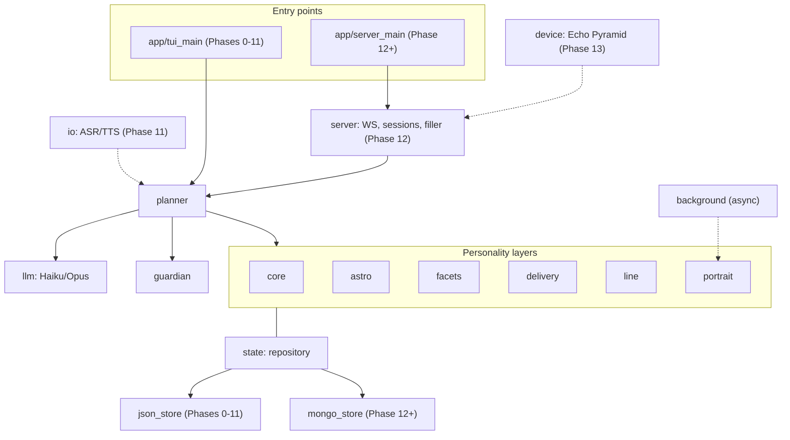
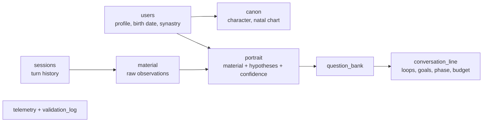
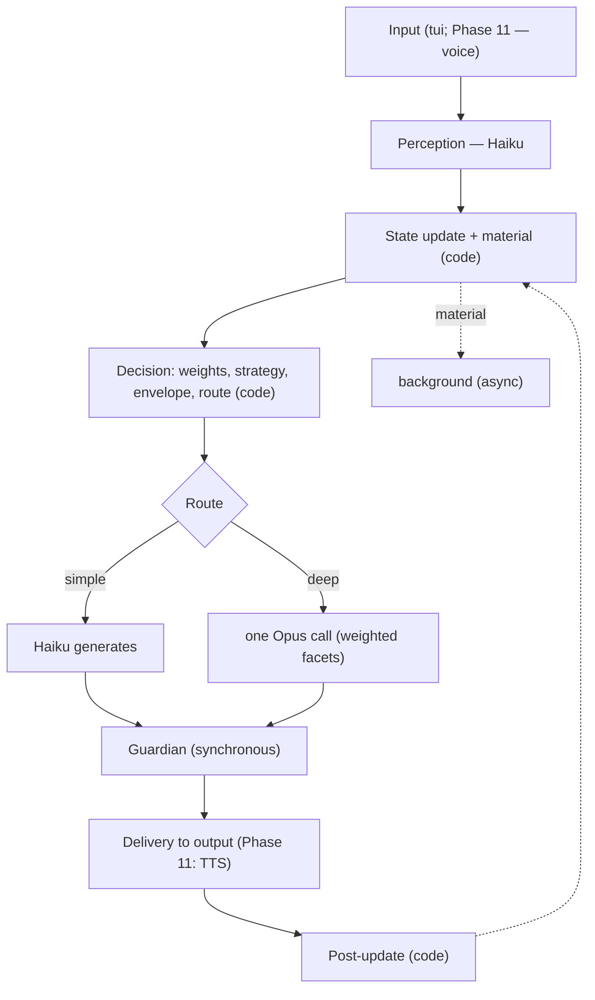
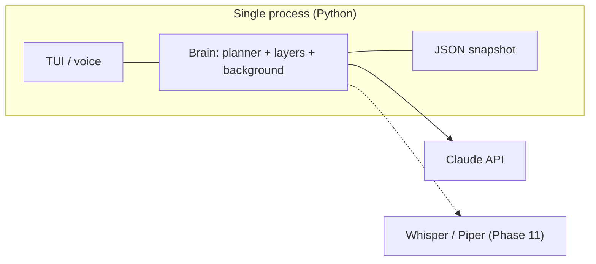
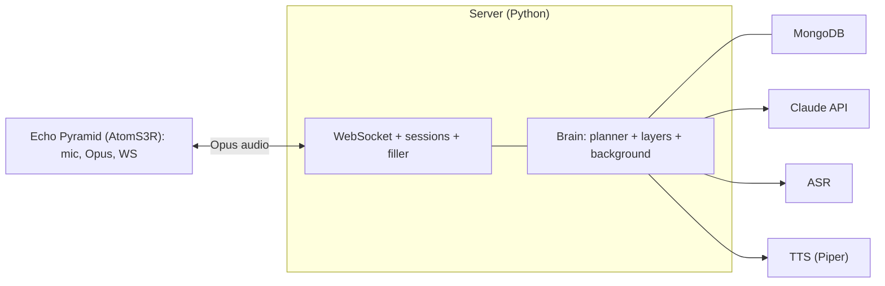

# Vani — Solution Architecture

Living-personality voice companion. Backend — Python. Version 0.1.
This is the "how it is built" document. The "what" is in the master specification (v1.8). The "when" is in the roadmap.

---

## 1. Overview

The solution grows from a monolithic local application into a client-server system with a device:

- **Phases 0-11:** a single Python process — a text TUI, then voice on the developer's machine. State is local JSON.
- **Phase 12:** a server backend (WebSocket) and MongoDB.
- **Phase 13:** the Echo Pyramid device as a terminal.

The brain (personality layers, planner, background pass, Guardian) is the same at every stage; only the transport and the storage change. All storage sits behind a thin repository, so JSON is swapped for Mongo without affecting the layers.

---

## 2. Solution Structure

```
voice_companion/
  app/
    tui_main.py        # entry point Phases 0-11 (local TUI)
    server_main.py     # entry point Phase 12+ (server)
  core/                # canon, hard invariants
  astro/               # natal, transits, synastry, dials, onboarding scoring
  planner/             # perception, policy, routing, dispatch, post-update
  facets/              # facet definitions, weight formula
  delivery/            # style profile, envelope, fluctuation
  line/                # loops, goals, phase, follow-ups, curiosity, question bank
  portrait/            # observational + interpretive layers, confidence
  background/          # async pass: validation, portrait, question generation
  guardian/            # synchronous safety gate
  llm/                 # Haiku/Opus clients, prompt assembly, caching
  state/
    repository.py      # state-access interface
    json_store.py      # implementation, Phases 0-11
    mongo_store.py     # implementation, Phase 12+
  io/                  # Phase 11: asr (Whisper), tts (Piper), barge-in
  server/              # Phase 12: FastAPI + WebSocket, sessions, protocol, filler
  device/              # Phase 13: Echo Pyramid integration (xiaozhi firmware, config)
  telemetry/           # metrics, validation log
  config/              # tuning knobs
  tui/                 # interface components
```

---

## 3. Module Map



Module responsibilities:

- **core** — the canon into a cached identity block; the invariants.
- **astro** — charts, temperament dials, candidate scoring at onboarding.
- **planner** — the executive function (Haiku perception, deterministic policy, routing, dispatch, post-update). Details in the specification, Section 9.
- **facets** — facets and weights (topic × temperament × canon).
- **delivery** — style profile, envelope, fluctuation (textual through Phase 11, prosodic from Phase 11).
- **line** — the conversation line and curiosity.
- **portrait** — two layers and confidence; the question bank.
- **background** — the async pass (validation + portrait + questions).
- **guardian** — the synchronous safety gate before speaking.
- **llm** — clients, prompt assembly, prefix caching.
- **state** — a repository with json (Phases 0-11) and mongo (Phase 12+) implementations.
- **io** — ASR/TTS (Phase 11).
- **server** — WebSocket, sessions, device protocol, filler (Phase 12).
- **device** — Echo Pyramid: firmware and config (Phase 13).
- **telemetry, config, tui** — cross-cutting.

---

## 4. State Model

The same logical documents at every stage; only the implementation behind the repository changes: JSON files (Phases 0-11) -> MongoDB collections (Phase 12+).



Documents: `canon` (stable character, no confidence), `users` (profile and birth date for synastry), `portrait` (two layers with confidence), `conversation_line`, `question_bank`, `material`, `sessions`, `telemetry`, `validation_log`. Fields are in the specification, Section 13. Every element (except the canon and invariants) carries confidence. The repository provides single-point access (store/read documents); no layer knows whether JSON or Mongo sits beneath it.

---

## 5. Execution Flows

### 5.1 A Turn in the Local Build (Phases 0-11)



Two LLM calls per turn (Haiku at the input, Opus at the output); the rest is code; the background does not block.

### 5.2 A Turn via Server and Device (Phases 12-13)

The same brain, a different transport: Atom catches the wake-word, encodes audio to Opus, and streams it over WebSocket to the server; the server runs the same pipeline; on a deep turn it emits a filler while Opus prepares the response; the result goes through TTS into Opus and back to Atom. State lives in Mongo.

---

## 6. Deployment

### 6.1 Local (Phases 0-11)



### 6.2 Client-Server with Device (Phases 12-13)



---

## 7. Concurrency

asyncio in a single process: the main turn loop (the fast path) and a background task (`background`) over a material queue; the background does not block the response and is triggered selectively. The Guardian is synchronous in the main loop. On the server (Phase 12), many sessions are served by the same brain.

---

## 8. Technology Stack by Stage

- **Phases 0-11:** Python; Textual (TUI); Anthropic SDK (Haiku/Opus); skyfield (astro); asyncio; local JSON; Whisper (ASR) and Piper-Ukrainian (TTS) from Phase 11.
- **Phase 12:** FastAPI + WebSocket; MongoDB.
- **Phase 13:** AtomS3R with xiaozhi firmware; the Opus codec; audio streaming.

---

## 9. Cross-Cutting Elements

The state repository (a single access point); confidence (an attribute of most state); the Guardian (a synchronous gate); telemetry (from early phases); configuration (tuning knobs). The canon and invariants are outside confidence.
