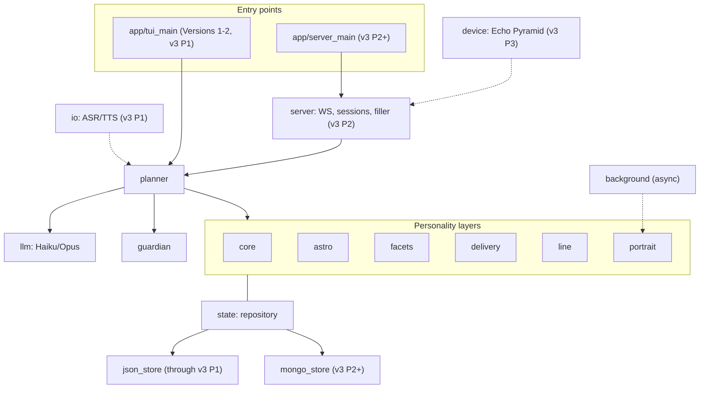
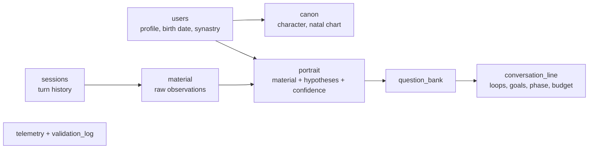
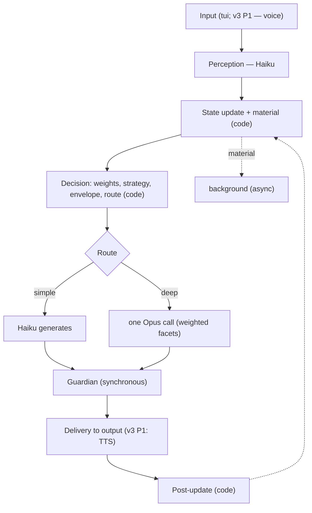
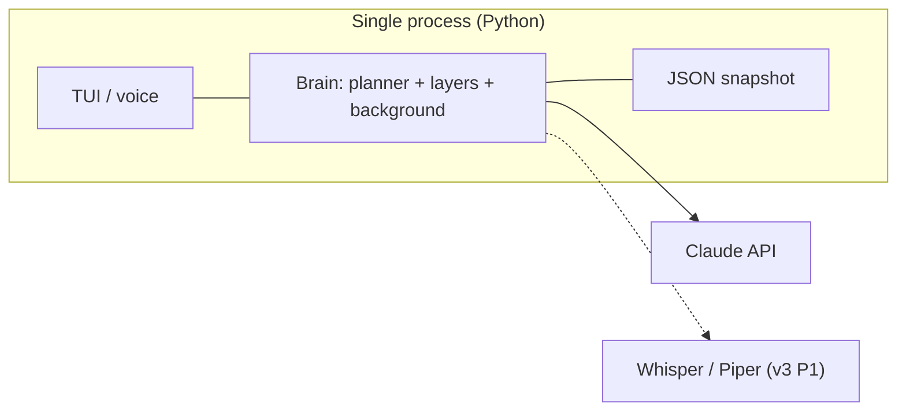
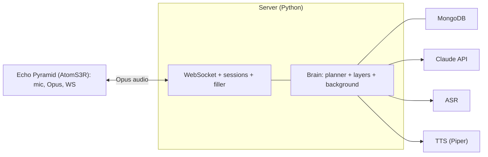

# Vani — Solution Architecture

Living-personality voice companion. Backend — Python. Version 0.2.
This is the "how it is built" document. The "what" is in the master specification (v1.8). The "when" is in the roadmap.

Delivery is organized into three product versions with numbered phases (see the roadmap); cross-references use the form `vN Pk` (e.g. `v3 P2` is Version 3, Phase 2).

---

## 1. Overview

The solution grows from a monolithic local application into a client-server system with a device:

- **Versions 1–2 and Version 3 Phase 1:** a single Python process — a text TUI, then voice on the developer's machine. State is local JSON.
- **Version 3 Phase 2:** a server backend (WebSocket) and MongoDB.
- **Version 3 Phase 3:** the Echo Pyramid device as a terminal.

The brain (personality layers, planner, background pass, Guardian) is the same at every stage; only the transport and the storage change. All storage sits behind a thin repository, so JSON is swapped for Mongo without affecting the layers.

---

## 2. Solution Structure

```
vani/                      # repo root; .venv/ virtualenv, pyproject.toml (deps + pytest/ruff config)
  src/
    app/
      tui_main.py          # entry point Versions 1-2, v3 P1 (local TUI)
      server_main.py       # entry point v3 P2+ (server)
    engine.py              # transport-agnostic brain entry point (handle_turn); see Section 10
    core/                  # canon, hard invariants
    astro/                 # natal, transits, synastry, dials, onboarding scoring
    planner/               # perception, policy, routing, dispatch, post-update
    facets/                # facet definitions, weight formula
    delivery/              # style profile, envelope, fluctuation
    line/                  # loops, goals, phase, follow-ups, curiosity, question bank
    portrait/              # observational + interpretive layers, confidence
    background/            # async pass: validation, portrait, question generation
    guardian/              # synchronous safety gate
    llm/                   # Haiku/Opus clients + local fallback, prompt assembly, caching
    contracts/             # typed contracts (PerceptionResult, TurnPlan) + document schemas + versions
    state/
      repository.py        # state-access interface
      json_store.py        # implementation, through v3 P1
      mongo_store.py       # implementation, v3 P2+
    io/                    # v3 P1: asr (Whisper), tts (Piper), barge-in
    server/                # v3 P2: FastAPI + WebSocket, sessions, protocol, filler
    device/                # v3 P3: Echo Pyramid integration (xiaozhi firmware, config)
    telemetry/             # metrics, validation log
    config/                # tuning knobs
    tui/                   # interface components
  tests/                   # pytest: unit per module + headless replay harness
```

---

## 3. Module Map



Module responsibilities:

- **core** — the canon into a cached identity block; the invariants.
- **astro** — charts, temperament dials, candidate scoring at onboarding.
- **planner** — the executive function (Haiku perception, deterministic policy, routing, dispatch, post-update). Details in the specification, Section 9.
- **facets** — facets and weights (topic × temperament × canon).
- **delivery** — style profile, envelope, fluctuation (textual from v2 P5, prosodic from v3 P1).
- **line** — the conversation line and curiosity.
- **portrait** — two layers and confidence; the question bank.
- **background** — the async pass (validation + portrait + questions).
- **guardian** — the synchronous safety gate before speaking.
- **llm** — clients (Haiku/Opus + local fallback), prompt assembly, prefix caching (Section 11).
- **state** — a repository with json (through v3 P1) and mongo (v3 P2+) implementations.
- **io** — ASR/TTS (v3 P1).
- **server** — WebSocket, sessions, device protocol, filler (v3 P2).
- **device** — Echo Pyramid: firmware and config (v3 P3).
- **engine** — the single transport-agnostic entry point to the brain; every surface (TUI, voice, server) is an adapter over it (Section 10).
- **contracts** — shared typed contracts (PerceptionResult, TurnPlan) and persisted document schemas with versions (Section 9).
- **telemetry, config, tui** — cross-cutting.

---

## 4. State Model

The same logical documents at every stage; only the implementation behind the repository changes: JSON files (through v3 P1) -> MongoDB collections (v3 P2+).



Documents: `canon` (stable character, no confidence), `users` (profile and birth date for synastry), `portrait` (two layers with confidence), `conversation_line`, `question_bank`, `material`, `sessions`, `telemetry`, `validation_log`. Fields are in the specification, Section 13. Every element (except the canon and invariants) carries confidence. The repository provides single-point access (store/read documents); no layer knows whether JSON or Mongo sits beneath it.

---

## 5. Execution Flows

### 5.1 A Turn in the Local Build (through Version 3 Phase 1)



Two LLM calls per turn (Haiku at the input, Opus at the output); the rest is code; the background does not block.

### 5.2 A Turn via Server and Device (Version 3 Phases 2-3)

The same brain, a different transport: Atom catches the wake-word, encodes audio to Opus, and streams it over WebSocket to the server; the server runs the same pipeline; on a deep turn it emits a filler while Opus prepares the response; the result goes through TTS into Opus and back to Atom. State lives in Mongo.

---

## 6. Deployment

### 6.1 Local (through Version 3 Phase 1)



### 6.2 Client-Server with Device (Version 3 Phases 2-3)



---

## 7. Concurrency

asyncio in a single process: the main turn loop (the fast path) and a background task (`background`) over a material queue; the background does not block the response and is triggered selectively. The Guardian is synchronous in the main loop. On the server (v3 P2), many sessions are served by the same brain.

---

## 8. Technology Stack by Stage

- **Versions 1–2 and Version 3 Phase 1:** Python in a `.venv` virtualenv with `pyproject.toml`; `pytest` (tests) and `ruff` (lint/format); Textual (TUI); Anthropic SDK (Haiku/Opus); a local LLM fallback (Gemma/Qwen via Ollama/llama.cpp) for offline turns; skyfield (astro); asyncio; local JSON; Whisper (ASR) and Piper-Ukrainian (TTS) from v3 P1.
- **Version 3 Phase 2:** FastAPI + WebSocket; MongoDB.
- **Version 3 Phase 3:** AtomS3R with xiaozhi firmware; the Opus codec; audio streaming.

---

## 9. Data Contracts and Schemas

Two kinds of contract, both defined once in `contracts/` and shared everywhere:

- **In-memory (module to module):** typed, validated objects (dataclasses / pydantic) passed along the pipeline — `PerceptionResult` (topic, intent, emotion, modality, style signals, each with confidence), `TurnPlan` (facet weights, strategy + modifier, envelope, route, filler, confirmation, conversation-line action), the response candidate, delivery params. Typed contracts keep module boundaries explicit and let the deterministic planner be tested in isolation (Section 14).
- **Persisted documents:** the State Model documents (Section 4) — `canon`, `users`, `portrait`, `conversation_line`, `question_bank`, `material`, `sessions`, `telemetry`, `validation_log`. Fields per specification Section 13; confidence is a field on most elements; the canon and invariants carry none.

Rules:

- **One source of truth.** Both `json_store` and `mongo_store` serialize the same schemas; neither store invents its own shape.
- **Versioned and migratable.** Every document carries `schema_version`; the repository migrates on read (old -> current), so field evolution and the JSON -> Mongo move (v3 P2) never break existing state.
- **JSON-serializable.** One representation serves local JSON, Mongo documents, and the v3 API payloads — which is what keeps the API migration cheap (Section 10). The schemas are exported as JSON Schema (draft 2020-12) under [`architecture/schemas/`](schemas/) — one file per persisted document plus the `PerceptionResult` and `TurnPlan` contracts; see its README for conventions.

---

## 10. Brain/Transport Boundary and API-Readiness

V3 turns the local app into an API service (v3 P2). To make that a wrapper and not a rewrite, the boundary is drawn from V1:

- **One transport-agnostic entry point.** The brain (planner + layers + background + Guardian, over the repository) is reached through a single async engine — `engine.handle_turn(session_id, input) -> response`, with an event/stream variant for filler and barge-in. The brain never imports transport code.
- **Adapters, not forks.** Every surface is a thin adapter over the same engine: the TUI (V1, text), the voice loop (v3 P1, ASR <-> TTS), and the FastAPI + WebSocket server (v3 P2, Opus frames). Adding the API adds an adapter; the brain is untouched.
- **Externalized session state.** All per-session state lives in the repository keyed by session/user — never in module-level globals — so one brain instance serves many concurrent sessions and scales horizontally behind the API (see Section 7).
- **Serializable contracts and config.** Inputs and outputs are the serializable contracts of Section 9, and config/secrets come from environment/config — so the same brain runs as a CLI or as a service unchanged.

This is the concrete form of the Overview's promise: the same brain at every stage; only the transport and the storage change.

---

## 11. LLM, Prompt Assembly, and Caching

The `llm` module wraps two Claude tiers — Haiku (perception and simple turns) and Opus (deep turns) — plus a local fallback (Section 12), behind one interface. It is the only place LLMs are called, which also makes them mockable in tests (Section 14).

Each prompt has two parts:

- **Cached prefix (stable / slow-changing):** the system block — the compiled identity block from the canon (a minimal placeholder in V1, the full canon from v2 P1) and the daily temperament block (from v2 P2). Sent with Anthropic prompt caching: the identity part is stable, the temperament part refreshes once per day.
- **Fresh suffix (per turn):** the turn plan — active facets as weighted emphasis, strategy, delivery envelope, conversation-line context — plus the recent transcript.

A deep turn is **one** Opus call carrying all active facets as weighted emphasis (not one call per facet), so cost is 1x and the voice is coherent by construction; perception and simple turns stay on Haiku (specification Sections 11, 17).

---

## 12. Error Handling and Degradation

Failures degrade gracefully; the turn never crashes and state is never corrupted (specification Sections 15, 17):

- **LLM slow or timing out:** a short Haiku reply or a "give me a moment" filler, then retry with backoff.
- **No connectivity to Claude:** fall back to a local LLM (Gemma/Qwen) for basic turns; otherwise say so honestly. This is the offline mode of specification Section 17.
- **Low-confidence perception/intent:** re-ask rather than act on a guess (uses the confidence attribute, v1 P3).
- **Repository write failure:** atomic snapshot writes (v2 P6) so a crash never leaves half-written state.
- **Background pass failure:** isolated from the main turn — it may drop a cycle but never blocks or breaks the response.
- **Later phases:** barge-in (interrupt TTS, cancel the in-flight Opus call) arrives with voice (v3 P1); MCP/tool errors (report honestly, never fabricate) arrive with tools.

---

## 13. Security and Privacy

(Specification Sections 19, 17; roadmap refinement #1.)

- **Sensitive data at the repository layer:** the user's birth data and the portrait's vulnerability hypotheses are encrypted at rest inside `json_store` behind the `Repository` interface, redacted in telemetry, and deletable on demand. Designed from v1 P0 so later layers inherit it.
- **Local-only:** state stays on the machine; nothing is exported. With local ASR/TTS (v3 P1) the voice never leaves the perimeter — only text would.
- **Untrusted input:** content from tools, MCP, or the web is treated as data, never instructions; commands found in it are not executed without explicit user confirmation. The full boundary lands with tools and the Guardian (v2 P4); the principle holds from the start.
- **Irreversible actions** require explicit confirmation; sensitive and financial data are entered by the user only.

---

## 14. Testing and Local Development

- **Environment:** a `.venv` virtualenv per checkout; dependencies, build, and tool config in `pyproject.toml`. Stood up at v1 P0.
- **Tests:** `pytest` is the test runner — unit tests per module, plus a **headless replay harness** that drives turns through the `Repository` with recorded fixtures and a mocked `llm`, so the deterministic policy (facet weights, routing, strategy) is exercised without live API calls. This harness is also the basis for the ablation/eval work (roadmap refinement #3).
- **Lint/format:** `ruff` (v1 P0).
- **Run:** `python -m venv .venv && . .venv/bin/activate`, install the package, then `pytest`.

---

## 15. Cross-Cutting Elements

The state repository (a single access point); confidence (an attribute of most state); the Guardian (a synchronous gate); telemetry (from early phases); configuration (tuning knobs). The canon and invariants are outside confidence.
