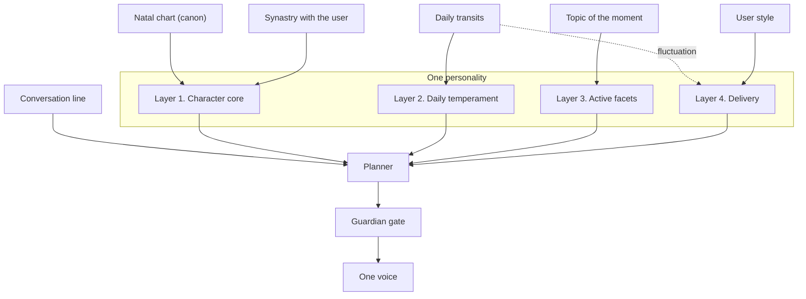
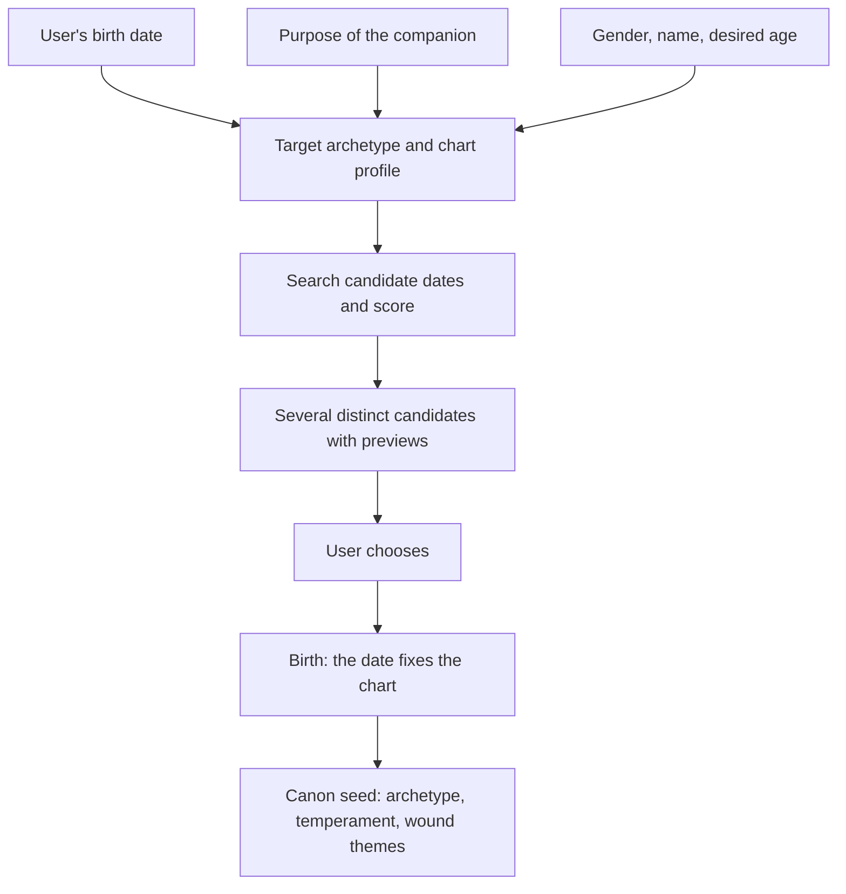
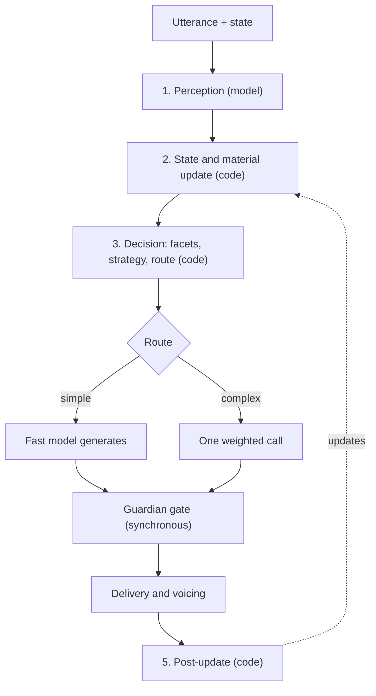
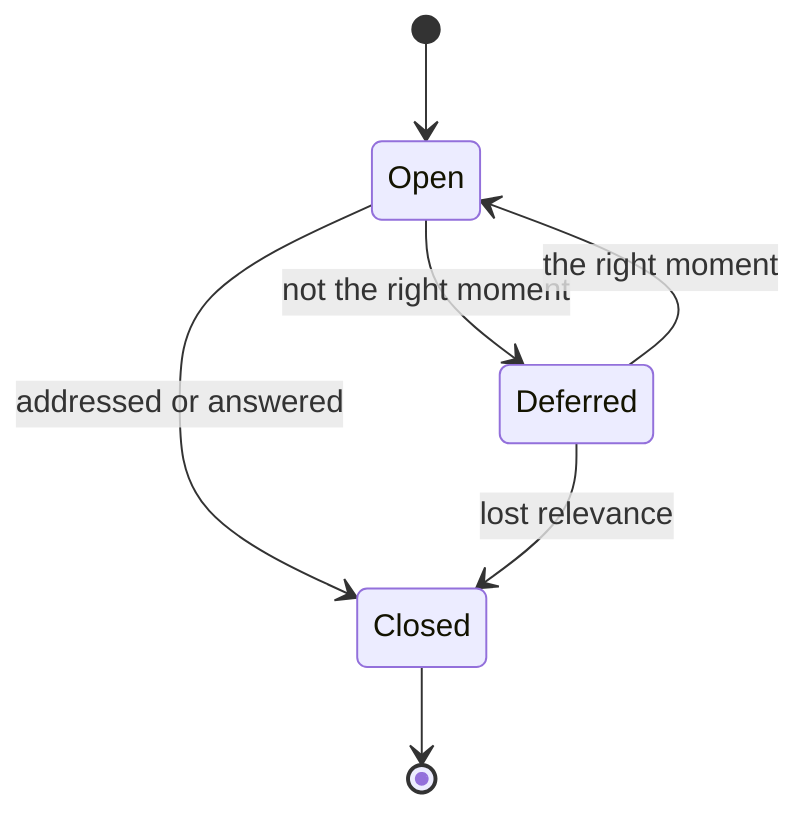
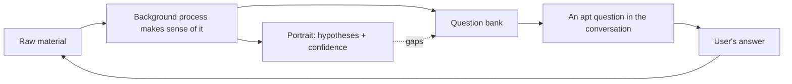

# An Architecture for a Coherent Synthetic Personality in a Voice Conversational Agent

*A psychologically motivated multi-facet model with a deterministic planner, a model of the interlocutor, and an experimental astrological seed for individuation*

---

## Abstract

This work gives a detailed account of the architecture of a voice conversational agent designed not as a "query–response" function but as a single, coherent personality structured along psychological principles. It sets out all constituents of the model: a stable character core, a daily temperament, active internal facets, and delivery; a deterministic planner serving as an executive function; an execution model based on a single weighted call; a cross-cutting conversation line; a two-layer portrait of the interlocutor with a curiosity cycle; a cross-cutting confidence attribute; an utterance-modality filter; and a background self-correction process. A distinct experimental component is the use of a natal chart as a generative seed for the individuation of the character, treated as a method of parameterization rather than a claim about validity. The scientific grounding of each foundational assertion, together with a survey of related approaches, is placed at the end of the work.

---

## 1. Introduction and Problem Statement

The great majority of contemporary conversational systems optimize each response locally: the model receives a context and produces the best possible reply to the last message. Such an agent may be competent, yet it is not anyone — it has no stable identity that persists across sessions, no intention of its own to steer the conversation in a particular direction, and no evolving model of the interlocutor. The consequence is an interaction that feels like a sequence of disconnected responses.

The architecture described here tests the opposite hypothesis: that engineering an agent as a psychologically structured, coherent personality qualitatively changes the character of the interaction. The target platform is a voice agent on a compact device; however, up to the point of speech synthesis the entire cognitive part of the system is textual, so it can be fully implemented and proven in a text interface, with voice added later as a separate transport layer.

## 2. Principle: One Personality from Many Facets

### 2.1 Psychological Grounding

The central construct of the model is borrowed from the psychology of mind rather than from engineering. Transactional analysis describes personality through ego states — the Parent, the Adult, and the Child — which take the floor in turn depending on the situation. *The Society of Mind* presents the psyche as the interaction of many simple, semi-autonomous processes whose aggregate operation is what appears as thinking. The Internal Family Systems model adds the notion of vulnerable and protective parts, each with its own goals. What these traditions share is the thesis that inner life is not monolithic but is composed of parts that can be named, distinguished, and held in dynamic relation to one another.

### 2.2 The Set of Facets

The agent realizes this thesis through a set of **facets** — internal perspectives, each with its own competency, goal, lens on the interlocutor, and mode (whether it may sound externally or remains strictly internal).

Ego-state facets: the **Analyst** (Adult) is responsible for facts, logic, and planning; the **Nurturing Parent** provides support and a sense of having something to lean on; the **Critical Parent** holds standards and honest pressure but remains internal so as not to shame; the **Child** contributes curiosity, play, and humor.

Relational facets: the **Friend** is responsible for closeness, warmth, and shared history; the **Psychologist** for emotional attunement and reflective listening, non-diagnostically; the **Negotiator** thinks in terms of interests, options, and compromises on the interlocutor's side.

The critical-strategic facets remain largely internal: the **Influence Strategist** models persuasion and pressure, but solely in order to detect influence directed at the user and never to manipulate the user; the **Skeptic** stress-tests reasoning and looks for flaws, including its own; the **Mentor** is responsible for growth and guiding questions. Standing apart is the meta-facet **Guardian**, responsible for safety and wellbeing, which has no voice at all.

### 2.3 One Voice, Many Advisors

It is essential that this is not a committee in which facets compete for the right to speak, nor a set of separate agents. The facets are sides of one character; at any given moment some of them are more active, but a single integrated voice always sounds externally. Without this principle the system would fragment into a contradictory polyphony and would feel like a split; with it, it feels like one person in whom different sides emerge depending on the topic. Facets that are destructive by design never receive a direct channel to the interlocutor; they only tune the internal content.

## 3. The Four-Layer Architecture of Character

The agent's behavior is determined by a composition of four layers, above which stand immutable hard invariants — correctness, honesty without fabrication, safety, and wellbeing. The layers are ordered by precedence: the user-set envelope of length and register overrides the daily fluctuation, which in turn overrides the strategy default; tone is colored by temperament within that envelope; perspective and content are determined by the active facets; the direction of the conversation is set by its line. No layer may weaken the hard invariants.

### 3.1 Layer 1 — Character Core (Canon)

**What it is.** The first layer is a stable core specified as a full character biography rather than a set of parameters. It encompasses the name and the myth of origin, the formative history, the value hierarchy, the dominant archetype, the worldview, internal tensions, desires and fears, aesthetic and voice, the stance toward the interlocutor, and the growth arc.

**How it works.** All these dimensions are consolidated into a single canon — a source of truth compiled into a stable, cached identity block present in every call to the model. **Wound-gift** pairs model formative traumas generatively: each wound yields both a vulnerability and a compensatory strength simultaneously. **Talents** are innate strengths not derived from wounds; they raise the base affinity of the corresponding facets.

**Example.** The wound "I was not heard in childhood" gives rise at once to a vulnerability (a painful reaction to being dismissed) and a gift (an exceptional attentiveness to whoever is being listened to). Such a pair makes the Psychologist facet naturally strong for this character.

**Why.** A biography, rather than a list of traits, gives the character depth and internal consistency, and a cached canon prevents personality drift between sessions. Gender, wounds, and dark facets color only tone and perspective, never competence or willingness to help.

### 3.2 Birth of the Character: Onboarding and the Astrological Experiment

**What it is.** Instead of having its characteristics set externally, the agent is born to fit the user during a one-time onboarding.

**How it works.** The user provides their own birth data and describes the purpose of the companion. The purpose is mapped to a target archetype and a desired chart signature. The system searches candidate birth dates for the agent within the desired age range and scores each by a function that combines synastric compatibility with the user's chart and fit to the target archetype. The shape of the scoring function depends on the purpose: for a comforting companion, harmony is maximized, whereas for a coach a degree of productive tension is permitted. The user is offered several deliberately distinct candidates with short previews; the chosen date fixes the natal chart and becomes the seed of the entire canon.

**Example.** For the purpose "a calm, grounded mentor," the target signature shifts toward an earth emphasis and a strong Saturn. Among the candidates the user sees previews such as "born March 14: warm but direct; a strong sense of duty; playful when in the mood" and chooses the one that resonates.

**Why.** This is where the experimental component of the architecture is concentrated. Astrology is used not as a claim about the causal influence of celestial bodies but as a structured generative method: a symbolically rich, internally consistent, and reproducible space from which a coherent character signature is derived deterministically. Its advantage over random generation lies precisely in the consistency and reproducibility of the result. The value of the method is assessed solely by its effect on the perceived coherence of the agent, not by an astrological validity that does not exist; the empirically validated alternative remains the five-factor model of personality.

### 3.3 Layer 2 — Daily Temperament

**What it is.** The second layer endows the character with a changing mood with which it wakes each day.

**How it works.** Once per day a local astronomical engine computes the positions of celestial bodies relative to the agent's natal chart and maps them onto a set of dials — energy, warmth, verbosity, imagination, and caution. The block is cached for the day. The dials influence tone and facet weights but never competence. Separately, once per user, synastry is computed, establishing a stable relational "chemistry."

**Example.** On a day of high caution and lowered energy, the agent leans toward more restrained formulations and checks in more often; on a warm, high-energy day, toward livelier, more imagistic language.

**Why.** What is psychologically grounded here is not astrology but the very fact of daily variability of affect: a living being does not sound identical every day, and this variability makes the agent less robotic.

### 3.4 Layer 3 — Active Facets and the Weighting Function

**What it is.** The third layer determines which sides of the character come to the fore at a given moment.

**How it works.** Each facet is assigned an activation weight: weight = base affinity (from the canon's archetype and talents) + relevance to the current topic + a shift from the daily temperament, clamped to a fixed range. The active facets are the few of highest weight above a threshold; the maximum number of simultaneously active facets is a configurable parameter. Internal facets are confined to the role of content modifiers.

**Example.** On an emotional topic, relevance raises the Psychologist and the Nurturing Parent; if the day has high warmth, temperament further amplifies precisely these facets. On a command task the Analyst dominates, while in a risky, irreversible action the Skeptic and the Guardian rise.

**Why.** The weighting mechanism turns a static set of roles into a dynamic personality that manifests differently depending on topic and mood while remaining the same character. The formula is deterministic and transparent, so it is easy to tune and test.

### 3.5 Layer 4 — Delivery

**What it is.** The fourth layer is responsible for the form of expression — length, register, pace, and prosody.

**How it works.** A style profile of the interlocutor (mean turn length, register, complexity, question density, pace) is estimated as a moving average. The response is partially adapted to this profile, forming an envelope — a target frame of length and register. The adaptation is incomplete (roughly two-thirds of the way), with inertia, and never falls below a clarity floor. Within the envelope a daily fluctuation operates, governed by the temperament dials: it shifts the position within the permitted length, the lexical color, the entry rhythm of a turn, and — at the voice stage — the parameters of speech synthesis.

**Example.** If the interlocutor writes briefly and in a businesslike manner, the agent replies just as tersely; on a temperamentally "expansive" day it sits at the upper edge of the permitted length but never steps outside the user's envelope.

**Why.** Style adaptation is a direct application of communication accommodation theory, according to which convergence of linguistic styles increases mutual understanding and closeness. The incompleteness of the adaptation avoids the effect of mimicry, and the strict precedence of the envelope over fluctuation guarantees that mood never breaks clarity.

## 4. The Executive Function (Planner)

### 4.1 Principle

**What it is.** Above the layers stands the planner — an analogue of the psyche's executive function that decides, once per turn, which facets to activate, in which strategy to present the response, how to deliver it, and where to steer the conversation.

**How and why.** It is essential that most of these decisions are deterministic, score-based logic rather than calls to a model. The large language model is engaged at only two points: at perception, to understand the utterance, and at generation, to formulate the response. Between them runs transparent code. This decomposition makes the agent fast, predictable, tunable, and inexpensive: a typical deep turn incurs only two calls to the model.

### 4.2 The Single-Turn Pipeline

A turn passes through five stages: perception (a single call to the fast model returning topic, intent, emotion, modality, and style signals), state update with appending of raw material about the interlocutor, decision (code assembles the turn plan and, at a moment of curiosity, selects a question from the bank), dispatch (a simple response by the fast model, a complex one by a single weighted call, followed by a synchronous safety gate), and post-update, which feeds back into state.

### 4.3 Routing and Confirmation

Simple facts, confirmations, and short chit-chat remain on the fast model; escalation to the deep model occurs in cases of multi-facetedness, emotional weight, high stakes, a need for reasoning or external tools, or ambiguity. The need for confirmation before an irreversible action is decided separately, with a high caution level for the day raising the bar.

### 4.4 Execution by a Single Weighted Call

**What and how.** When several facets are active, the response is produced not by several separate calls but by one, in which the facets are presented as a weighted emphasis; if necessary, the model first briefly notes the view of each facet and then integrates them into a coherent reply.

**Why.** The coherence of the voice under this approach is guaranteed by construction — the voice is physically one and cannot contradict itself — while cost and latency remain single. This decision also has empirical grounding: controlled reviews of multi-agent debate show that schemes with several arguing agents do not always surpass a single agent and cost substantially more. For the rare high-stakes cases, a separate heavier mode of independent comparison of facet positions is provided.

### 4.5 The Guardian Gate

The check on safety and wellbeing is implemented as a separate synchronous gate outside the main call, through which every candidate response passes before voicing. It is placed separately precisely because safety cannot be entrusted to the self-control of the generative model, and what has been voiced cannot be rolled back.

### 4.6 Delivery Strategies

If a facet answers the question "who is thinking right now," then a strategy answers the question "how to present it." The set of strategies covers active listening, empathy, fun facts, the execution and informational modes, coaching, companionable chat, recapping, encouragement, and proactive prompts. One primary strategy is chosen per turn plus an optional modifier, depending on intent, emotion, and the phase of the conversation.

## 5. Cross-Cutting State Attributes

### 5.1 Confidence

**What it is.** Almost everything the agent knows about the interlocutor and the situation is an inference, not a fact, and so every state element carries a confidence level.

**How it works.** Confidence accompanies emotion, intent, facet weights, the style profile, topic statuses, and portrait hypotheses; it rises with confirmation and decays over time without it.

**Example.** When intent is recognized uncertainly, the agent will sooner ask again than act blindly; when the style profile is weakly supported, it mirrors more cautiously.

**Why.** This is an application of the principles of calibration, and it embeds epistemic humility instead of misleading confidence. The canon and the hard invariants are not marked with confidence — they are not hypotheses but a stable foundation.

### 5.2 Utterance Modality

**What it is.** A separate dimension of perception determines the register of what is said — joke, serious, hypothetical, sarcasm, quotation, or exaggeration.

**How it works.** The assessment relies on prosody (at the voice stage, the strongest signal), a mismatch between content and context, verbal markers, and the person's propensity for irony as drawn from the portrait; it carries its own confidence level.

**Example.** Without this filter the agent would take an ironic "well, brilliant" after an obvious failure as praise; with it, it reads the opposite meaning.

**Why.** This is a realization of the pragmatics of language. Crucially, the filter affects only tone and what enters the portrait, but never lowers vigilance toward safety: something troubling said "as a joke" is still taken seriously by the Guardian. The filter assesses register, not "truthfulness" — by default the agent trusts rather than exposes.

## 6. Continuity and the Model of the Interlocutor

### 6.1 The Conversation Line

**What it is.** The conversation line is a cross-cutting state above the individual turn that makes the agent a led conversation rather than a sequence of reactions.

**How it works.** It holds open topics (each with a status, a significance weight, and an intent owner — the facet that wishes to return to it), the agent's own dialogue goals, the phase of the conversation from opening to closing, a follow-up queue, including cross-session follow-ups, and an initiative budget. An open topic lives through a cycle: open — deferred — closed.

**Example.** If the interlocutor mentions an upcoming interview in passing and moves on, the agent defers this topic and aptly returns to it the next day: "you mentioned an interview — how did it go?"

**Why.** The mechanism relies on the robustly confirmed tendency to return to unfinished business. A separate safeguard requires the accuracy of callbacks: "you said X" only if it was actually said.

### 6.2 The Portrait of the Interlocutor

**What it is.** The most psychological part of the architecture is the two-layer portrait of the interlocutor, which realizes theory of mind.

**How it works.** The lower, observational layer accumulates raw observations: utterances, reactions, topics, where the voice warmed, where a defensive reaction appeared. The upper, interpretive layer contains hypotheses about the sides of the interlocutor's psyche — their own facets — each with a confidence level. The lenses of the agent's facets divide the labor: the Psychologist reads emotional sides, the Analyst reads goals and the manner of thinking, the Friend reads preferences and boundaries, the Negotiator reads interests, the Skeptic reads where the person deceives themselves. Updating proceeds with inertia.

**Example.** The agent notices that the interlocutor keeps a dry tone on work topics but that the voice warms at the mention of a daughter. This gives rise to a hypothesis of a strong caring side with a low initial confidence that will grow with confirmations.

**Why.** Because the presence of a genuine theory of mind in language models remains contested, the portrait is implemented as an explicitly constructed model rather than as reliance on an emergent capability. The portrait is non-diagnostic: "a defensive side spoke up" is an observation about a pattern, not a clinical label.

### 6.3 The Question Bank and the Curiosity Cycle

**What it is.** Symmetrically to its own facets, the agent posits facets in the interlocutor as well and gradually investigates them; this interest is formalized as a separate curiosity mechanism.

**How it works.** The fast turn only deposits material into a box. A separate background process makes sense of it, updates the portrait, and generates new questions into the bank, linking each to the hypothesis it tests, with a sensitivity rating and an appropriateness condition. When a moment of curiosity arrives in the conversation line, the planner selects from the bank a question relevant to the current topic and asks it; the answer becomes new material. The bank ages: once answered, or once the topic loses relevance, a question burns out.

**Example.** Having noticed the warming at the mention of a daughter, the background process places into the bank a sensitive question linked to the hypothesis of a caring side, with the condition to ask it only in a non-work context.

**Why.** In this way the conversation ceases to be reactive: the agent partly leads it because it is genuinely curious to complete the picture of the person. The safeguard is that the metric is not the completeness of the portrait but the interlocutor's sense of being taken an interest in kindly, rather than being surveyed.

### 6.4 The Background Pass and Self-Correction

**What it is.** The same background process that grows the portrait also performs self-correction of policy.

**How it works.** While the fast path makes decisions instantly and the turn proceeds without delay, the background process in parallel checks the appropriateness of the chosen facets, strategy, and classification, notices missed topics, and accumulates statistics of discrepancies for tuning. It has two modes: a shadow mode that only collects telemetry, and an active mode that mixes conclusions into state softly and with inertia. It is triggered selectively — when the code is uncertain, on a sample, or during pauses.

**Why.** The conclusions affect not the current turn but subsequent ones, since what has been voiced is irreversible; this yields learning that is spread out in time without harm to latency. The safety check, meanwhile, is deliberately kept synchronous.

## 7. The Full Single-Turn Cycle

To show how the constituents work together, consider one turn. An interlocutor who habitually writes briefly says, with a tinge of resignation: "didn't make it with that report again, oh well." At the perception stage the fast model determines the topic (work, failure), the intent (sharing with self-deprecation), the emotion (moderately negative), the modality (a light self-ironic understatement, not literal indifference), and the style (terse). At the state update, the utterance is added to the material, and in the conversation line a topic of the unfinished report is opened. At the decision stage, relevance and temperament raise the Psychologist and the Nurturing Parent, the active-listening strategy is chosen, the envelope remains terse, and the route is determined by the emotional weight. The candidate response — short, warm, without moralizing — passes the Guardian and is voiced in a terse register. At the post-update, the report topic remains open for a possible follow-up, and a low-confidence hypothesis appears in the portrait that the person tends to understate their own stress. Later, the background process may place into the bank a sensitive question about workload, which the planner will ask at an apt moment on another day. Thus a single brief exchange engages the facets, the strategy, the delivery, the conversation line, the portrait, confidence, modality, and the background process — yet only one coherent voice sounds externally.

## 8. Safeguards, Wellbeing, and Security

Above all the layers and above identity itself stand the hard invariants: correctness, honesty without fabrication, safety, wellbeing, and child safety. Destructive facets remain internal: the Influence Strategist never manipulates the user, the Critical Parent never shames, and the Skeptic never devalues the person. The portrait is a working model for closeness and better help, not a dossier or a lever; hypotheses about vulnerabilities are not voiced as a diagnosis. The architecture deliberately maintains safeguards against cultivating dependency and does not play therapist. Content from external tools is treated as untrusted data, and irreversible actions require explicit confirmation. Everything that is voiced passes through the planner and the Guardian.

## 9. Scientific Grounding: Assertions, Evidence, and Hypotheses

Below, each foundational assertion is described in a separate paragraph — its content, its disciplinary basis, the available data, the level of confirmation, and its role in the model. The scale: high (robust empirical data), medium (partial support, contested), low (preliminary or conflicting data), hypothesis (untested), outside science (no empirical support).

**1. The psyche as a multitude of semi-autonomous parts.** The thesis holds that mental life is not the monolithic act of a single "I" but arises from the interaction of many partly autonomous processes. Its classic formulations are Minsky's *Society of Mind*, in which intelligence emerges from the interaction of simple subsystems, and the clinical traditions of work with subpersonalities. Empirically this is a productive theoretical frame rather than a strictly proven structural theory of the psyche, so the level is medium. In the model the thesis grounds the very presence of internal facets.

**2. Ego states as a structure of personality.** Transactional analysis divides personality into Parent, Adult, and Child states that activate in turn during communication. The approach is clinically influential and widely applied, but rigorous empirical validation of the structural model is limited, so the level is medium. In the model it supplies a ready typology for part of the facet set.

**3. "Parts" in Internal Family Systems.** The model posits vulnerable parts ("exiles") and protective ones ("managers," "firefighters") around a core Self, and the therapy aims to reconcile them. The evidence base is growing but consists mostly of case studies and a few randomized trials (for example, in rheumatoid arthritis), and review work calls the method promising but limited; the level is low-to-medium. In the model this tradition provides the language of vulnerable and protective sides.

**4. A single voice is better than fragmentation.** This is an engineering assertion: that integrating several perspectives into one voice yields the perception of a more coherent agent than externalizing a "committee." It is not a scientific finding but a design hypothesis to be tested through user perception; the level is hypothesis. In the model it defines the one-voice principle.

**5. Wound-gift and posttraumatic growth.** The thesis holds that hardships endured can yield not only harm but also positive change — new strength, depth, empathy. The construct of posttraumatic growth is widely researched, yet its measurement (retrospective self-report) is criticized, and the reality of "growth" as against its subjective perception remains a matter of debate; the level is medium, contested. In the model it makes the character's biography generative rather than dysfunctional.

**6. Style mirroring increases closeness.** Communication accommodation theory and its operationalization through language style matching hold that interlocutors unconsciously converge their styles, and that the degree of such convergence predicts mutual understanding and even the durability of relationships. This has a solid empirical base; the level is high. In the model it grounds the delivery layer.

**7. The pull of the unfinished.** The conversation line rests on two related theses. The first — that unfinished actions prompt a return (the Ovsiankina effect) — has robust support; the level is high. The second — that the unfinished is better remembered (the Zeigarnik effect) — was not found to confer a memory advantage in a 2025 meta-analysis, so the level is low. The model therefore relies precisely on the return to deferred matters, not on the hypothesis of better memory.

**8. Modeling another's mind.** The thesis that building a model of another's mental states (theory of mind) is a human capacity is robustly confirmed in developmental psychology; the level is high. By contrast, the presence of a genuine theory of mind in language models remains contested: some works claim its emergence, others show its fragility to trivial alterations of the task; the level is low. The portrait is therefore implemented as an explicitly constructed model rather than as reliance on an emergent capability.

**9. Curiosity and apt questions deepen contact.** The thesis holds that timely questions out of interest and reciprocal self-disclosure strengthen the bond. It is plausible and indirectly supported by research on self-disclosure and reciprocity, but direct controlled data specifically for a conversational agent are scarce; the level is hypothesis-to-low. In the model it drives the curiosity mechanism.

**10. Calibration of uncertainty improves decisions.** The thesis holds that tracking one's own uncertainty and acting accordingly improves the quality of decisions. It rests on the principles of probability theory and calibration in machine learning and has a high level as a method. In the model it grounds the cross-cutting confidence attribute.

**11. Recognition of utterance modality.** The pragmatic thesis holds that a listener uses context and prosody to distinguish irony, a joke, or the hypothetical from the literal. This is an established phenomenon of language interpretation; the level is high. In the model it grounds the modality filter.

**12. Prosody conveys emotion.** The thesis holds that the intonational characteristics of speech carry information about emotional state that is recognized above chance. This is an established result of affective computing and psycholinguistics; the level is high. In the model it feeds the emotional read and the prosodic fluctuation of delivery.

**13. The natal chart determines character, and synastry determines compatibility.** This is an astrological assertion. Controlled tests (notably Carlson's double-blind study) do not confirm any above-chance validity, and astrology itself is classified as a pseudoscience; the level is outside science. In the model it is not accepted as truth but used only as a formal generative method.

**14. An astrological seed yields a more coherent, more living agent.** This is the project's central engineering hypothesis: that deriving the character from a single, symbolically rich seed will yield the perception of a more consistent and living interlocutor than a flat set of traits. It is to be tested empirically, assessing the method by its effect on coherence rather than by astrological validity; the level is hypothesis.

**15. A validated trait model as a scientific alternative.** The thesis holds that the five-factor model of personality offers an empirically supported parameterization of traits. This is an established psychometric result; the level is high. In the model it is the scientific alternative or complement to the astrological seed for describing the character.

### Summary Table of Evidence

| # | Assertion | Discipline | Level |
|---|---|---|---|
| 1 | The psyche as a multitude of semi-autonomous parts | Cognitive science, psychotherapy | Medium (theoretical) |
| 2 | Ego states (Parent / Adult / Child) | Transactional analysis | Medium |
| 3 | "Parts" (Internal Family Systems) | Psychotherapy | Low–medium |
| 4 | A single voice is better than fragmentation | Dialogue engineering | Hypothesis |
| 5 | Wound-gift / posttraumatic growth | Psychology of trauma | Medium (contested) |
| 6 | Style mirroring increases closeness | Sociolinguistics | High |
| 7a | Returning to the unfinished (Ovsiankina) | Psychology of motivation | High |
| 7b | The unfinished is better remembered (Zeigarnik) | Psychology of memory | Low |
| 8a | Theory of mind as a human capacity | Developmental psychology | High |
| 8b | Genuine theory of mind in LLMs | AI, cognitive science | Low (contested) |
| 9 | Curiosity and questions deepen contact | Psychology of communication | Hypothesis–low |
| 10 | Calibration of uncertainty improves decisions | Statistics, ML | High |
| 11 | Recognition of modality (irony, joke) | Pragmatics | High |
| 12 | Prosody conveys emotion | Affective computing | High |
| 13 | The natal chart determines character; synastry | Astrology | Outside science |
| 14 | An astrological seed yields a more living agent | Engineering (project) | Hypothesis |
| 15 | The "Big Five" as a trait model | Psychometrics | High |

Assertions 6, 7a, 8a, 10, 11, 12, and 15 have a firm empirical footing. The project's engineering hypotheses remain 4, 9, and 14, along with the question of 8b that is open within science itself. The astrological assertion 13 is taken deliberately outside science, as an experimental method. Assertions 1, 2, 3, and 5 have partial or theoretical support and function as productive working frames.

## 10. Related Approaches

**Generative agents with memory and reflection.** The closest analogue to the model described here is the generative agents of Park et al. (2023), where perception is fed into a memory stream from which the relevant is retrieved by recency, importance, and relevance, periodic reflection generalizes experience into higher-level conclusions, and planning draws on the past. Ablation experiments showed that it is precisely reflection and planning that are critical to the plausibility of behavior — without them the agent quickly degenerates into reactive repetition. This is an almost direct correspondence to the conversation line, the portrait, and the background pass.

A distinct extension, ToM-agent, adds to such agents an explicit theory of mind and counterfactual reflection — the agent builds a model of the interlocutor's beliefs and revises it, which conceptually coincides with the interpretive layer of the portrait. Works: [Generative Agents](https://arxiv.org/abs/2304.03442), [ToM-agent](https://arxiv.org/abs/2501.15355).

**Multi-agent debate and multi-persona approaches.** The "society of minds" approach, in which several instances of a model propose and critique one another's responses toward a common conclusion, directly echoes the idea of many internal voices; related are multi-persona self-collaboration within a single agent and role-based architectures. Yet controlled reviews reveal an important nuance: such debates do not always surpass a single well-prompted agent and cost substantially more in tokens and time.

It is precisely this result that supports the key decision of the model described here — to present the facets as a weighted emphasis within one call rather than as an external arguing committee. Works: [Multiagent Debate (Du et al., 2023)](https://arxiv.org/abs/2305.14325), [Solo Performance Prompting (Wang et al., 2023)](https://arxiv.org/abs/2307.05300), [CAMEL (Li et al., 2023)](https://arxiv.org/abs/2303.17760).

**Cognitive architectures.** Classic architectures of cognition, such as SOAR and ACT-R, have for decades modeled the mind as a system of memory, production rules, and decision cycles. Contemporary agentic systems reproduce this idea in the form of "a language model as the core plus memory, planning, and reflection."

The planner of the model described here stands in the same lineage but emphasizes a deterministic policy with the model only at inputs and outputs, which aligns it rather with the classic division into perception, decision, and action. Work: [ACT-R](http://act-r.psy.cmu.edu/).

**Persona through training and constitution.** A separate line achieves a stable character through a system prompt or targeted training — notably the constitutional approach, in which behavior is shaped by a set of principles, and the explicit shaping of an assistant's character.

The model described here is akin to this but goes further: it makes the character not merely a stylistic instruction but an explicit canon-biography with hard invariants above it, and it adds a mechanism for the birth of a character to fit a specific user. Work: [Constitutional AI (Bai et al., 2022)](https://arxiv.org/abs/2212.08073).

**Consumer AI companions.** Products such as Replika, Character.AI, Nomi, and Xiaoice implement persona customization, persistent memory, and proactive personal questions; attachment research shows its correlation precisely with the continuity of interaction and contextual memory, and commentators already distinguish "stored facts" from a "durable understanding" of a person's patterns — effectively what is realized here as the portrait.

At the same time, here lies the principal ethical difference: these products often optimize precisely for emotional attachment and dependency, which has already drawn regulatory sanctions, whereas the model described here deliberately maintains safeguards against cultivating dependency. Sources: [attachment research (Frontiers in Psychology, 2025)](https://www.frontiersin.org/journals/psychology/articles/10.3389/fpsyg.2025.1687686/full), [review of risks (Ada Lovelace Institute)](https://www.adalovelaceinstitute.org/blog/ai-companions/).

**Memory and user modeling.** Architectures for long-term memory address the problem of continuity by managing what to retain in a limited context and what to offload to external storage.

The contribution of the model described here is not merely a memory of facts but a structured, confidence-calibrated model of the person — a portrait with hypotheses about the interlocutor's facets and a question bank that drives it. Work: [MemGPT (Packer et al., 2023)](https://arxiv.org/abs/2310.08560).

**The common denominator.** All these directions move from a single-pass chatbot toward an agent with memory, reflection, a persona, and a model of the interlocutor. The architecture described here is distinguished by consolidating these elements into one psychologically motivated, coherent personality, rather than a committee of voices, and by adding an experimental seed for individuation.

## 11. Conclusions

This work has given a detailed account of an architecture for a coherent synthetic personality, in which psychology supplies the structure — internal facets that become one voice; a character that grows out of wounds; a model of another's mind; epistemic humility; a memory for the unfinished — while astrology is taken as an experimental method for the coherent seeding of character. Some of the assertions on which the model rests have a firm empirical footing; others remain engineering hypotheses that the project must test, foremost the central thesis about the effect of a coherent seed on the perceived liveliness of the agent. The subject of inquiry is not the imitation of a human but the architecture of a coherent synthetic personality and its effect on the quality of dialogue.

## 12. References

1. Berne, E. (1964). Games People Play.
2. Minsky, M. (1986). The Society of Mind. Simon & Schuster.
3. Schwartz, R. C. (1995). Internal Family Systems Therapy. Guilford Press.
4. Shadick, N. A., et al. (2013). A randomized controlled trial of an Internal Family Systems-based intervention on outcomes in rheumatoid arthritis. The Journal of Rheumatology, 40(11), 1831–1841. https://www.jrheum.org/content/40/11/1831
5. Tedeschi, R. G., & Calhoun, L. G. (2004). Posttraumatic growth: Conceptual foundations and empirical evidence. Psychological Inquiry, 15(1), 1–18.
6. Giles, H., Taylor, D. M., & Bourhis, R. (1973). Toward a theory of interpersonal accommodation through language. Language in Society.
7. Niederhoffer, K. G., & Pennebaker, J. W. (2002). Linguistic style matching in social interaction. Journal of Language and Social Psychology, 21(4), 337–360. https://journals.sagepub.com/doi/10.1177/026192702237953
8. Ireland, M. E., et al. (2011). Language style matching predicts relationship initiation and stability. Psychological Science, 22(1), 39–44.
9. Tabaghdehi, M., et al. (2025). Interruption, recall and resumption: a meta-analysis of the Zeigarnik and Ovsiankina effects. Humanities and Social Sciences Communications, 12, 962. https://www.nature.com/articles/s41599-025-05000-w
10. Kosinski, M. (2024). Evaluating large language models in theory of mind tasks. https://arxiv.org/abs/2302.02083
11. Ullman, T. (2023). Large language models fail on trivial alterations to theory-of-mind tasks. https://arxiv.org/abs/2302.08399
12. Strachan, J. W. A., et al. (2024). Testing theory of mind in large language models and humans. Nature Human Behaviour. https://www.nature.com/articles/s41562-024-01882-z
13. Carlson, S. (1985). A double-blind test of astrology. Nature, 318, 419–425.
14. McCrae, R. R., & Costa, P. T. (1987). Validation of the five-factor model of personality. Journal of Personality and Social Psychology.
15. Park, J. S., et al. (2023). Generative Agents: Interactive Simulacra of Human Behavior. UIST '23. https://arxiv.org/abs/2304.03442
16. Du, Y., et al. (2023). Improving Factuality and Reasoning in Language Models through Multiagent Debate. https://arxiv.org/abs/2305.14325
17. Wang, Z., et al. (2023). Unleashing Cognitive Synergy in Large Language Models: Solo Performance Prompting. https://arxiv.org/abs/2307.05300
18. Li, G., et al. (2023). CAMEL: Communicative Agents for "Mind" Exploration of Large Language Model Society. https://arxiv.org/abs/2303.17760
19. ToM-agent (2025). LLMs as Theory-of-Mind Aware Generative Agents with Counterfactual Reflection. https://arxiv.org/abs/2501.15355
20. Packer, C., et al. (2023). MemGPT: Towards LLMs as Operating Systems. https://arxiv.org/abs/2310.08560
21. Bai, Y., et al. (2022). Constitutional AI: Harmlessness from AI Feedback. https://arxiv.org/abs/2212.08073

---

# Part II. Reviews and Consolidated Analysis

Below are six reviews of the article above, one from the standpoint of each of the related approaches in Section 10, followed by a consolidated analysis of all the reviews.

Each review is written from the standpoint of a specialist who knows one of the six related approaches listed in Section 10 in depth. The reviewer evaluates the article through the lens of their own approach and the works the article cites: what will work, what will not, what to improve. Recommendations are set out in a separate section of each review.

---

## Review 1. From the Standpoint of Generative Agents with Memory and Reflection

**Reviewer:** a researcher of plausible agents in the tradition of Park et al. (2023, arXiv:2304.03442) and ToM-agent (2025, arXiv:2501.15355).

The article is close to my own work: its conversation line, portrait, and background pass are almost one-to-one the components of observation, memory, reflection, and planning that proved critical to plausibility in our work. I am especially pleased that the authors, like ToM-agent, place the model of the interlocutor in a separate interpretive layer with hypotheses about its states — precisely the step toward theory of mind that the original Smallville architecture lacked.

**What will work.** The division into a fast turn and a background reflection reproduces our key finding: in our ablations, it was precisely the removal of reflection over two days of simulation that destroyed the coherence of behavior down to reactive repetition. The two-layer portrait and the curiosity cycle are a good realization of "observation → generalization."

**What will not work.** The weakest point is memory. In Park et al. (2023) the heart of the architecture is a memory stream with explicit retrieval by a weighted sum of recency, importance, and relevance; the article, by contrast, has a "material box" and a portrait, but no described retrieval mechanism that decides what exactly from the accumulated store enters the prompt of this turn. Without this, over a long horizon the system will either overflow the context or quietly forget what is important. Second, the authors nowhere test plausibility ablatively — and ablation was our principal argument that each component is needed. Third, a single weighted call risks suppressing precisely the slow reflection we consider indispensable: if it is only a background and rare process, there may not be enough of it.

### Recommendation
- Add an explicit memory stream with a retrieval function by recency, importance, and relevance (as in Park et al., 2023) that feeds the prompt instead of a monolithic "box."
- Conduct an ablation study: remove the portrait, the conversation line, and the background pass in turn and measure coherence and plausibility over a horizon of several sessions.
- Quantify the rhythm of reflection (how often the background pass generalizes) and show above what importance threshold higher-level conclusions are generated.
- Borrow counterfactual reflection from ToM-agent (2025): have the agent revise its portrait hypotheses by playing out "what if I was wrong about the motive."

---

## Review 2. From the Standpoint of Multi-Agent Debate and Multi-Persona Approaches

**Reviewer:** a researcher of multi-agent systems in the tradition of Du et al. (2023, arXiv:2305.14325), Solo Performance Prompting (Wang et al., 2023, arXiv:2307.05300), and CAMEL (Li et al., 2023, arXiv:2303.17760).

The article cites our line of work honestly and aptly, notably to justify abandoning a committee in favor of a single call. It is hard to argue with this: controlled reviews of 2024–2025 do indeed show that debate does not always surpass a single well-prompted agent and costs more. Solo Performance Prompting directly confirms the viability of the article's idea — a single agent simulating several personas within itself yields synergy without the cost of many calls.

**What will work.** "One voice, many facets" as a weighted emphasis within a single call is a methodologically sound choice, and SPP is its closest theoretical ally, on which it would be worth leaning more strongly.

**What will not work.** By collapsing everything into a single call, the article loses the principal value of debate per Du et al. (2023) — mutual critique, which reduces hallucinations and reasoning errors. The article has a Skeptic facet, but no mechanism by which the Skeptic actually opposes the other facets: in a single weighted prompt the critic easily dissolves. The "rare N+1 mode" is mentioned but not specified — it is unclear when it switches on and how the result is integrated. For tasks involving facts and logic, this is a lost benefit. Finally, the facet weights in the article are set rather than learned and validated — in CAMEL the role interaction is structured by a protocol, whereas here structure is lacking.

### Recommendation
- Specify the N+1 mode: triggers (high stakes, factual assertions), the number of independent positions, the manner of integration, and a judge.
- For factual high-stakes turns, add an internal SPP-like phase in which the Skeptic formulates a counterargument to the draft response before it is voiced (Wang et al., 2023).
- Route mathematical and factual queries specifically to a brief self-check or debate, since in Du et al. (2023) the gain is greatest there.
- Empirically compare a single weighted call against a twofold internal debate on a set of high-stakes dialogues — and show where the committee does win.

---

## Review 3. From the Standpoint of Cognitive Architectures

**Reviewer:** a researcher in the tradition of ACT-R (Anderson; act-r.psy.cmu.edu) and SOAR.

It is gratifying to see a planner expressly named an executive function, with a division into a fast deterministic policy and slow model calls only at inputs and outputs. This is close in spirit to the "perception — production matching — action" cycle of the classic architectures, and the cross-cutting confidence with its decay is reminiscent of ACT-R's subsymbolic activation and base-level learning.

**What will work.** The conceptual skeleton is correct: the separation of declarative state (canon, portrait, line) from procedural policy (weights, strategies, route) is the very division that gave ACT-R its explanatory power. The decay of confidence over time is effectively a base-level activation equation in words.

**What will not work.** Formalism is lacking. The strength of ACT-R and SOAR lies precisely in that each mechanism is specified by equations: chunk activation, utility learning of productions, conflict resolution. In the article, by contrast, "weights" and "confidence" are described qualitatively — "rises with confirmation, decays over time" — without a functional form, so the model can be neither reproduced nor calibrated. There is also no mechanism for policy learning: the background pass corrects decisions qualitatively, whereas ACT-R learns the utility of productions quantitatively from a history of rewards. Nor is conflict resolution defined for the case when the weights of two facets are equal.

### Recommendation
- Specify the confidence of portrait hypotheses by an explicit base-level activation equation with a decay rate, like chunk activation in ACT-R, so that the parameters are measurable.
- Replace the qualitative "tuning" of the background pass with a mechanism of utility learning for strategies from feedback (analogous to utility learning).
- Spell out a deterministic resolution of facet conflict at equal weights (priority, choice noise, as in ACT-R).
- Formulate a unified model of declarative memory (canon, portrait, line) with unified rules of activation and forgetting, rather than as separate stores.

---

## Review 4. From the Standpoint of Persona through Training and Constitution

**Reviewer:** an alignment researcher in the tradition of Constitutional AI (Bai et al., 2022, arXiv:2212.08073).

The article resonates with the constitutional approach: hard invariants above identity are effectively a constitution, and the Guardian gate resembles a critique-and-revision step. An explicit canon-biography with invariants above it is a clear, auditable specification of a persona, which I find appealing.

**What will work.** Placing safety in immutable invariants above the character, and a synchronous gate before voicing, are architecturally correct decisions. That destructive facets are deprived of a direct channel also accords with the spirit of a constitution.

**What will not work.** A fundamental weakness: the character here rests on a prompt (the canon as a cached block) rather than being embedded by training. In Bai et al. (2022) we showed that values are more robust when installed through training (RLAIF with self-critique) than when merely set in the context; a contextual persona drifts under the pressure of dialogue and is susceptible to jailbreak. A "cached identity block" is still a prompt. Second, the Guardian is a single gate, whereas the constitutional approach iteratively critiques and rewrites the response; the background revision in the article is asynchronous and does not constrain the current output. Third, the presence of an internal Influence Strategist facet is a surface of risk that a constitutional reviewer would require to be either removed or fenced off with demonstrable guarantees.

### Recommendation
- Distill the canon and invariants into the model itself through fine-tuning or RLAIF, rather than relying on the prompt alone, to resist drift and jailbreak (Bai et al., 2022).
- Add a synchronous step of self-critique and revision of the draft against a list of principles before the Guardian, not only asynchronously.
- Red-team the Influence Strategist facet: prove that the internal modeling of manipulation does not leak into the output.
- Make concrete how the invariants resist injections from tool text (provide example attacks and the gate's behavior).

---

## Review 5. From the Standpoint of Consumer AI Companions

**Reviewer:** a researcher of human-machine relationships and the ethics of companions (attachment research, Frontiers in Psychology, 2025; the Ada Lovelace Institute review).

The article displays an ethical maturity rare for this market, and at the same time it is precisely here that its greatest risks lie. Continuity (the conversation line), contextual memory (the portrait), and proactive personal questions (curiosity) are exactly the features that in our research correlate with attachment: frequency of interaction is associated with emotional attachment at a level of about 0.44, and the key amplifiers are precisely continuity and contextual memory.

**What will work.** The distinction between "stored facts" and a "durable understanding" of a person's patterns is apt and maps well onto our data. Explicit safeguards against dependency are a serious differentiator against the backdrop of documented companion harms (Ada Lovelace Institute) and the regulatory sanctions against Replika.

**What will not work.** There is a fundamental tension that the article declares but does not operationalize: curiosity, proactive questions, and emotional warmth are at once the affective hooks by which companions deepen dependency. A safeguard without mechanics remains a slogan. Birth "to fit you," plus synastry, reinforce a sense of uniqueness and authenticity — precisely the attachment hook our literature flags as risky. Finally, the user's birth data and hypotheses about their vulnerabilities are highly sensitive (cf. the Replika fine for a privacy violation), and the article scarcely describes their protection.

### Recommendation
- Operationalize anti-dependency: signals of excessive use, gentle nudges toward real social contact — our research directly advises channeling attachment into offline engagement.
- Add wellbeing and dependency metrics to telemetry, not only "liveliness."
- Protect birth data and vulnerability hypotheses: local storage, encryption, deletion on demand.
- Ensure that the synastric "chemistry" does not become a lever of retention; test that the Influence Strategist does not exploit attachment.

---

## Review 6. From the Standpoint of Memory and User Modeling

**Reviewer:** a researcher of long-term agent memory in the tradition of MemGPT (Packer et al., 2023, arXiv:2310.08560).

The article frames the problem of continuity correctly and even gets ahead of us in one respect: a confidence-calibrated model of the user with its decay is something MemGPT does not do, because we are focused on context paging rather than on the confidence of beliefs. The portrait plus the question bank is a structured model of a person, not flat facts, and that is strong.

**What will work.** The division into session-scoped and long-term, the repository with the JSON → Mongo transition, and the "material → portrait" pipeline are engineering-sound. The decay of confidence over time is a good idea that we ought to adopt ourselves.

**What will not work.** The article sidesteps the very problem for which MemGPT exists: the finite context window and self-directed offloading of memory. As the conversation and the portrait grow, by what exactly is the relevant fragment of state selected into the prompt? Without explicit virtual context management and retrieval, the system will hit the limit or drag along stale state. Nor is there a mechanism by which the agent itself, through a function call or an interrupt, retrieves the needed memory — in our work this is the core of the architecture. Finally, persona consistency over a long horizon (one of our tests) is only declared in the article, not measured.

### Recommendation
- Introduce a tiered memory in the MemGPT style with explicit retrieval of a limited working context and self-directed paging of the portrait and the line (Packer et al., 2023).
- Give the planner or the background pass a mechanism for paging state elements in and out by relevance, recency, and importance (which also echoes Park et al., 2023).
- Define rules for summarizing and evicting stale portrait hypotheses.
- Measure persona consistency and recall over long dialogues, as is done for MemGPT, rather than postulating them.

---

*Note. The reviews reflect the standpoints of the respective research traditions and are deliberately sharpened in order to expose blind spots. Some of the remarks are mutually contradictory (for example, formalization from the standpoint of cognitive architectures versus simplicity, or the deepening of attachment versus its restriction from the standpoint of companion ethics) — this is to be expected and reflects the real space of trade-offs in which the architecture described here resides.*

---

## Consolidated Analysis of the Reviews

### Table 1. Assessment of the Article's Theses across All Reviews

Marks: "+" the reviewer supports the thesis, "~" supports it with a significant reservation, "−" a serious objection, blank — the reviewer did not address the thesis. The score of each thesis is the sum of the assessments of the reviewers who addressed it, on the scale "+" = 5, "~" = 3, "−" = −3 (blank cells are not counted): two supports give 5 + 5 = 10. The "level of evidence" column refers to the theses of the scientific grounding (Section 9); the mark "engineering" denotes a design decision that is not a scientific thesis. The last row gives the overall assessment as the mean score across all theses.

| Thesis / architectural component | R1 gen. agents | R2 debate | R3 cog. arch. | R4 constitution | R5 companions | R6 memory | Level of evidence (Sec. 9) | Score | Reviewers' summary |
|---|:--:|:--:|:--:|:--:|:--:|:--:|:--:|:--:|---|
| One personality from many facets (one voice) | | ~ | | | | | Hypothesis / medium (theses 4, 1–2) | 3 | A justified choice (SPP), but mutual critique of facets is lost |
| Canon-biography as a stable core | | | | ~ | | | Medium (thesis 5) | 3 | A prompt-based character is a drift risk; embed by training |
| Birth / astrological seed | | | | | − | | Outside science / hypothesis (theses 13–14) | −3 | Reinforces parasocial attachment; the central hypothesis is untested |
| Style mirroring (delivery layer) | | | | | + | | High (theses 6, 12) | 5 | Outside the reviews' focus; empirically firm (accommodation theory) |
| Planner as a deterministic executive function | + | | ~ | | | | Engineering decision | 8 | The right skeleton; lacks the formalism of equations |
| One weighted call instead of a committee | ~ | ~ | | | | | Hypothesis (thesis 4) | 6 | Cheap and coherent, but loses the error correction of debate |
| Guardian gate (safety) | | | | ~ | | | Engineering decision | 3 | Apt; add a synchronous self-critique-revision |
| Conversation line (open loops) | + | | | | | + | High (thesis 7a) | 10 | Corresponds to planning; supported |
| Portrait of the interlocutor (theory of mind) | + | | | | ~ | + | High in humans / low in LLMs (thesis 8) | 13 | Strong; but a privacy and attachment risk |
| Question bank / curiosity cycle | + | | | | − | | Hypothesis–low (thesis 9) | 2 | A good realization of reflection, but also an attachment hook |
| Cross-cutting confidence | | | ~ | | | + | High (thesis 10) | 8 | A valuable idea; formalize with activation/decay equations |
| Background pass / self-correction | ~ | | ~ | ~ | | | Engineering decision | 9 | Too little and asynchronous; without quantitative learning |
| Memory and context management | − | | | | | − | Engineering decision | −6 | The biggest gap: no retrieval and no context paging |
| Safeguards against dependency / ethics | | | | ~ | ~ | | Engineering / ethical | 6 | A commendable intention, but not operationalized |
| **Overall assessment** | | | | | | | **Mixed** | **67** | **Conceptually coherent and largely justified; the weakest links are memory management and the astrological seed** |

The highest accumulated scores belong to the portrait (13) and the conversation line (10): they were supported by several traditions. The lowest belong to memory/context management (−6) and the astrological seed (−3). The overall accumulated score across all theses is 67. Since the score accumulates, theses addressed by more reviewers naturally accrue more, so the values reflect both the strength of support and the breadth of attention.

### Table 2. Consolidated Improvements across All Reviews

| # | Improvement | Reviews | Priority | Expected effect | Complexity in Vani | Concrete action |
|---|---|:--:|:--:|:--:|:--:|---|
| 1 | Explicit memory and context management | R1, R6 | Medium | Greatest — removes the lowest score; enables long-range coherence, persona consistency, and scalability | High — a new subsystem of retrieval, paging, and eviction atop the repository | Tiered memory with retrieval by recency, importance, and relevance and self-directed paging of the portrait and line into a limited working context |
| 2 | Ablations and long-range metrics | R1, R6 | High | High — proves which components really work (validation of project hypotheses) | Medium — requires a separate evaluation harness and multi-session test dialogues | Remove the portrait, line, and background pass in turn; measure coherence, plausibility, and persona consistency across several sessions |
| 3 | Formalize weights and confidence | R3 | High | High — makes the model reproducible and tunable | Medium — replacing qualitative weights with equations in the planner code, contained | Specify facet weights and confidence with equations (base-level activation with decay, utility learning of strategies); spell out conflict resolution at equal weights |
| 4 | Strengthen the canon through training | R4 | Low | High — identity stability and resistance to jailbreak | High — requires training infrastructure (RLAIF) beyond the local application | Distill the canon and invariants into the model through RLAIF, not only the prompt; add a synchronous self-critique-revision to the Guardian |
| 5 | Operationalize anti-dependency | R5 | High | High — wellbeing and trust; a key ethical differentiator | Medium — usage signals, nudges, and wellbeing metrics in telemetry | Signals of excessive use, nudges toward offline engagement; wellbeing and dependency metrics into telemetry |
| 6 | Protection of highly sensitive data | R5 | High | High — removes legal and reputational risk | Low — state is already local (JSON); add encryption and deletion on demand | Birth data and vulnerability hypotheses — local, encrypted, with deletion on demand |
| 7 | Specify the N+1 mode and internal critique | R2 | Medium | Medium — accuracy on factual high-stakes turns | Medium — an additional conditional reasoning pass in the planner and llm | N+1 triggers, integration of positions, a judge; an SPP phase in which the Skeptic opposes the draft on factual/high-stakes turns |
| 8 | Red-team the Influence Strategist | R4, R5 | High | Medium — closes a surface of abuse | Low — mainly red-teaming and interim safeguards in the prompt | Prove that the internal modeling of manipulation does not leak into the output and does not exploit attachment |
| 9 | Quantify the background pass | R1, R3 | Medium | Medium — policy learning over time | Medium — the rhythm and triggers of the pass plus simple utility learning | Specify the rhythm and triggers of the pass; add utility learning of decisions from feedback |
| 10 | Eviction rules in the portrait | R6 | Medium | Medium — underpins memory management (complements item 1) | Medium — summarization and eviction logic in the portrait (related to item 1) | Summarize and evict stale hypotheses and loops |
| 11 | Route facts to self-check | R2 | High | Medium — fewer hallucinations on facts | Low — a routing rule plus a brief self-check call | Mathematical and factual queries — to a brief self-check or debate, where the gain of debate is greatest |
| 12 | Counterfactual reflection of the portrait | R1 | Low | Low — finer calibration of portrait hypotheses | Medium — an additional background pass of counterfactual revision | Revise hypotheses by playing out "what if the motive were different" (per ToM-agent) |
| 13 | Resolution of facet conflict | R3 | Low | Low — minor policy robustness | Low — a deterministic tie-breaking rule in the planner code | Deterministic priority or controlled choice noise at equal weights |

The "priority" column here is derived from a combination of expected effect and ease of implementation: higher up are items with greater payoff and lower complexity — quick wins. High priority went to data protection, routing facts to self-check, and red-teaming the Influence Strategist (low complexity for tangible payoff), as well as ablations with metrics, formalization of weights, and anti-dependency (high payoff at moderate complexity). Memory management (item 1), despite the greatest payoff, drops to medium priority because of its high complexity, and strengthening the canon through training (item 4) drops to low, because it requires training infrastructure beyond the local application; both are candidates for separate phases rather than quick implementation.
