# Vani — Implementation Roadmap

Living-personality voice companion. Backend — Python. Revision 0.4 — phases grouped into three delivery versions (order reprioritized by review scores).
The "when" document. The "what" is in the specification (v1.8). The "how" is in the architecture (v0.1).

**Version and phase notation.** The work is delivered in three product **versions**. Each version contains numbered **phases**: Version 1 begins at Phase 0 (P0); Versions 2 and 3 each begin at Phase 1 (P1). Cross-references use the form `vN Pk` — e.g. `v1 P1` is Version 1, Phase 1; `v2 P4` is Version 2, Phase 4.

- **Version 1 — Cognitive core (text):** phases P0–P4 — the high-score concepts (planner, conversation line, portrait + confidence, background pass).
- **Version 2 — Personality layers (text):** phases P1–P6 — canon, astro + temperament, onboarding, weighted facets + Guardian, delivery, memory.
- **Version 3 — Voice, server, and device:** phases P1–P3 — voice (ASR/TTS), server + MongoDB, hardware.

---

## 1. Principle

The phase order is reprioritized by the consolidated review scores: **concepts scoring >= 8 are built first** — the planner (8), the conversation line (10), the portrait with cross-cutting confidence (13 and 8), and the background pass (9) — so that the most valuable cognitive machinery runs and is validated earliest. These make up **Version 1**. **The rest then follows the existing plan:** canon, astro and temperament, onboarding, weighted facets with the Guardian, delivery, memory (**Version 2**); then voice, server, and the device (**Version 3**). As before, the whole brain lives first in a text TUI (Versions 1–2), then voice (v3 P1), then server and MongoDB (v3 P2), then the device (v3 P3); state is JSON through v3 P1 and Mongo from v3 P2, behind the same repository.

```mermaid
flowchart LR
  subgraph V1["Version 1 — cognitive core (text)"]
    direction LR
    A0["P0 skeleton"] --> A1["P1 planner (8)"] --> A2["P2 line (10)"] --> A3["P3 portrait (13) + confidence (8)"] --> A4["P4 background (9)"]
  end
  subgraph V2["Version 2 — personality layers (text)"]
    direction LR
    B1["P1 canon"] --> B2["P2 astro + temperament"] --> B3["P3 onboarding"] --> B4["P4 facets + Guardian"] --> B5["P5 delivery"] --> B6["P6 memory"]
  end
  subgraph V3["Version 3 — voice, server, device"]
    direction LR
    C1["P1 voice"] --> C2["P2 server + Mongo"] --> C3["P3 device"]
  end
  A4 --> M1{{"High-score concepts in text"}} --> B1
  B6 --> M2{{"All layers in text"}} --> C1
```

**Reprioritization trade-off:** the early personality is thin in character and flat in delivery (a minimal placeholder canon and plain-text delivery), because canon, facets, onboarding, and mirroring are filled in during Version 2; safety is held by the minimal gate from v1 P0 until the full Guardian arrives at v2 P4.

Each phase is described by: goal; scope (what is added); modules; state; dependencies; tasks; definition of done.

---

## 2. Phases

## Version 1 — Cognitive Core (concepts scoring >= 8, in text)

### Phase 0 — Chat Skeleton (TUI)
- **Goal:** a working text chat with the model.
- **Scope:** the TUI loop, an Opus call, a response; a minimal safety check; the repository interface from day one; a transport-agnostic brain `engine` with the TUI as an adapter; shared data contracts with versioned document schemas; a `pytest` harness; a minimal placeholder canon (identity) and confidence scaffolding in state.
- **Modules:** tui, llm, state, engine, contracts, tests.
- **State:** a JSON snapshot of history; confidence scaffolding.
- **Dependencies:** none.
- **Tasks:**
  - Scaffold the Python project: a `.venv` virtualenv and `pyproject.toml` for dependencies, with `ruff` (lint/format) and `pytest` (tests) configured.
  - Define the `Repository` interface and a first `json_store` implementation (load/save by document type).
  - Define the `contracts/` module and add a `schema_version` field to every persisted document, with migrate-on-read in the repository; export the document schemas to `architecture/schemas` as JSON Schema.
  - Expose the brain through a single transport-agnostic `engine.handle_turn(session_id, input)`; make the TUI a thin adapter over it and keep session state in the repository, so the v3 P2 server/API is a later adapter rather than a rewrite.
  - Stand up the `pytest` harness, including a headless replay path that drives turns through the repository with a mocked `llm`.
  - Implement the `llm` client over the Anthropic SDK (Opus), with streaming.
  - Build the TUI loop (input field, scrollable transcript, status line).
  - Persist and reload transcript history via the repository.
  - Add a minimal guardrail pass on output (placeholder for the Guardian).
  - Author a minimal placeholder canon so the assistant has an identity.
  - Scaffold confidence fields on state elements.
  - Set up logging/telemetry scaffolding (no metrics yet).
- **Definition of done:** the user can hold a streaming text conversation; history survives restart; the TUI runs as an adapter over `engine.handle_turn`; `pytest` is green.

### Phase 1 — Planner Skeleton and Tiers (score 8)
- **Goal:** a structured turn pipeline.
- **Scope:** perception (a Haiku classification), deterministic routing (simple -> Haiku, complex -> Opus), dispatch, a minimal turn plan.
- **Modules:** planner; telemetry (start).
- **State:** turn plan, telemetry.
- **Dependencies:** v1 P0.
- **Tasks:**
  - Define the `PerceptionResult` and `TurnPlan` contracts in `contracts/`.
  - Implement the perception call on Haiku returning structured JSON (topic, intent; emotion/modality added later).
  - Implement the deterministic router (simple vs. deep) with thresholds.
  - Implement dispatch for both routes and a post-update hook.
  - Handle LLM failure in dispatch: a "give me a moment" filler with retry/backoff on timeout, and an honest message on connectivity loss (the local-LLM offline fallback is wired in a later robustness pass).
  - Emit per-turn telemetry (route taken, latencies, token usage).
  - Add prompt-prefix assembly in `llm` (system block placeholder).
- **Definition of done:** classification and routing are observable; two LLM calls on a deep turn.

### Phase 2 — Conversation Line (score 10)
- **Goal:** a led conversation rather than a reaction.
- **Scope:** open loops, arc goals, phases, follow-ups (including cross-session), the initiative budget.
- **Modules:** line, state (persistence).
- **State:** conversation_line.
- **Dependencies:** v1 P1. Delivery is a plain-text stub for now; full mirroring at v2 P5.
- **Tasks:**
  - Define the open-loop record and its lifecycle (open/deferred/closed) with significance weight and intent owner.
  - Implement arc-goal stack and arc-phase tracking (opening -> ... -> closing).
  - Implement the follow-up queue, including cross-session surfacing.
  - Implement the initiative budget (decrement on lead, refill on user-led turns).
  - Wire conversation-line actions into the decision step (pick up loop, follow-up, converge).
  - Add the accuracy safeguard for callbacks.
- **Definition of done:** the assistant returns to deferred threads, poses follow-ups, and converges in the closing phase.

### Phase 3 — Portrait, Confidence, Modality (scores 13 and 8)
- **Goal:** a model of the user; decisions account for confidence; reading of jokes.
- **Scope:** the two-layer portrait and the material box; confidence as a cross-cutting attribute; the modality filter in perception.
- **Modules:** portrait, planner extension.
- **State:** portrait, material; confidence on state elements.
- **Dependencies:** v1 P1, v1 P2, and the minimal canon (v1 P0). Facet lenses are realized in the interpretation prompt for now; runtime weighted facets replace them at v2 P4.
- **Tasks:**
  - Implement the observational layer (the material box appended each turn).
  - Define the interpretive layer (hypotheses about the user's facets with confidence).
  - Add confidence to every relevant state element; implement rise and time-decay.
  - Wire confidence into planner decisions (ask again / cautious strategy / mirror less).
  - Extend perception with the utterance-modality field (joke/serious/hypothetical/sarcasm/quotation, with confidence).
  - Apply modality effects to tone and to what enters the portrait; keep the safety safeguard.
- **Definition of done:** the portrait builds; uncertainty changes behavior; sarcasm and jokes are not taken literally.

### Phase 4 — Background Pass (Async) (score 9)
- **Goal:** self-correction and curiosity.
- **Scope:** the async pass — policy validation + portrait growth + question generation into the bank; the curiosity cycle.
- **Modules:** background.
- **State:** question_bank, validation_log, updates to portrait and line.
- **Dependencies:** v1 P3.
- **Tasks:**
  - Implement the asyncio background task and the material queue.
  - Implement policy validation (facets/strategy/classification/missed loops) with shadow and active modes.
  - Implement portrait growth from accumulated material.
  - Implement question generation into the bank (hypothesis link, sensitivity, appropriateness condition, aging).
  - Implement curiosity as a loop class; add question selection at curiosity moments (relevance + sensitivity + budget).
  - Apply background conclusions to state softly, with inertia; keep the Guardian synchronous and outside.
  - Add selective triggering (uncertainty threshold, sampling, pauses).
- **Definition of done:** the system self-corrects and asks curiosity-driven questions without blocking the response.

**Milestone: the high-score concepts (score >= 8) work in text. End of Version 1.**

## Version 2 — Personality Layers (in text)

### Phase 1 — Layer 1: Character Core (Canon)
- **Goal:** a stable character.
- **Scope:** a hand-authored character bible compiled into a cached identity block; the invariants (expands the v1 P0 placeholder canon into the full bible).
- **Modules:** core.
- **State:** canon.
- **Dependencies:** v1 P1.
- **Tasks:**
  - Define the canon schema (all Layer 1 dimensions).
  - Author the full character bible (replacing the v1 P0 placeholder).
  - Compile the canon into a cached system-prompt prefix; wire prompt caching in `llm`.
  - Encode the hard invariants as a non-overridable prompt section.
  - Add a canon-loading path through the repository.
- **Definition of done:** the assistant shows a recognizable personality in text; the identity block is cached.

### Phase 2 — Astro Engine and Layer 2 (Temperament)
- **Goal:** a daily mood.
- **Scope:** natal (a fixed date for now) and transits via skyfield; the temperament dials in the prompt.
- **Modules:** astro.
- **State:** astro state (natal, daily transits).
- **Dependencies:** v2 P1.
- **Tasks:**
  - Integrate skyfield; cache the ephemeris locally.
  - Compute the natal chart from a configured date.
  - Compute daily transits to the natal chart.
  - Map astro state to the five dials (energy, warmth, verbosity, imagination, caution).
  - Render a cached daily temperament block into the prompt; refresh once per day.
  - Verify the dials shift tone and verbosity in text.
- **Definition of done:** tone and verbosity vary by day; prosodic fluctuation deferred to v3 P1.

### Phase 3 — Onboarding (Birth)
- **Goal:** the character is born to fit the user.
- **Scope:** candidate-date search by synastry (the user's birth date) and purpose; previews; selection; the canon seed.
- **Modules:** astro (scoring), onboarding flow in tui.
- **State:** users (birth date, synastry), updated canon.
- **Dependencies:** v2 P2.
- **Tasks:**
  - Add a TUI onboarding flow collecting the user's birth data, purpose, and assistant gender/name/age.
  - Map purpose to a target archetype and a desired chart signature.
  - Implement synastry computation (assistant chart x user chart).
  - Implement the scoring function (synastry-to-user + archetype fit), purpose-shaped.
  - Search candidate dates within the birth-year range; rank and pick 3-4 diverse candidates.
  - Generate a short character preview per candidate.
  - On selection, fix the natal chart and seed the canon (archetype, base temperament, wound-gift themes).
- **Definition of done:** instead of a fixed date, the natal chart is chosen at onboarding and seeds the canon.

### Phase 4 — Layer 3: Weighted Facets and the Guardian
- **Goal:** responses reflect weighted facets; an active safety gate.
- **Scope:** facet definitions, the weight formula, one weighted Opus call; the Guardian as a separate synchronous check. Replaces the interim lens-in-prompt from v1 P3 with runtime weighted facets; activates the full Guardian (the minimal gate held since v1 P0).
- **Modules:** facets, guardian.
- **State:** facet weights in the turn plan.
- **Dependencies:** v2 P1, v2 P2.
- **Tasks:**
  - Define the facet set and per-facet metadata (competency, goal, mode, archetype affinity).
  - Implement the weight formula (base affinity + topic relevance + temperament shift), clamped, with a threshold and max-active knob.
  - Assemble the weighted-facets emphasis in the Opus prompt (single call).
  - Mark internal-only facets as content modifiers, never the voice.
  - Implement the Guardian as a separate synchronous gate (block/redirect on safety/wellbeing).
  - Add facet weights and Guardian outcomes to telemetry.
- **Definition of done:** different facets come forward by topic and mood; everything spoken passes the Guardian.

### Phase 5 — Layer 4: Delivery
- **Goal:** style mirroring and a daily textual drift.
- **Scope:** the style profile (moving average), the envelope, fluctuation of position-in-envelope and lexical color. Replaces the plain-text delivery stub from v1 P2.
- **Modules:** delivery.
- **State:** style profile.
- **Dependencies:** v1 P1, v2 P2.
- **Tasks:**
  - Implement the style profile (EMA of length, register, complexity, question density, language mix, impatience).
  - Derive the delivery envelope (target length, register) with partial convergence and a clarity floor.
  - Implement textual fluctuation: position within the envelope and lexical color from the dials.
  - Add the "never mirror the harmful" and "informal address only after the user" rules.
  - Enforce precedence (user envelope > fluctuation) when assembling the plan.
- **Definition of done:** terse to the user -> terse back; manner drifts by day; clarity floor never breached.

### Phase 6 — Memory and Persistence
- **Goal:** continuity across sessions.
- **Scope:** separation of session-scoped and long-term; consolidation of the local JSON store behind the repository.
- **Modules:** state.
- **State:** all documents with lifecycle policy.
- **Dependencies:** v1 P2, v1 P3, v1 P4.
- **Tasks:**
  - Define lifecycle/retention policy per document (session vs. long-term).
  - Consolidate the JSON store; ensure atomic snapshot writes.
  - Implement merge of long-term baseline with session state on startup.
  - Handle privacy for the user's birth data (local, not exported).
  - Add migration-readiness checks for the eventual Mongo swap.
- **Definition of done:** character and portrait survive restarts. **Milestone: all layers in text. End of Version 2.**

## Version 3 — Voice, Server, and Device

### Phase 1 — Voice: ASR + TTS
- **Goal:** a voice conversation on the developer's machine.
- **Scope:** Whisper (ASR) in, Piper-Ukrainian (TTS) out; prosodic fluctuation now active; barge-in.
- **Modules:** io (asr, tts), delivery extension.
- **State:** unchanged.
- **Dependencies:** all layers (v2 P6).
- **Tasks:**
  - Integrate local Whisper (faster-whisper); expose transcript + optional prosody signals.
  - Integrate Piper-Ukrainian; expose synthesis parameters (rate, variation).
  - Map delivery fluctuation to prosody parameters from the dials.
  - Implement microphone capture, VAD, and speaker playback.
  - Implement barge-in (interrupt TTS, cancel in-flight Opus).
  - Verify Ukrainian quality by ear (especially stress); tune.
- **Definition of done:** you can speak with the assistant by voice; no server or device yet.

### Phase 2 — Server and MongoDB
- **Goal:** a backend for sessions and groundwork for the device.
- **Scope:** a FastAPI + WebSocket server around the brain; the protocol; the filler for latency hiding; MongoDB as the repository implementation in place of JSON.
- **Modules:** server, state (mongo_store).
- **State:** migration JSON -> Mongo behind the same interface.
- **Dependencies:** v3 P1.
- **Tasks:**
  - Implement `mongo_store` against the existing `Repository` interface.
  - Migrate existing JSON state into Mongo collections.
  - Build the FastAPI + WebSocket server; wrap the brain; manage sessions.
  - Define the device-facing protocol (handshake, Opus audio frames).
  - Implement the filler path to hide Opus TTFT on deep turns.
  - Support multiple concurrent sessions over the same brain.
  - Add auth/session security and connection lifecycle handling.
- **Definition of done:** the brain is reachable over WebSocket; state is in Mongo; the filler hides Opus TTFT.

### Phase 3 — Hardware: Echo Pyramid
- **Goal:** a physical voice terminal.
- **Scope:** AtomS3R with xiaozhi firmware pointed at our server; bidirectional Opus audio streaming.
- **Modules:** device.
- **State:** unchanged.
- **Dependencies:** v3 P2.
- **Tasks:**
  - Flash xiaozhi firmware to AtomS3R + Echo Pyramid via M5Burner.
  - Point the device at our server's WebSocket/OTA endpoint.
  - Verify Opus streaming both ways and wake-word behavior.
  - Tune end-to-end latency (filler timing, audio buffering).
  - Validate the full conversation loop on hardware.
- **Definition of done:** conversation through the Echo Pyramid; the complete target system.

---

## 3. Review-Driven Refinements (High Priority)

The six high-priority improvements from the reviews, mapped to phases. Full implementation notes are in `vani_high_priority_improvements_uk.md`.

| # | Improvement | Target phases | How (in brief) |
|---|---|:--:|---|
| 1 | Protect sensitive data | v1 P0, v2 P6 | Encrypt sensitive documents in `json_store` behind the `Repository` interface; redact in telemetry; delete on demand |
| 2 | Route facts to self-check | v1 P1 | A `self_check` flag from perception; a conditional cheap verification call in dispatch |
| 3 | Ablations and metrics | after v1 P4 | `config.ablation` flags; headless replay through `repository`; coherence/loop/contradiction metrics into telemetry (Haiku judge) |
| 4 | Red-team the Influence-Strategist | v2 P4 | A "no manipulation in output" rule in the Guardian rubric; adversarial dialogues in the eval harness (from #3) |
| 5 | Formalize weights and confidence | v1 P3, v1 P4, v2 P4 | Decay/reinforcement equations for confidence (`state/confidence.py`); explicit weight formula with tie-break; strategy utility learning |
| 6 | Operationalize anti-dependency | after v1 P4, finalized v2 P4 | A risk indicator from telemetry; reduced initiative budget and question frequency; offline check-ins |

Recommended order: quick wins first (1 data protection, 2 fact self-check), then 3 ablations as the basis for 4 red-teaming, then 5 formalization and 6 anti-dependency (best after v1 P4, finalized with the full Guardian at v2 P4).

---

## 4. Cross-Cutting Elements

Not separate phases; they accompany all: confidence and the Guardian are designed into the state scaffolding from early phases (a minimal safety check from v1 P0, the full Guardian from v2 P4); telemetry from v1 P1; the state repository from v1 P0 (so v3 P2 changes only the implementation); the transport-agnostic `engine` boundary, the shared data contracts, and the versioned document schemas are established at v1 P0 so the v3 P2 API is a thin adapter; sensitive-data encryption at the repository layer from v1 P0 (refinement #1).

---

## 5. Open Decisions

- TUI library: Textual or a simpler start.
- Whether to raise the minimal canon (v1 P0) and basic delivery earlier if the early thinness of character hinders testing.
- Onboarding (v2 P3) early, or temporarily live with a fixed date.
- Local ASR/TTS on the machine vs. cloud during v3 P1.
- Background-pass cadence: shared between validation and portrait growth, or separated.
